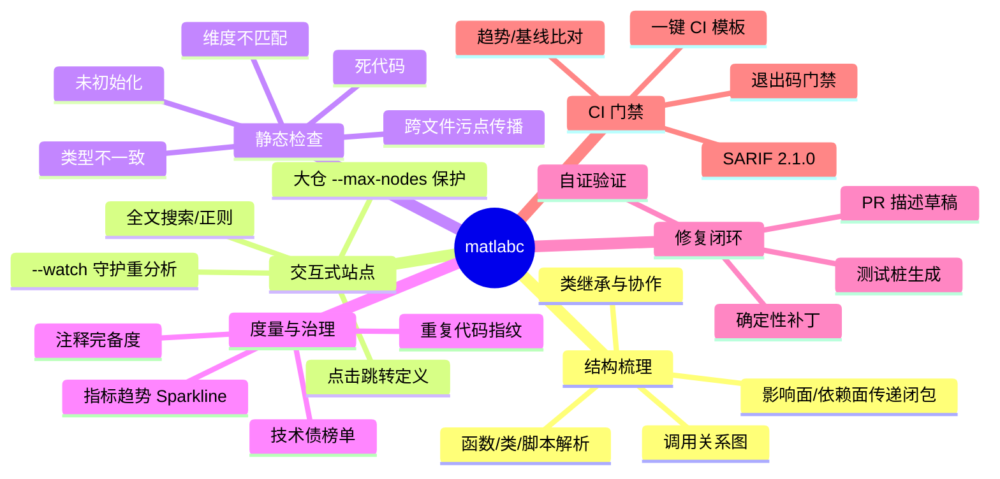
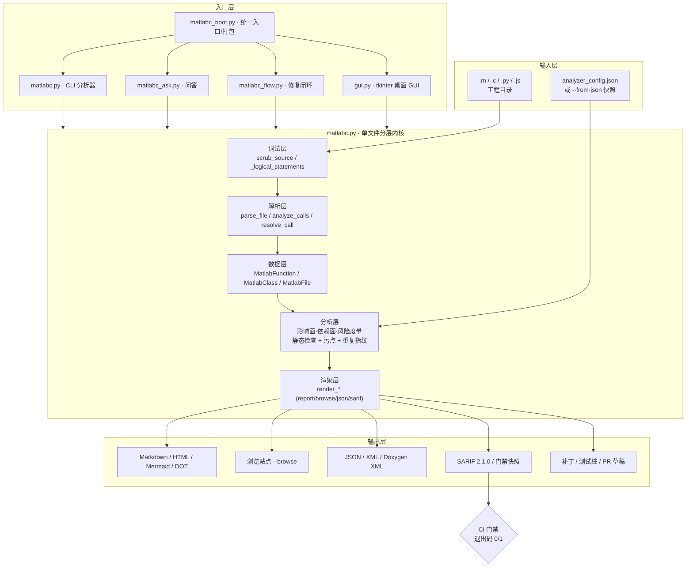
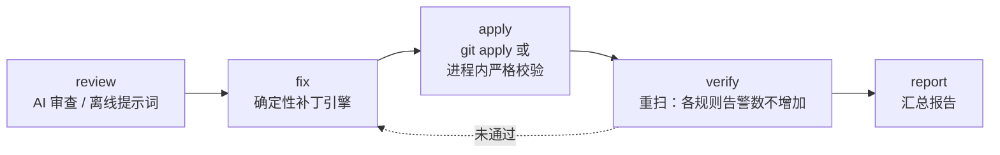
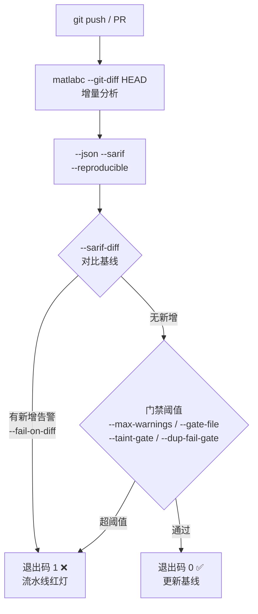

<div align="center">


# malabc

**MATLAB / Simulink 静态分析与确定性自动修复引擎（`matlabc`）**

把「看代码」升级为「工作台」：不止梳理调用关系，还直接告诉你
**哪里有隐患、属于哪一级严重度、怎么改、能否一键生成修复补丁 / 测试桩 / PR 草稿**，
并把所有结论接入 **CI 质量门禁**。

<br>


-brightgreen)


[快速开始](#-快速开始) · [核心能力](#-核心能力) · [架构](#-架构) · [命令速查](#-命令速查) · [CI 门禁](#-ci-质量门禁) · [English](#english-overview) · [许可证](#-许可证)

</div>

---

## 它解决什么问题

| 场景 | 以前的做法 | 用 `matlabc` |
| --- | --- | --- |
| 接手一个陌生的 MATLAB 工程 | 全局搜索 + 人肉跳转，三天才摸清入口 | `--browse` 生成可点击跳转站点，10 分钟看完全景 |
| 「这个函数改了会影响谁」 | 靠经验猜，改完才发现漏了 | 影响面 / 依赖面传递闭包 + 算子影响分析 |
| 「这段有没有隐患」 | 跑一遍 MATLAB 才知道 | 未初始化 / 类型不一致 / 死代码 / 维度不匹配 / 污点传播，静态即出 |
| 「怎么改才安全」 | 手改，容易引入新问题 | `--gen-apply-patch` 生成确定性补丁并可自证验证 |
| 「怎么防止再恶化」 | 靠 Code Review 自觉 | SARIF + 退出码 + 趋势基线，接进 CI 自动卡 |

> **零依赖、免 MATLAB、默认离线**：只依赖 Python 标准库，不需要安装 MATLAB / Octave，
> 也不发任何外网请求（离线优先，产物不含 CDN 引用），纯内网可用。

---

## 核心能力



### 多语言支持

| 语言 | 开关 | 关键能力 |
| --- | --- | --- |
| **MATLAB**（默认） | — | 函数 / 类 / 脚本 / 嵌套函数 / `arguments` 块 / 结构体字段 / 全局状态全量解析 |
| **C** | `--lang c` | 函数调用 / `#include` 跨文件依赖边 / 悬空指针、越界、use-after-free 等启发式检查 |
| **Python** | `--lang py` | 函数 / 调用 / 静态检查，含 **Python 3.6 语法兼容门禁**（`--check-py36`） |
| **JavaScript** | `--lang js` | 函数 / 调用 / 全局变量、参数过多、缺文档等检查 |
| **混合（MEX 桥接）** | `--mixed` | MATLAB ↔ C 跨语言调用边 |

### 静态检查规则

| 规则 | 说明 |
| --- | --- |
| `uninitialized` | 读前无写局部变量（区分「未初始化 / 可能未初始化」，高置信才卡 CI） |
| `type_mismatch` | 同一变量类型不一致（矩阵变量被赋标量等） |
| `dead_code` | `return` 后不可达代码 + `if` 恒假分支 |
| `shape_mismatch` | `A*B` / `A+B` / `A-B` 维度约束违规 |
| `tainted_sink` | 跨文件污点：用户输入 / 文件 / 网络 → `system` / `eval` / `fprintf` 等危险汇 |

**四档告警抑制**（写在源码注释里，不改业务语义）：

```matlab
% analyzer:ignore uninitialized                 % ① 文件级：整文件忽略
% analyzer:ignore type_mismatch x -- 历史遗留     % ② 名称级：仅变量 x，可附原因
% analyzer:ignore-next-line shape_mismatch        % ③ 行级：仅下一行
% analyzer:disable uninitialized                  % ④ 区间级：↓ 块内全部忽略
y = a + b;
% analyzer:enable uninitialized                   %   ↑ 区间结束
```

---

## 架构



**目录结构**

```
malabc/
├─ matlabc.py          # 核心分析器 + 报告渲染（CLI 主程序，约 2.9 万行，零依赖）
├─ matlabc_boot.py     # 统一入口分发器：无参=GUI / ask / flow / 其余=分析器
├─ matlabc_ask.py      # 问答式代码理解（BM25 检索 + 意图识别 + 大模型）
├─ matlabc_flow.py     # AI 修复闭环编排器 review→fix→apply→verify→report
├─ ai_cli.py           # 多厂商大模型接入（离线回显 / 在线回答，优雅降级）
├─ gui.py              # 基于 tkinter 的零依赖桌面 GUI
├─ renderers/          # 报告与可视化渲染器（report/callgraph/hotspot/sarif/snapshot...）
│  └─ assets/          # 内联 CSS 资源（离线优先，无 CDN）
├─ tests/              # 测试与样例（test_matlabc.py / eval_ai_fix / sample_m/*.m）
├─ docs/               # 完整文档（用法 / 特性 / JSON Schema / 交付报告 ...）
├─ ci-examples/        # GitHub / GitLab CI 模板示例
├─ LICENSE             # MIT 许可证（英文原文，唯一法律效力文本）
└─ LICENSE_CN          # MIT 许可证中文译本（仅供参考）
```

---

## 快速开始

```bash
# ① 控制台报告（零安装，克隆即用）
python matlabc.py my_matlab_project/

# ② 生成可交互浏览站点（推荐：点击跳转、全文搜索）
python matlabc.py my_matlab_project/ -o report.html --browse

# ③ CI 静态分析（SARIF + 退出码门禁）
python matlabc.py my_matlab_project/ --checks all --sarif report.sarif \
    --max-warnings 0 --reproducible
```

环境要求：**Python 3.6+**（工具自身严格兼容 3.6.5，可用 `--check-py36` 自查）。
可选安装为命令：`pip install -e .` 后使用 `matlabc <参数>`（无参数 = 图形界面）。

> 也可一键打包成免 Python 的单文件可执行程序（`build_dist.py` + `build_release.bat/.sh`），
> 双击 = GUI，带参数 = CLI。

---

## 四大入口

### 1. 分析器（CLI）

```bash
python matlabc.py myproj/ -o report.md --html report.html --browse \
    --offline --checks all --debt --sarif report.sarif
```

### 2. `ask` —— 问答式代码理解

把静态分析结果归一化为「函数文档 + 调用图 + 告警/优先级」三类可检索对象，
再用 BM25 检索 + 意图识别（谁调用 X / X 调用谁 / 风险热点 / 解释 X）组装提示词交给大模型。

```bash
matlabc ask "main 被谁调用" --dir ./myproj          # 打包后的统一入口
python matlabc_ask.py "哪里风险最高" --dir ./myproj   # 源码态等价写法
python matlabc_ask.py "helper 是做什么的" --json report.json --provider deepseek
```

> **离线优先**：不配密钥时不调用任何模型，只回显「检索到的真实上下文 + 问题」的可粘贴提示词；
> 配置 provider 后直接给出中文回答。

### 3. `flow` —— AI 修复闭环



```bash
matlabc flow ./myproj                    # 默认只产出补丁 + 报告，不改任何文件
matlabc flow ./myproj --auto-apply       # 应用补丁并自证
matlabc flow ./myproj --steps review,fix,report --lang c --provider deepseek
```

### 4. GUI（零依赖桌面界面）

```bash
python gui.py            # 或双击打包后的 matlabc.exe
python gui.py --selftest # 无界面自检
```

选目录 → 勾选产物（浏览站点 / HTML / JSON / SARIF / MD）→ 选 AI 时机 → 一键分析并流式显示日志。

---

## 输出产物一览

| 产物 | 触发参数 | 用途 |
| --- | --- | --- |
| 控制台 / Markdown 报告 | `dir`（默认）/`-o` | 快速查看、归档评审 |
| HTML 报告 | `--html` | 单文件、可直接分享 |
| Mermaid / Graphviz DOT | `--mermaid` / `--dot` | 嵌入 Wiki / 文档 |
| 交互式浏览站点 | `--browse`（+`--watch` 守护） | 点击跳转定义、全文搜索 |
| JSON / XML / Doxygen XML | `--json` / `--xml` / `--export-doxygen-xml` | 二次开发、接入 doxygen 生态 |
| SARIF 2.1.0 | `--sarif`（+`--sarif-base` / `--sarif-diff`） | GitHub / GitLab 代码扫描 |
| 技术债 / 趋势 | `--debt` / `--trend` / `--gate` | 质量度量与趋势门禁 |
| 修复闭环 | `--gen-pr` / `--gen-apply-patch` / `--gen-tests-risk` | 修复落地、测试桩骨架 |
| 重复代码治理 | `--dup-*`（基线 / 补丁 / 自证 / 门禁） | 复制粘贴坏味道治理 |
| 差异报告 | `--diff` / `--diff-html` | 两快照全维度对比 |

---

## CI 质量门禁



| 退出码 | 含义 |
| --- | --- |
| `0` | 成功（未触发任何门禁阈值） |
| `1` | 门禁未通过（告警超阈值 / 污点违例 / 重复代码 / diff 新增 / 语法问题等） |
| `2` | 用法 / 参数错误 |
| `3` | 输入目录 / 文件不存在或解析失败 |

一键生成流水线模板：

```bash
python matlabc.py src/ --gen-ci both      # github / gitlab / both
```

**大仓友好**：`--incremental`（内容 SHA-256 签名缓存，只重分析变更）+ `--git-diff`（只分析 diff 涉及文件）
+ `--benchmark`（合成 N 文件压测，含 `--max-nodes` 渲染保护）。

---

## 命令速查

```bash
# 全量审计（离线、可复现、零告警门禁）
python matlabc.py src/ -o audit.md --html audit.html --browse \
    --offline --checks all --max-warnings 0 --reproducible

# PR 增量审查（仅 diff 范围 + SARIF 增量门禁）
python matlabc.py src/ --git-diff HEAD --sarif pr.sarif \
    --sarif-base pr_base.sarif --sarif-diff pr_delta.sarif --fail-on-diff

# 技术债门禁（CI 趋势）
python matlabc.py src/ --debt --gate gate.json \
    --gate-max-debt 100 --gate-max-uninit 0 --gate-max-delta 10

# 重复代码治理（检测 + 自证补丁）
python matlabc.py src/ --fail-on-dup --dup-baseline org.json \
    --dup-emit-patch refactor.patch --dup-verify-patch verify.json

# 修复闭环（可应用补丁 + 测试桩）
python matlabc.py src/ --gen-apply-patch fix.patch --gen-tests-risk tests_stub.py

# 其他语言 / 混合工程
python matlabc.py src/ --lang c --c-strict
python matlabc.py src/ --mixed            # MATLAB + C（MEX 跨语言）
python matlabc.py src/ --lang py --check-py36
```

完整参数总表见 [`docs/matlabc_USAGE.md`](docs/matlabc_USAGE.md)。

---

## 测试

```bash
python tests/test_matlabc.py        # 核心分析器测试
python tests/test_eval_ai_fix.py    # AI 修复闭环评测
```

---

## 文档

| 文档 | 内容 |
| --- | --- |
| [`docs/matlabc_USAGE.md`](docs/matlabc_USAGE.md) | 参数总表、配置文件、常用组合、退出码、CI 接入 |
| [`docs/matlabc_FEATURES.md`](docs/matlabc_FEATURES.md) | 能力矩阵、架构分层、产物一览、版本亮点 |
| [`docs/matlabc_README.md`](docs/matlabc_README.md) | 工具自身的完整说明 |
| [`docs/matlabc_STRUCTURE.md`](docs/matlabc_STRUCTURE.md) | 代码结构与实现细节 |
| [`docs/matlabc_JSON_SCHEMA.md`](docs/matlabc_JSON_SCHEMA.md) | `--json` 输出 Schema（二次开发必读） |
| [`docs/matlabc_FRONTEND_GUIDE.md`](docs/matlabc_FRONTEND_GUIDE.md) | 多语言前端扩展指南 |
| [`docs/matlabc_AI_ROADMAP.md`](docs/matlabc_AI_ROADMAP.md) | AI 能力演进路线 |
| [`docs/matlabc_DEEP_IMPROVEMENT.md`](docs/matlabc_DEEP_IMPROVEMENT.md) | 深度改进记录 |
| [`docs/matlabc_DELIVERY_REPORT.md`](docs/matlabc_DELIVERY_REPORT.md) | 版本交付报告 |
| [`docs/matlabc_DOXYGEN_GAP_ANALYSIS.md`](docs/matlabc_DOXYGEN_GAP_ANALYSIS.md) | Doxygen 兼容性差距分析 |
| [`MEMORY.md`](MEMORY.md) | 项目记忆与演进上下文（含 Python 3.6.5 硬约束、历史审计结论） |

---

## AI Agent 集成（MCP）

`malabc` 可作为 **Model Context Protocol (MCP)** 工具服务器，被任意支持 MCP 的 AI Agent
（CodeBuddy / Cursor / Claude 等）即插即用地调用，把「代码理解 + 静态检查 + 确定性补丁」
能力接入 Agent 的自主工作流。这是 malabc 从「单体脚本式 AI 能力」迈向 **agent-native 节点** 的关键一步。

启动（由 Agent 的 MCP client 自动拉起，纯标准库、零第三方依赖）：

```bash
python matlabc_mcp.py
```

协议为 MCP over stdio（LSP 分包帧，兼容官方 MCP SDK）。暴露的工具：

| 工具 | 作用 |
| --- | --- |
| `matlabc_analyze` | 静态分析 + 结构梳理，生成调用关系 / 风险热点 / 技术债报告 |
| `matlabc_check` | 门禁式静态检查（`uninitialized` / `type_mismatch` / `dead_code` / `shape_mismatch` / `tainted_sink`） |
| `matlabc_ask` | 自然语言问答式代码理解（谁调用 X / 风险热点 / 解释 X） |
| `matlabc_gen_patch` | 运行 AI 修复闭环，生成 / 应用确定性修复补丁 |
| `matlabc_version` | 返回引擎版本与能力清单，供 Agent 做能力协商 |

> **设计要点**：server 通过 `subprocess` 复用 `matlabc` 现有 CLI（进程隔离、行为一致）；
> 拉起的子进程**整棵进程树**在 server 退出 / 超时时被强制回收（Windows `taskkill /T`、
> POSIX `killpg`），避免孤儿进程跑飞。所有工具返回带 `isError` 标记，便于 Agent 做错误分支。

Agent 调用示例（伪代码）：

```json
{"method":"tools/call","params":{"name":"matlabc_check",
 "arguments":{"target":"src/","check":"uninitialized","max_warnings":0}}}
```

---

## English Overview

`malabc` ships **`matlabc`**, a static analysis and deterministic auto-fix engine for
MATLAB/Simulink (also C, Python, JavaScript) codebases.

* **Zero dependencies** — Python standard library only; MATLAB/Octave not required.
* **Offline-first** — no network calls, no CDN references in generated artifacts.
* **From reading to workbench** — call graph, risk hotspots, fix patches, test stubs,
  PR drafts, and CI quality gates.

```bash
# Console report
python matlabc.py my_matlab_project/

# Interactive browsable site (recommended)
python matlabc.py my_matlab_project/ -o report.html --browse

# CI gate (SARIF + exit code)
python matlabc.py my_matlab_project/ --checks all --sarif report.sarif \
    --max-warnings 0 --reproducible

# Natural-language Q&A / AI fix loop (packaged entry: `matlabc ask|flow`)
python matlabc_ask.py "who calls main"    --dir ./myproj
python matlabc_flow.py ./myproj --auto-apply
```

Requirements: Python 3.6+. Full documentation lives in [`docs/`](docs/).

---

## 许可证

本项目采用 **MIT License** 双文本发布：

* [`LICENSE`](LICENSE) — 英文原文，**唯一具有法律效力的许可文本**
* [`LICENSE_CN`](LICENSE_CN) — 中文译本，仅供参考与阅读便利；与原文不一致时以英文原文为准

> MIT License · Copyright (c) 2026 pony-029
