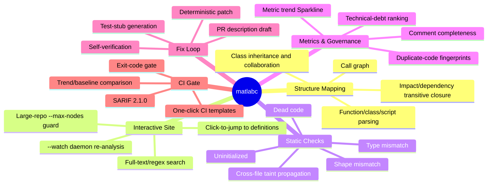
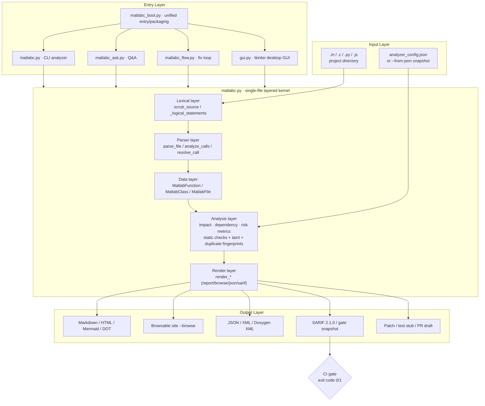
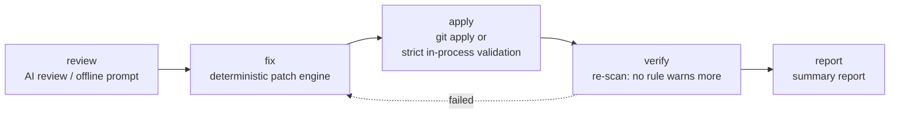
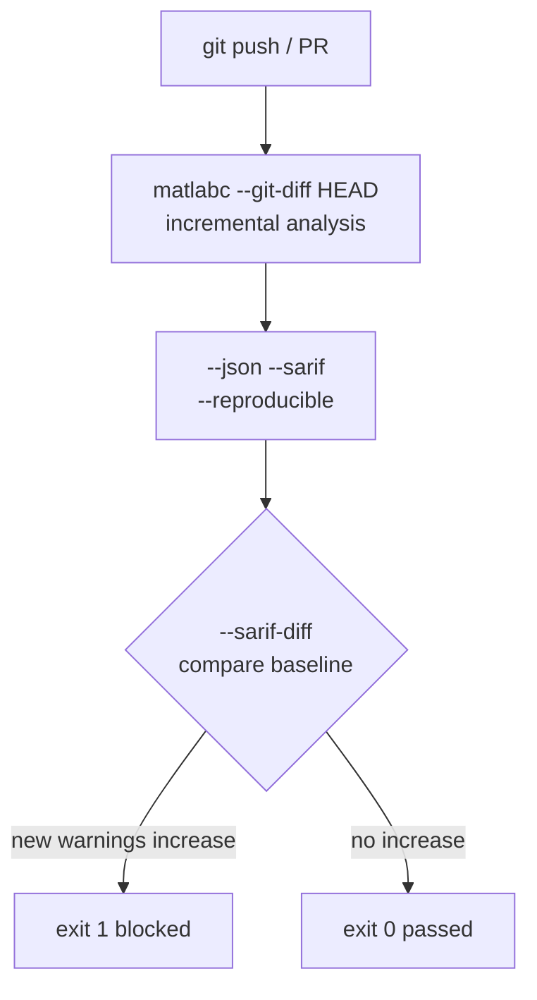

<div align="center">


# malabc

**Static analysis and deterministic auto-fix engine for MATLAB / Simulink (`matlabc`)**

Turn "reading code" into a "workbench": it does not just map call relationships, it
tells you **where the risks are, how severe they are, how to fix them, and whether a
fix patch / test stub / PR draft can be generated in one shot** — and wires every
conclusion into a **CI quality gate**.

<br>


-brightgreen)


[Quick Start](#quick-start) · [Core Capabilities](#core-capabilities) · [Architecture](#architecture)
· [Command Cheatsheet](#command-cheatsheet) · [CI Gate](#ci-quality-gate) · [中文文档](README_CN.md)
· [License](#license)

</div>

---

## What Problem It Solves

| Scenario | The old way | With `matlabc` |
| --- | --- | --- |
| Taking over an unfamiliar MATLAB project | Global search + manual jumping, three days to map entry points | `--browse` builds a clickable site; see the whole picture in 10 minutes |
| "Who is affected if I change this function?" | Guess by experience; miss something and find out after the change | Impact / dependency transitive closure + operator impact analysis |
| "Any hidden risks in this code?" | Run MATLAB to find out | Uninitialized / type mismatch / dead code / shape mismatch / taint, all statically |
| "How do I change it safely?" | Edit by hand and risk new bugs | `--gen-apply-patch` generates a deterministic, self-verified patch |
| "How do we stop the rot?" | Rely on reviewers' diligence | SARIF + exit code + trend baseline, enforced in CI |

> **Zero dependencies, no MATLAB needed, offline by default**: only the Python standard
> library is used; MATLAB / Octave is not required, and no network requests are made
> (offline-first, no CDN references in artifacts) — fully usable on an intranet.

---

## Core Capabilities



### Multi-Language Support

| Language | Flag | Key capabilities |
| --- | --- | --- |
| **MATLAB** (default) | — | Functions / classes / scripts / nested functions / `arguments` blocks / struct fields / global state, fully parsed |
| **C** | `--lang c` | Function calls / `#include` cross-file dependency edges / heuristics for dangling pointers, out-of-bounds, use-after-free |
| **Python** | `--lang py` | Functions / calls / static checks, including a **Python 3.6 syntax-compatibility gate** (`--check-py36`) |
| **JavaScript** | `--lang js` | Functions / calls / global variables, too-many-parameters, missing-docs checks |
| **Mixed (MEX bridge)** | `--mixed` | MATLAB ↔ C cross-language call edges |

### Static Check Rules

| Rule | Description |
| --- | --- |
| `uninitialized` | Read-before-write local variables (distinguishes "uninitialized / maybe uninitialized"; blocks CI only on high confidence) |
| `type_mismatch` | Inconsistent types for the same variable (e.g. a matrix variable assigned a scalar) |
| `dead_code` | Unreachable code after `return` + always-false `if` branches |
| `shape_mismatch` | `A*B` / `A+B` / `A-B` dimension-constraint violations |
| `tainted_sink` | Cross-file taint: user input / file / network → dangerous sinks such as `system` / `eval` / `fprintf` |

**Four levels of warning suppression** (written as source comments, without changing business semantics):

```matlab
% analyzer:ignore uninitialized                 % (1) File level: ignore the whole file
% analyzer:ignore type_mismatch x -- legacy      % (2) Name level: only variable x, reason optional
% analyzer:ignore-next-line shape_mismatch        % (3) Line level: next line only
% analyzer:disable uninitialized                  % (4) Range level: ignore everything inside the block
y = a + b;
% analyzer:enable uninitialized                   %     ↑ end of range
```

---

## Architecture



**Directory structure**

```
malabc/
├─ matlabc.py          # Core analyzer + report rendering (CLI main, ~29k lines, zero deps)
├─ matlabc_boot.py     # Unified entry dispatcher: no args = GUI / ask / flow / else = analyzer
├─ matlabc_ask.py      # Q&A code understanding (BM25 retrieval + intent recognition + LLM)
├─ matlabc_flow.py     # AI fix-loop orchestrator review→fix→apply→verify→report
├─ matlabc_mcp.py      # MCP server (exposes matlabc as tools to AI agents)
├─ ai_cli.py           # Multi-vendor LLM access (offline echo / online answer, graceful degradation)
├─ gui.py              # Zero-dependency tkinter desktop GUI
├─ renderers/          # Report and visualization renderers (report/callgraph/hotspot/sarif/snapshot...)
│  └─ assets/          # Inlined CSS assets (offline-first, no CDN)
├─ tests/              # Tests and samples (test_matlabc.py / eval_ai_fix / sample_m/*.m)
├─ docs/               # Full documentation (usage / features / JSON Schema / delivery report ...)
├─ ci-examples/        # GitHub / GitLab CI template examples
├─ LICENSE             # MIT License (English original, the sole legally binding text)
└─ LICENSE_CN          # MIT License Chinese translation (for reference only)
```

---

## Quick Start

```bash
# (1) Console report (zero install, clone and run)
python matlabc.py my_matlab_project/

# (2) Generate an interactive browsable site (recommended: click-to-jump, full-text search)
python matlabc.py my_matlab_project/ -o report.html --browse

# (3) CI static analysis (SARIF + exit-code gate)
python matlabc.py my_matlab_project/ --checks all --sarif report.sarif \
    --max-warnings 0 --reproducible
```

Requirements: **Python 3.6+** (the tool itself is strictly 3.6.5-compatible; self-check with `--check-py36`).
Optionally install as a command: after `pip install -e .`, use `matlabc <args>` (no args = GUI).

> You can also package it into a single-file executable that needs no Python
> (`build_dist.py` + `build_release.bat/.sh`): double-click = GUI, with args = CLI.

---

## The Four Entry Points

### 1. Analyzer (CLI)

```bash
python matlabc.py myproj/ -o report.md --html report.html --browse \
    --offline --checks all --debt --sarif report.sarif
```

### 2. `ask` — Q&A Code Understanding

Normalizes static-analysis results into three retrievable object classes — "function docs +
call graph + warnings/priority" — then uses BM25 retrieval + intent recognition (who calls X /
what X calls / risk hotspots / explain X) to assemble a prompt for the LLM.

```bash
matlabc ask "who calls main" --dir ./myproj           # packaged unified entry
python matlabc_ask.py "where is the risk highest" --dir ./myproj   # source-mode equivalent
python matlabc_ask.py "what does helper do" --json report.json --provider deepseek
```

> **Offline-first**: without an API key, no model is called; it just echoes a paste-ready prompt
> containing the retrieved real context + the question. After configuring a provider, it answers directly.

### 3. `flow` — AI Fix Loop



```bash
matlabc flow ./myproj                    # by default only emits a patch + report, changes nothing
matlabc flow ./myproj --auto-apply       # applies the patch and self-verifies
matlabc flow ./myproj --steps review,fix,report --lang c --provider deepseek
```

### 4. GUI (Zero-Dependency Desktop UI)

```bash
python gui.py            # or double-click the packaged matlabc.exe
python gui.py --selftest # headless self-test
```

Pick a directory → tick the artifacts (browsable site / HTML / JSON / SARIF / MD) → choose the AI
timing → one-click analyze with streaming logs.

---

## Output Artifacts

| Artifact | Trigger | Purpose |
| --- | --- | --- |
| Console / Markdown report | `dir` (default) / `-o` | Quick viewing, archived review |
| HTML report | `--html` | Single file, directly shareable |
| Mermaid / Graphviz DOT | `--mermaid` / `--dot` | Embed in Wiki / docs |
| Interactive browsable site | `--browse` (+`--watch` daemon) | Click-to-jump to definitions, full-text search |
| JSON / XML / Doxygen XML | `--json` / `--xml` / `--export-doxygen-xml` | Secondary development, doxygen ecosystem |
| SARIF 2.1.0 | `--sarif` (+`--sarif-base` / `--sarif-diff`) | GitHub / GitLab code scanning |
| Technical debt / trend | `--debt` / `--trend` / `--gate` | Quality metrics and trend gates |
| Fix loop | `--gen-pr` / `--gen-apply-patch` / `--gen-tests-risk` | Fix landing, test-stub skeleton |
| Duplicate-code governance | `--dup-*` (baseline / patch / self-verify / gate) | Copy-paste code-smell governance |
| Diff report | `--diff` / `--diff-html` | Full-dimension comparison of two snapshots |

---

## CI Quality Gate



`ci-examples/` provides ready-to-use GitHub Actions / GitLab CI templates; just copy them in.

## Command Cheatsheet

```bash
# Structure-map report (Markdown)
python matlabc.py myproj/ -o report.md

# Interactive browsable site (click-to-jump + full-text search)
python matlabc.py myproj/ --browse -o site.html

# C project analysis
python matlabc.py myproj/ --lang c --checks all

# Python 3.6 syntax compatibility gate
python matlabc.py myproj/ --lang py --check-py36

# CI gate: fail on any new warning, SARIF output
python matlabc.py myproj/ --checks all --sarif report.sarif \
    --sarif-base baseline.sarif --sarif-diff --max-warnings 0 --reproducible

# Cross-file taint scan
python matlabc.py myproj/ --check tainted_sink

# Generate a deterministic self-verified fix patch
python matlabc flow myproj --auto-apply --gen-apply-patch

# Q&A code understanding (offline => echoes a paste-ready prompt)
python matlabc_ask.py "where is the risk highest" --dir myproj
```

---

## AI Agent Integration (MCP)

`malabc` can run as a **Model Context Protocol (MCP)** tool server, so any MCP-capable AI agent
(CodeBuddy / Cursor / Claude, etc.) can call it out of the box, wiring "code understanding +
static checks + deterministic patches" into the agent's autonomous workflow.

Launch (started automatically by the agent's MCP client; zero third-party dependencies):

```bash
python matlabc_mcp.py
```

The protocol is MCP over stdio (LSP framing, compatible with the official MCP SDK). Exposed tools:

| Tool | Purpose |
| --- | --- |
| `matlabc_analyze` | Static analysis + structure mapping; produces call relationships / risk hotspots / tech-debt report |
| `matlabc_check` | Gated static check (`uninitialized` / `type_mismatch` / `dead_code` / `shape_mismatch` / `tainted_sink`) |
| `matlabc_ask` | Natural-language Q&A code understanding (who calls X / risk hotspots / explain X) |
| `matlabc_gen_patch` | Runs the AI fix loop; generates / applies a deterministic fix patch |
| `matlabc_version` | Returns the engine version and capability list for agent capability negotiation |

> **Design note**: the server reuses the existing `matlabc` CLI via `subprocess` (process isolation,
> consistent behavior); the spawned child process tree is force-reclaimed on server exit / timeout
> (Windows `taskkill /T`, POSIX `killpg`) to avoid orphaned processes running away. Every tool
> returns an `isError` flag for easy agent error branching.

Agent call example (pseudocode):

```json
{"method":"tools/call","params":{"name":"matlabc_check",
 "arguments":{"target":"src/","check":"uninitialized","max_warnings":0}}}
```

---

## Documents

- [docs/matlabc_USAGE.md](docs/matlabc_USAGE.md) — full command-line usage reference
- [docs/matlabc_FEATURES.md](docs/matlabc_FEATURES.md) — capability details and examples
- [docs/matlabc_JSON_SCHEMA.md](docs/matlabc_JSON_SCHEMA.md) — JSON output schema
- [docs/matlabc_DELIVERY_REPORT.md](docs/matlabc_DELIVERY_REPORT.md) — delivery / packaging notes
- [docs/matlabc_STRUCTURE.md](docs/matlabc_STRUCTURE.md) — code structure overview
- [docs/matlabc_AI_ROADMAP.md](docs/matlabc_AI_ROADMAP.md) — AI roadmap

---

## License

[MIT](LICENSE) — see [LICENSE](LICENSE) (English original, the sole legally binding text) and
[LICENSE_CN](LICENSE_CN) (Chinese translation for reference only).

---

> This document has a fully corresponding **Chinese version**: [README_CN.md](README_CN.md).
> The two are kept in sync section by section; do not mix languages within a single file.

