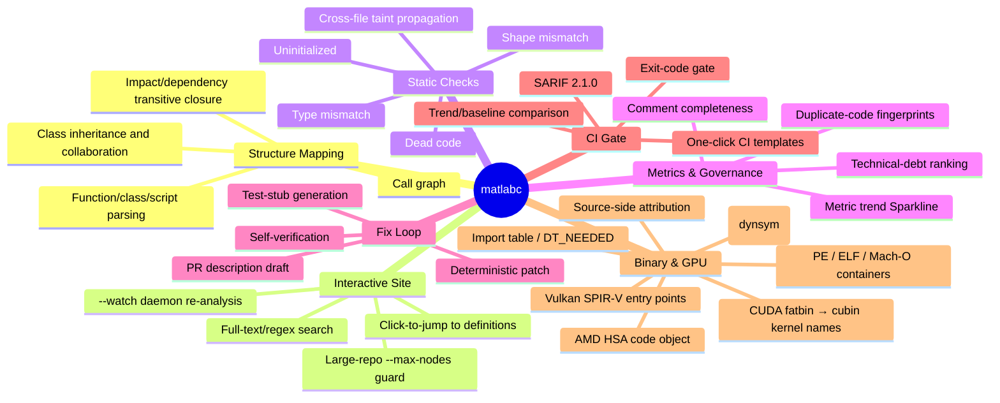
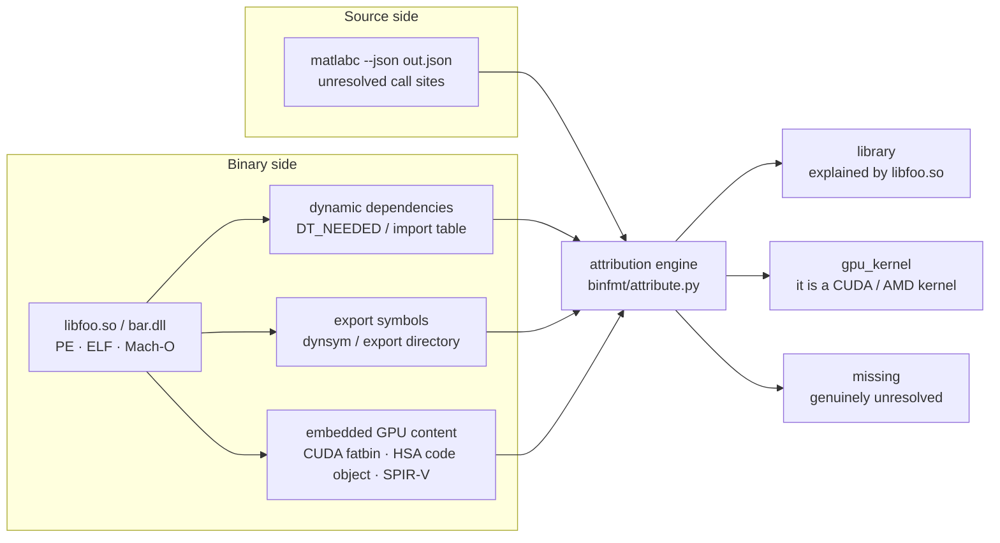
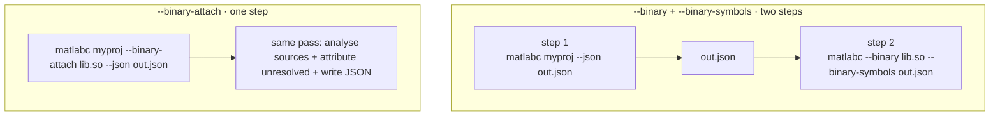
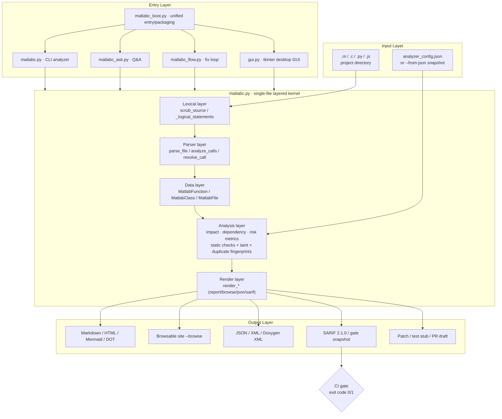
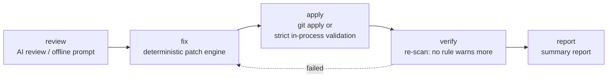
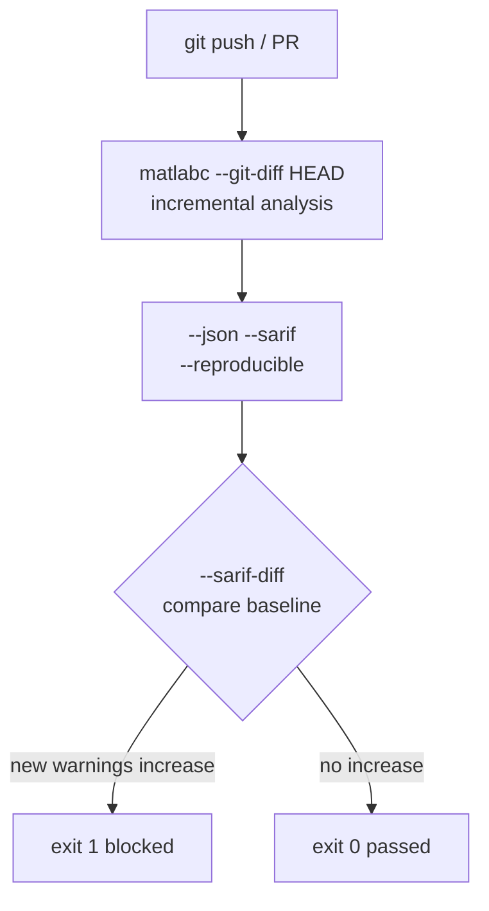
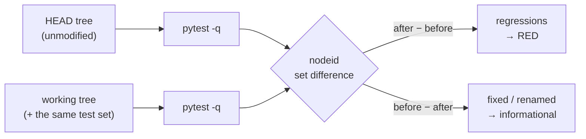

<div align="center">


# malabc

**Static analysis and deterministic auto-fix engine — MATLAB / Simulink, C·C++ (subset), Python and JavaScript, plus PE / ELF / Mach-O binaries and the CUDA · ROCm · Vulkan GPU content embedded in them**

Turn "reading code" into a "workbench": it does not just map call relationships, it
tells you **where the risks are, how severe they are, how to fix them, and whether a
fix patch / test stub / PR draft can be generated in one shot** — and wires every
conclusion into a **CI quality gate**.

<br>


-brightgreen)


[Quick Start](#quick-start) · [Core Capabilities](#core-capabilities) · [Architecture](#architecture)
· [Binary & GPU](#binary--gpu-analysis---binary) · [Command Cheatsheet](#command-cheatsheet)
· [CI Gate](#ci-quality-gate) · [Quality Gates](#quality-gates-self-verifying) · [中文文档](README_CN.md)
· [License](#license)

**Author & copyright holder: 冯磊 (Feng Lei)** — © 2026 冯磊 (Feng Lei).
**侵权必究**: the **code** is MIT — the **name and branding** are not. See [LICENSE](LICENSE) §6.

</div>

---

## What Problem It Solves

| Scenario | The old way | With `matlabc` |
| --- | --- | --- |
| Taking over an unfamiliar MATLAB project | Global search + manual jumping, three days to map entry points | `--browse` builds a clickable site; see the whole picture in 10 minutes |
| "Who is affected if I change this function?" | Guess by experience; miss something and find out after the change | Impact / dependency transitive closure + operator impact analysis |
| "Any hidden risks in this code?" | Run MATLAB to find out | Uninitialized / type mismatch / dead code / shape mismatch / taint, all statically |
| "How do I change it safely?" | Edit by hand and risk new bugs | `--gen-apply-patch` generates a deterministic, self-verified patch |
| "How do we stop the rot?" | Rely on reviewers' diligence | SARIF + exit code + trend baseline, enforced in CI |
| "This call resolves to nothing — is it our bug or a library's?" | Guess, or grep the disk | `--binary` + `--binary-symbols`, or the single-command `--binary-attach`: every unresolved name is attributed to a library, a GPU kernel, or `missing` |

> **Zero dependencies, no MATLAB needed, offline by default**: only the Python standard
> library is used; MATLAB / Octave is not required, and no network requests are made
> (offline-first, no CDN references in artifacts) — fully usable on an intranet.

---

## Core Capabilities



### Multi-Language Support

| Language | Flag | Key capabilities |
| --- | --- | --- |
| **MATLAB** (default) | — | Functions / classes / scripts / nested functions / `arguments` blocks / struct fields / global state, fully parsed |
| **C / C++** | `--lang c`（alias `--lang cpp`） | `.c/.h/.cc/.cpp/.cxx/.hpp/.hh/.hxx`; function calls / `#include` cross-file dependency edges / heuristics for uninitialized pointers, out-of-bounds, use-after-free, double-free, buffer overflow. **Preprocessor-aware for literal `#if 0`**: dead blocks are not analysed (line numbers preserved) while `#else` branches stay live — `#ifdef` / `#if defined` are deliberately left alone rather than guessed. Function definitions are found by a **lexical + brace-balancing** scanner (R49): a `name(args) {` whose signature **spans lines** (Allman brace, return type on its own line, multi-line parameter list) is recognised too — measured on glibc-2.37 (13,527 `.c/.h` files) the miss rate drops from **99.05%** to **0.04%** and `unresolved` false positives go to zero. C++ is parsed as a **C subset** (templates / classes / namespaces are not guaranteed) — a disclosed degradation, never a silent drop |
| **Python** | `--lang py` | Functions / calls / static checks (`py_unused_import` / `py_dup_params` / `py_too_many_params` / `py_missing_doc` / `py_eval_usage` / `py_sql_injection`), including a **Python 3.6 syntax-compatibility gate** (`--check-py36`) |
| **JavaScript** | `--lang js` | Functions / calls / static checks (`js_unused_import` / `js_global_var` / `js_too_many_params` / `js_missing_doc` / `js_dangerous_call` / `js_unused_var` / `js_prototype_pollution`) |
| **Mixed (MEX bridge)** | `--mixed` | MATLAB ↔ C cross-language call edges |

**Language boundary (explicit, not silent).** `--lang` covers MATLAB / C·C++ / Python / JavaScript only. TypeScript, Rust, Go, Java, Kotlin, C#, Swift, Scala, Ruby and PHP have **no frontend**: when such files exist but the requested language finds none, the CLI prints a `[warn]` line to stderr naming the language and the files it skipped, instead of quietly reporting `0 files / 0 functions`. When such files sit alongside sources of the requested language they are **skipped silently** — so "this language found 0 files" does not mean "there was nothing there". A cross-language operator label is only listed in the operator catalog if some code path actually emits it; operators that are deliberately not implemented are registered in `_UNIMPLEMENTED_KINDS` with a stated reason, and `tools/check_operator_impl.py` fails the build if the two ever diverge.

### Binary & GPU Analysis (`--binary`)

Source-side analysis can tell you *that* a call is unresolved. It cannot tell you *why*.
`--binary` closes that loop: point it at the libraries your code actually links against, and
every unresolved name gets an owner.



```bash
# What does this library depend on, and what does it export?
python matlabc.py --binary libfoo.so

# Ask the source side and the binary side the same question
python matlabc.py myproj/ --json out.json                    # 1) find unresolved calls
python matlabc.py --binary libcublas.so.12 --binary-symbols out.json   # 2) attribute them

# Machine-readable, for wiring into your own pipeline
python matlabc.py --binary a.dll,b.so --binary-json -
```

| Backend | Where it hides | How it is found | What comes out |
| --- | --- | --- | --- |
| **CUDA** | PE `.nv_fatb` · ELF `.nv_fatbin` · PE/ELF `.nvFatBi` / `.nvFatBin` | fatbin magic `0xba55ed50`; cubin located through the `.text._Z…` section-name table | kernel names + demangled forms, SM targets, code-object counts |
| **ROCm / HIP** | PE/ELF `.hip_fat` / `.hipFatBin` | HSA code object header (`e_ident[7]` = 64, `e_machine` = 224) | trusted code-object count (names are **not** guessed) |
| **Vulkan** | **no dedicated section** — SPIR-V sits in `.rdata` | raw magic scan for `0x03022307` (`OpEntryPoint` decoding) | entry-point names, module count |
| **PTX** | inside the same fatbin segment | `.entry <name>(` with the parenthesis required | *usually nothing* — see the honest limits below |

> **Field note — the 8-byte trap.** PE section names are hard-truncated to eight bytes. The very
> same CUDA section is `.nv_fatbin` in an ELF but `.nv_fatb` in a PE; `.nvFatBin` becomes
> `.nvFatBi`; AMD's `.hip_fatbin` becomes `.hip_fat`. A matcher that only knows the full spelling
> reports **zero** GPU content in every Windows binary — silently, and with no error. Both
> spellings are matched.

> **Field note — cubins are not standard ELF.** A cubin sets `e_type = 0x8000`,
> `e_machine = 0x100`, and parks a `0xCAFE…` sentinel in `e_shoff`. The only trustworthy
> discriminators are `e_ident[7]` (`ELFOSABI_CUDA` = 51) and `e_ident[8]`. Counting `\x7fELF`
> occurrences is a *cheap* signal and is reported under a different field name
> (`suspect_code_objects`) than the strict one (`confidence_code_objects`), so the two can never
> be confused.

**Honest limits (measured, not guessed).**

- **PTX barely yields kernel names.** Requiring `.entry <name>(` on a 692 MB real driver
  distribution leaves ~2 usable names; the rest of the `.entry ` hits are binary metadata. The
  CUDA kernel-name path that actually works is the `.text._Z…` **section-name table** inside each
  cubin — measured **171** distinct kernel names in one vendor BLAS library and **59** in another,
  100% demangle-able.
- **Mach-O is implemented but unvalidated.** No Mach-O sample exists on the development machine;
  the parser says so in the report's `notes` instead of pretending.
- **"Unparseable" is a first-class state.** A GPU blob with no extractable content is reported as
  `NOT-PARSEABLE` **with a written reason** — never as a silent `0 kernels`.
- **Truncation is always visible.** `--binfmt-scan-cap` (default 64 MiB) bounds the scan; when it
  bites, the report prints `[TRUNCATED]`.
- **Run-time binding is out of scope.** `dlopen` / `LoadLibrary` / `dlsym` / `LD_PRELOAD` are not
  traced, and `Makefile` / `CMakeLists.txt` link intent is not parsed (`-lfoo` is only used as a
  candidate-name hint). To see who loads whom at run time, use an external tool: `ltrace`,
  `strace -e openat`, or glibc's `LD_DEBUG=bindings` - those are run-time instruments, and
  static analysis cannot give you that answer.

#### One command instead of two: `--binary-attach`

`--binary` **short-circuits** — it inspects the binary and exits. `--binary-attach` deliberately
does **not**: it runs the normal source analysis, and then attributes the unresolved calls it just
found — in a single invocation, with no intermediate JSON to shuttle around.



| | `--binary` | `--binary-attach` |
| --- | --- | --- |
| Source analysis in the same call | no — binary only | **yes** — then attributes |
| Where the names come from | a `--binary-symbols` file you built earlier | the source side, automatically |

```bash
# One command: analyse myproj, then attribute its unresolved calls against libblas.so
python matlabc.py myproj/ --binary-attach libblas.so --json out.json
```

Only the binaries you explicitly pass are consulted. A library you did **not** pass yields
`missing`, never a guess — a false positive would launder a real defect into "it came from some
library", which is worse than no attribution at all. In JSON the result lands in
`unresolved_attribution` (`{summary, rows}`), and that key is **absent** when the flag is not
given — no empty shell that downstream code could mistake for "attributed, but nothing matched".

When a name still lands in `missing`, it goes one step further: it reads the project's
`Makefile` / `CMakeLists.txt` and lists their **literal** link intents (`-lblas` → candidate
`libblas.so`, `find_package(BLAS)` → a hint too), so you can see *which library to pass next*.
Variable-expanded flags such as `-l$(X)` are reported as an explicit note, never guessed.

### Static Check Rules

| Rule | Description |
| --- | --- |
| `uninitialized` | Read-before-write local variables (distinguishes "uninitialized / maybe uninitialized"; blocks CI only on high confidence) |
| `type_mismatch` | Inconsistent types for the same variable (e.g. a matrix variable assigned a scalar) |
| `dead_code` | Unreachable code after `return` + always-false `if` branches |
| `shape_mismatch` | `A*B` / `A+B` / `A-B` dimension-constraint violations |
| `tainted_sink` | Cross-file taint: user input / file / network → dangerous sinks such as `system` / `eval` / `fprintf` |
| `py_eval_usage` | `--lang py`: bare `eval()` / `exec()` inside a function (code injection / sandbox escape) |
| `py_sql_injection` | `--lang py`: SQL built by concatenation / `%` / `.format()` and then handed to `execute()`; parameterised calls are not reported |
| `c_double_free` | `--lang c`: the same pointer freed twice with no reassignment in between |
| `c_buffer_overflow` | `--lang c`: unbounded `strcpy`/`strcat`/`sprintf`/`gets` (or `memcpy`/`strncpy` without `sizeof(buf)`) into a fixed-size buffer |
| `js_dangerous_call` | `--lang js`: `eval` / `new Function` / `document.write` / `innerHTML` assignment / `insertAdjacentHTML` / string-timer |
| `js_unused_var` | `--lang js`: a simple local declaration never referenced again in the function body |
| `js_prototype_pollution` | `--lang js`: `__proto__` writes, `prototype[<variable>] =`, `constructor.prototype`, or a for-in merge that writes `target[key]` |

**Four levels of warning suppression** (written as source comments, without changing business semantics):

```matlab
% analyzer:ignore uninitialized                 % (1) File level: ignore the whole file
% analyzer:ignore type_mismatch x -- legacy      % (2) Name level: only variable x, reason optional
% analyzer:ignore-next-line shape_mismatch        % (3) Line level: next line only
% analyzer:disable uninitialized                  % (4) Range level: ignore everything inside the block
y = a + b;
% analyzer:enable uninitialized                   %     ↑ end of range
```

---

## Architecture



**Directory structure**

```
malabc/
├─ matlabc.py          # Core analyzer + report rendering (CLI main, ~29k lines, zero deps)
├─ matlabc_boot.py     # Unified entry dispatcher: no args = GUI / ask / flow / else = analyzer
├─ matlabc_ask.py      # Q&A code understanding (BM25 retrieval + intent recognition + LLM)
├─ matlabc_flow.py     # AI fix-loop orchestrator review→fix→apply→verify→report
├─ matlabc_mcp.py      # MCP server (exposes matlabc as tools to AI agents)
├─ frontends/          # The ONE decision point for "which call could not be resolved"
│  ├─ ir.py            #   shared IR + resolve_calls(); the single place that decides
│  ├─ matlab.py        #   MATLAB's own unresolved producer (different shape, same contract)
│  └─ __init__.py      #   public surface + IR_LANG_OWNERS (which language is whose)
├─ binfmt/             # Binary & GPU container analysis (zero-dependency)
│  ├─ model.py         #   unified IR: Section / Symbol / Dependency / GpuBlob / BinaryReport
│  ├─ pe.py  elf.py    #   PE32+ and ELF64/32 streaming parsers (incl. CUDA/AMDGPU classification)
│  ├─ macho.py         #   Mach-O (⚠ implemented, unvalidated — no sample on the dev machine)
│  ├─ gpu.py           #   CUDA fatbin/cubin · HSA code object · SPIR-V entry points
│  ├─ attribute.py     #   attribution: unresolved name → library / gpu_kernel / missing
│  ├─ buildsys.py      #   Makefile / CMakeLists.txt link-intent hints
│  └─ report.py        #   text report (never hides a negative state)
├─ tools/              # Self-verifying static gates (see "Quality Gates")
│  ├─ check_all.py     #   one-shot runner: runs every check_*.py + its own --selftest
│  └─ check_*.py       #   doc-flags · operator-impl · patch-ops · py36-clean ·
│                      #   help-contract · binfmt-fixtures · subprocess-hygiene ·
│                      #   readme-parity · baseline · ir-attribution
├─ ai_cli.py           # Multi-vendor LLM access (offline echo / online answer, graceful degradation)
├─ gui.py              # Zero-dependency tkinter desktop GUI
├─ renderers/          # Report and visualization renderers (report/callgraph/hotspot/sarif/snapshot...)
│  └─ assets/          # Inlined CSS assets (offline-first, no CDN)
├─ tests/              # Tests and samples (test_matlabc.py / eval_ai_fix / sample_m/*.m)
├─ docs/               # Full documentation (usage / features / JSON Schema / delivery report ...)
├─ ci-examples/        # GitHub / GitLab CI template examples
├─ LICENSE             # MIT License (English original, the sole legally binding text)
└─ LICENSE_CN          # MIT License Chinese translation (for reference only)
```

**One rule, one place.** `resolve_calls()` is the only code that decides a call could not be resolved;
everything downstream — the call graph, the "possibly missed" page, and the binary attribution —
reads that same verdict instead of re-deriving it.

```mermaid
flowchart LR
  C["C frontend"] --> RC
  P["Py frontend"] --> RC
  J["JS frontend"] --> RC
  M["MATLAB<br/>frontends/matlab.py"] --> U
  RC["frontends/ir.py<br/>resolve_calls()<br/><b>the ONE decision point</b>"] --> E["edges → call graph"]
  RC --> U["unresolved"]
  U --> RP["\"possibly missed\" page"]
  U --> AT["--binary-attach<br/>library: / gpu_kernel: / missing"]
```

---

## Quick Start

```bash
# (1) Console report (zero install, clone and run)
python matlabc.py my_matlab_project/

# (2) Generate an interactive browsable site (recommended: click-to-jump, full-text search)
python matlabc.py my_matlab_project/ -o report.html --browse

# (3) CI static analysis (SARIF + exit-code gate)
python matlabc.py my_matlab_project/ --checks all --sarif report.sarif \
    --max-warnings 0 --reproducible
```

Requirements: **Python 3.6+** (the tool itself is strictly 3.6.5-compatible; self-check with `--check-py36`).
Optionally install as a command: after `pip install -e .`, use `matlabc <args>` (no args = GUI).

> You can also package it into a single-file executable that needs no Python
> (`build_dist.py` + `build_release.bat/.sh`): double-click = GUI, with args = CLI.

---

## The Four Entry Points

### 1. Analyzer (CLI)

```bash
python matlabc.py myproj/ -o report.md --html report.html --browse \
    --offline --checks all --debt --sarif report.sarif
```

### 2. `ask` — Q&A Code Understanding

Normalizes static-analysis results into three retrievable object classes — "function docs +
call graph + warnings/priority" — then uses BM25 retrieval + intent recognition (who calls X /
what X calls / risk hotspots / explain X) to assemble a prompt for the LLM.

```bash
matlabc ask "who calls main" --dir ./myproj           # packaged unified entry
python matlabc_ask.py "where is the risk highest" --dir ./myproj   # source-mode equivalent
python matlabc_ask.py "what does helper do" --json report.json --provider deepseek
```

> **Offline-first**: without an API key, no model is called; it just echoes a paste-ready prompt
> containing the retrieved real context + the question. After configuring a provider, it answers directly.

### 3. `flow` — AI Fix Loop



```bash
matlabc flow ./myproj                    # by default only emits a patch + report, changes nothing
matlabc flow ./myproj --auto-apply       # applies the patch and self-verifies
matlabc flow ./myproj --steps review,fix,report --lang c --provider deepseek
```

### 4. GUI (Zero-Dependency Desktop UI)

```bash
python gui.py            # or double-click the packaged matlabc.exe
python gui.py --selftest # headless self-test
```

Pick a directory → tick the artifacts (browsable site / HTML / JSON / SARIF / MD) → choose the AI
timing → one-click analyze with streaming logs.

---

## Output Artifacts

| Artifact | Trigger | Purpose |
| --- | --- | --- |
| Console / Markdown report | `dir` (default) / `-o` | Quick viewing, archived review |
| HTML report | `--html` | Single file, directly shareable |
| Mermaid / Graphviz DOT | `--mermaid` / `--dot` | Embed in Wiki / docs |
| Interactive browsable site | `--browse` (+`--watch` daemon) | Click-to-jump to definitions, full-text search |
| JSON / XML / Doxygen XML | `--json` / `--xml` / `--export-doxygen-xml` | Secondary development, doxygen ecosystem |
| SARIF 2.1.0 | `--sarif` (+`--sarif-base` / `--sarif-diff`) | GitHub / GitLab code scanning |
| Technical debt / trend | `--debt` / `--trend` / `--gate` | Quality metrics and trend gates |
| Fix loop | `--gen-pr` / `--gen-apply-patch` / `--gen-tests-risk` | Fix landing, test-stub skeleton |
| Duplicate-code governance | `--dup-*` (baseline / patch / self-verify / gate) | Copy-paste code-smell governance |
| Binary / GPU report | `--binary` (+`--binary-symbols` / `--binary-json` / `--binfmt-scan-cap`) | Dynamic dependencies, exports, CUDA/ROCm/Vulkan content, and source-side attribution |
| Diff report | `--diff` / `--diff-html` | Full-dimension comparison of two snapshots |

---

## CI Quality Gate



`ci-examples/` provides ready-to-use GitHub Actions / GitLab CI templates; just copy them in.

## Command Cheatsheet

```bash
# Structure-map report (Markdown)
python matlabc.py myproj/ -o report.md

# Interactive browsable site (click-to-jump + full-text search)
python matlabc.py myproj/ --browse -o site.html

# C project analysis
python matlabc.py myproj/ --lang c --checks all

# Python 3.6 syntax compatibility gate
python matlabc.py myproj/ --lang py --check-py36

# CI gate: fail on any new warning, SARIF output
python matlabc.py myproj/ --checks all --sarif report.sarif \
    --sarif-base baseline.sarif --sarif-diff --max-warnings 0 --reproducible

# Cross-file taint scan
python matlabc.py myproj/ --checks tainted_sink

# Binary analysis: dependencies, exports, GPU content
python matlabc.py --binary libfoo.so

# Attribute unresolved calls: source side ↔ binary side
python matlabc.py myproj/ --json out.json
python matlabc.py --binary libcublas.so.12 --binary-symbols out.json

# ...or do both in one command (no intermediate JSON)
python matlabc.py myproj/ --binary-attach libcublas.so.12 --json out.json

# Generate a deterministic self-verified fix patch
python matlabc flow myproj --auto-apply --gen-apply-patch

# Q&A code understanding (offline => echoes a paste-ready prompt)
python matlabc_ask.py "where is the risk highest" --dir myproj
```

---

## AI Agent Integration (MCP)

`malabc` can run as a **Model Context Protocol (MCP)** tool server, so any MCP-capable AI agent
(CodeBuddy / Cursor / Claude, etc.) can call it out of the box, wiring "code understanding +
static checks + deterministic patches" into the agent's autonomous workflow.

Launch (started automatically by the agent's MCP client; zero third-party dependencies):

```bash
python matlabc_mcp.py
```

The protocol is MCP over stdio (LSP framing, compatible with the official MCP SDK). Exposed tools:

| Tool | Purpose |
| --- | --- |
| `matlabc_analyze` | Static analysis + structure mapping; produces call relationships / risk hotspots / tech-debt report |
| `matlabc_check` | Gated static check (`uninitialized` / `type_mismatch` / `dead_code` / `shape_mismatch` / `tainted_sink`) |
| `matlabc_ask` | Natural-language Q&A code understanding (who calls X / risk hotspots / explain X) |
| `matlabc_gen_patch` | Runs the AI fix loop; generates / applies a deterministic fix patch |
| `matlabc_version` | Returns the engine version and capability list for agent capability negotiation |

> **Design note**: the server reuses the existing `matlabc` CLI via `subprocess` (process isolation,
> consistent behavior); the spawned child process tree is force-reclaimed on server exit / timeout
> (Windows `taskkill /T`, POSIX `killpg`) to avoid orphaned processes running away. Every tool
> returns an `isError` flag for easy agent error branching.

Agent call example (pseudocode):

```json
{"method":"tools/call","params":{"name":"matlabc_check",
 "arguments":{"target":"src/","check":"uninitialized","max_warnings":0}}}
```

---

## Quality Gates (self-verifying)

The project's own claims are enforced by executable gates. One command runs them all:

```bash
python tools/check_all.py        # runs every tools/check_*.py AND its --selftest
```

| Gate | What it stops |
| --- | --- |
| `check_baseline.py` | `P1–P4/T1` — "Did this change make the suite worse?" — answered by comparing failure **nodeid sets**, not counts. This suite is *not* green, so counts prove nothing: 124 → 123 can be "fixed one" or "fixed two, broke one". `--full` runs both sides; the default mode checks preconditions and self-tests the verdict logic. A "repository" counts in **both** git forms: `.git` a directory, or `.git` a file whose first line is `gitdir:` pointing at an **existing** directory (`git worktree add`) — the old check accepted only the former, so a worktree could not run `check_all` at all (R54). **T1 (R63)**: the tests **added or modified this round** are separated out — `--full` copies the *current* `tests/` into the export tree while that tree's `tools/` is still the **previous commit**, so a test asserting *this round's* product facts fails on the `before` side **by construction**. Registering such a nodeid would be wrong: after the commit the export tree carries the product too, so the registration would be **stale on the very next run** |
| `check_doc_flags.py` | `NO_HELP_SCRIPTS` — Documentation **or a help screen** advertising a CLI flag that does not exist (this really happened: the README said `--check tainted_sink`, which argparse rejects as an **ambiguous prefix**) |
| `check_operator_impl.py` | `_UNIMPLEMENTED_KINDS` — "Phantom operators" (a rule in the catalog that no code path emits), contradictions between the catalog and the not-implemented table, and **a "we don't do this" that never reaches `--help`** |
| `check_patch_ops.py` | `G0–G3` — Patch operators that overwrite a target line instead of inserting before it (which would silently delete source) |
| `check_binfmt_fixtures.py` | `C1–C12` — Binary / GPU parsers regressing — synthetic PE/ELF/Mach-O fixtures plus contract assertions C1–C12. **R68**: the three mechanisms by which a dynamic library says what it links against are now all read — ELF `DT_NEEDED`, PE import table, and Mach-O `LC_LOAD_DYLIB` (incl. weak/reexport/upward/lazy) + `LC_ID_DYLIB` + `LC_RPATH` + `LC_LOAD_DYLINKER` (C10); Mach-O `LC_SYMTAB` external symbols are read while internal/debug symbols are strictly kept out of the export table (C11); and library **name families** are normalised so that `libfoo.so.1`, `libfoo.so.1.2.3` and `libfoo.1.dylib` count as one library, while rpath/runpath are never mistaken for a library you still have to add (C12). **R68 also found a defect while measuring**: the `.framework` branch of that normaliser was **unreachable** — the basename was stripped *before* the `.framework/` test, so `@rpath/Foo.framework/Versions/A/Foo` came back as `foo` while the function's own docstring promised `foo.framework`; the order is now fixed and the three framework spellings are pinned by C12's fixtures |
| `check_py36_clean.py` | `--check-py36` — The repo breaking **its own** Python 3.6.5 promise (it already had: `list[str]` and `from __future__ import annotations` had shipped) |
| `check_subprocess_hygiene.py` | `S1–S5` — Any subprocess that captures output while inheriting stdin, or that can hang forever |
| `check_help_contract.py` | `B0–B5` — An exit code that exists in the code but not in `--help`, or in `--help` but never returned; help that lost its usage example, diagram, or exit-code section; **examples that do not actually run**; help that silently shrank or bloated (an absolute bound, a **±64 B** drift band against a ratified snapshot, **and** a byte-exact match on a version- and width-independent canonical form of `--help` — resolution **1 byte**); exit codes claimed by the `ci-examples/` templates; and **stale "N gates" numbers in prose**. **R70**: every guard's `rc=0` description in `GUARD_CONTRACT` must contain that guard's own `ROW_SIGNATURE` **verbatim** — the description had been write-only prose and had silently fallen two rounds behind (it said `C1–C6` while the fact was `C1–C12`) |
| `check_ir_attribution.py` | `I0–I7` — A **second** place deciding "this call could not be resolved". Before R44 that rule was **copied five times** (inline in `build_c_model` and `_build_ext_model`, verbatim in three `build_edges`), so the call graph and the binary attribution could be discussing **different sets of names** while neither side reported anything. The gate pins the whole-repo **set** of write sites, the **write shape** per site, and the `func_index.get(x.lower())` lookup that no re-copy can avoid — any unregistered "look the function index up by lowercased name" predicate is red; and **C7'** pins the **C extension-name truth source** — `CFrontend.exts` must *reference* `matlabc.py::_C_SOURCE_EXTS` instead of copying it (R50 measured 2 extensions declared vs the 8 that `collect_c_files` really honours) |
| `check_import_graph.py` | `G1–G7` — A **new cycle at import time**. `renderers/*` used to borrow symbols from `matlabc.py` through a module-level `from matlabc import ...` at the *bottom* of each file, while `matlabc.py` re-exported `renderers.*` at its own bottom — a real import-time cycle that only worked because of an **implicit ordering contract** ("whatever gets borrowed must already be defined before the re-export point"). Nothing pinned that contract, and no test, `git status` or `git diff` could see it. R52 moved the borrows onto a lazy accessor (`renderers/_late.py`), so the import-time graph is acyclic; this gate keeps it that way, and requires every remaining lazy cycle and every dynamic import of a repo module to be **registered and counter-party checked** (unregistered → red; stale registration → red). **G7** extends the same discipline to the channel's *contents*: `renderers/_late.py::BORROWED` is the static single source of truth for the borrow list, so a `_mL.X` with no registration → red, and a registration with no use site (or naming something `matlabc.py` does not define at module level) → also red |
| `check_flow_diagrams.py` | `D1–D12` — Six sources kept mutually aligned — the images embedded in the READMEs, the files in `flow/diagrams/`, the claims in `candidate*.json`, the interactive artefacts, and the `flow/FLOW_INDEX.json` index (D1–D12, every pair checked in **both** directions). A broken image, an unreferenced leftover, an English-only addition, or an SVG that is not self-contained (size / fonts / dual theme / no external reference) → red |
| `check_boundary_reverse.py` | `V1–V5` — Whether those **written promises are still true**. R51 only checks that each "honest boundary" sentence is *still there*; this gate attaches a criterion that can say **no** to every one of them (V1–V5): unclaimed, claimed *and* exempted (ambiguous), a too-short exemption reason, a claim whose head is gone, an assertion carrying only "must not appear" (vacuously green), or a ratchet edited without its constant. **R56**: V1's admission rule was widened from "contains one of 6 negation words" to **every** bullet — the old rule skipped `* Mach-O：` entirely (a status statement with no negation word at all), even though its behavioural counterparty had been living in `check_binfmt_fixtures.py` C8/C9 all along |
| `check_c_frontend_shapes.py` | `F1–F6` — The C frontend's **function-definition shapes** losing a case that was already fixed once. R49 replaced the line-anchored `_RE_C_FUNC` with a lexical brace-matching scanner and proved it on glibc (missed definitions 15,471 → 4, all inside `#if 0`), but that evidence lived **outside the repo** (`_r49/`) and the product's own `_scan_c_definitions_selftest()` has **zero call sites in the product** — so `check_all.py` could run every gate it had and still nothing could say "no" to a C-shape regression. This gate drives the **public CLI** on three synthetic fixtures and pins six **disjoint** criteria: the P1/P2/P3/P4 writing shapes (F1), a pointer return type glued to the function name (F2), the parameter / return value domain (F3), the body boundary when a **string literal** contains braces (F4), the declaration-start line (F5), and both "no false positives" and the disclosed "we do not recognise K&R definitions or function-pointer returns" boundary (F6, which carries a positive half so it cannot pass vacuously). Fixture completeness (`R2`) and five ratchets (`R1`) stop the criteria from silently shrinking |
| `check_py_js_frontend_shapes.py` | `G1–G7 (py/js)` — The **Python / JS** frontends losing a definition shape that is already handled once. A standalone probe (`_r66/probe_r66a_forms.py`) measured that of **8** real Python shapes **4 were missed** (`def one(): return 1`, `async def`, a `-> bool` return annotation, a parameter list spanning lines) and that of **10** JS shapes **8 were missed** (`async function`, `export function`, `export default function`, `function*`, the three arrow forms) — while the same probe measured the **C** frontend at **0 missed**. A second probe (`_r66/probe_r66b_domain.py`) found the parameter tuple was captured with `\(([^)]*)\)`, which **cannot contain `)`**, so a nested pair inside a default value (`x=(1, 2)` / `b = g(1, 2)`) truncated the parameters or hid the definition entirely. R66 fixed both (re-measured: Python 0/8, JS 1/10, value domain 0/8, false positives 0/7 — the one left is the **deliberately disclosed** object-method shorthand). This gate drives the **public CLI** on four synthetic fixtures and pins seven **disjoint** criteria: the four Python shapes (G1), the seven JS shapes (G2), the parameter value domain including annotation stripping and nested parentheses (G3), no false positives (G4), the disclosed "we do not recognise object-method shorthand or an anonymous default export" boundary **and its positive half** (G5), the declaration-start line (G6), and no **over**-recognition of a definition that only appears on its own line inside a triple-quoted string, a block comment or a template literal (G7). Fixture completeness (`R2`) and the ratchets (`R1`) stop the criteria from silently shrinking |
| `check_readme_parity.py` | `P1/P2/P4/P5` — The English and Chinese READMEs drifting apart structurally — section count, and per-section table-row / code-block / mermaid counts. It deliberately does **not** compare line counts, because Chinese is more compact. **P4 (R61)** points the criterion at *reality* instead of at the other file: the quality-gate table in **each** README must name exactly the scripts present in `tools/check_*.py` — a missing row, an extra row, a duplicated row, or a stray continuation line right after the table is red. Parity alone could never see that bug: both READMEs lost the **same** row, so the per-section counts still matched **P5 (R62)** points the criterion at **that gate itself**: every guard declares a `ROW_SIGNATURE` (its own criterion family, or a mechanism only it owns) and prints it in its own success line, and the matching row in **each** README must carry it verbatim — swapping two rows' descriptions leaves the row *set* unchanged, so P4 alone cannot see it. |
| `check_legal_parity.py` | `L1–L7` — The **dual-track licence** rotting silently. R69 turned the licence into “MIT for the code, reserved for the name and branding”, and that arrangement has three ways to go wrong that **no other gate could see**: (i) the MIT body getting “tidied up” — GitHub's licensee detects the licence from that **body**, so one reworded sentence silently turns the `license-MIT` badge into a lie, and no existing gate read LICENSE at all; (ii) only one of `LICENSE` / `LICENSE_CN` receiving the new copyright holder, leaving two files that describe the *same* grant contradicting each other while both still exist and rc stays 0; (iii) the README version badge going stale — **R69 measured exactly that**: both READMEs said `1.16.71` while `matlabc.py`'s `VERSION` was already `1.16.72`, and nothing had ever watched it. L1 keeps the MIT body verbatim (the precondition of a dual track: the **code** side must still be MIT); L2 makes the copyright holder a single source of truth across both licence files; L3 requires the “all rights reserved” notice to be visible in the licence texts **and** in every reader entry point (both READMEs, CONTRIBUTING); L4 requires the two READMEs' badge sets to match item for item while the `license` badge stays `MIT`; L5 pins the `version` badge to the `VERSION` constant; L6 keeps the numbered sections of `LICENSE` and `LICENSE_CN` equal; L7 requires the dual track to be visible **inside** the READMEs' licence sections. Why it matters: the project's own notices deliberately live in an *Appendix* **after** the MIT grant, precisely so the grant body stays untouched — that promise had no counterparty until this gate existed |
| `check_known_red.py` | `K1–K9` — "the suite is permanently red" turned from folklore into a **two-way register**. Six artifacts that were **never committed** (`fe_audit.py`, `fe_dom_check.js`, `.github/workflows/frontend-gate.yml`, `_fe_capability.json`, `setup.py`, `analyzer_config.example.json`) plus one intentional negative fixture; every test that references them is classified into red (**47**) / gracefully skipped (**8**) / green (**4**). An unregistered hole, a stale registration, a reason that does not name its own artifact, a fake skip, or a **new** reference to a missing artifact → red. **K7–K9 (R65)** add the *measured* half: `--measure` really runs the registered 59 nodeids (~6 s) and compares each observed outcome against its bucket — a registered red that now passes, a registered green that now fails, or a registered skip that no longer skips is red; with pytest unavailable it returns rc=2 rather than silently passing |

**"How many tests fail" proves nothing here — the baseline gate exists to say so.** Because the
suite carries a backlog of failures, a gate that compared counts would happily bless a change
that fixed one test and broke another. So it compares *sets*:



```bash
python tools/check_baseline.py          # preconditions + the gate's own two-way self-test
python tools/check_baseline.py --full    # the real baseline: both sides, minutes
```

Four disciplines make these gates trustworthy rather than decorative:

1. **Every gate proves itself in both directions.** `--selftest` builds *bad* samples that must go
   red **and** *good* samples that must stay green, then prints a machine-readable line
   (`SELFTEST COUNTS {"bad": N, "good": M}`) that the regression tests assert against — using
   **lower bounds**, so silently shrinking the sample set fails the build.
2. **A gate that hangs is worse than no gate.** `check_all.py` gives every child a wall-clock
   timeout and treats a timeout as **red**. This came from a real defect: a gate spawned
   `<script> --help` with its output captured while *inheriting stdin*; the last of the four
   scripts is a stdio MCP server that reads stdin, so it blocked until its own 180 s timeout
   fired — the gate took ~181 s and was killed by the surrounding `timeout 90`, looking like an
   inexplicable freeze. Cutting stdin took the same gate to **3.4 s**, and
   `check_subprocess_hygiene.py` now enforces that lesson repo-wide.
3. **A measurement tool's own bug fabricates bugs in the thing it measures.** Two-way self-test
   must therefore run green **before** you are allowed to announce "0 violations in the real
   repo". This is not a slogan: the exit-code gate's own evidence matcher used `\breturn\s+0\b`,
   which matches inside `return 0.0` (the boundary sits between `0` and `.`) — so a function that
   returns a *float* was accepted as proof of "exits with code 0", and a **stale registry entry
   was laundered as valid**. The gate caught its own bug only because its self-test ran first.
4. **A number in prose is a claim, and nothing fails when it goes stale.** `--help` said "7 gates" <!-- guard-count:historical R42 历史引用：举例引用旧值 -->
   while there were 9; both READMEs said "8 gates". No syntax error, no failing test, no compiler <!-- guard-count:historical R42 历史引用：举例引用旧值 -->
   warning — a stale number is only ever found by someone happening to read it. So
   `check_help_contract.py` now checks every `N 道…护栏` / `N gates` in the current-state docs
   against the real count, and requires the claim to *still exist* (deleting the sentence would
   silently drop the coverage while `rc` stayed 0). Historical documents — the per-round reviews
   and `docs/analysis/**` — are explicitly exempt: their numbers were true when written, and
   "correcting" them would be rewriting history.

Several of these gates map a claim to an executable counter-party rather than to a style rule:
`check_py36_clean.py` feeds this repository's own sources to this repository's own 3.6.5 gate;
`check_help_contract.py` cross-checks the documented exit codes against the codes the source can
actually return, *runs* every documented example command, and holds the `ci-examples/` CI
templates to their own exit codes; `check_baseline.py` compares the working tree against
`git archive HEAD`; `check_readme_parity.py` compares the two READMEs to each other. All are
**two-way**: a stale registry entry fails just as loudly as a missing one, because a registry
that only ever grows stops meaning anything.

---

## Built-in help (illustrated, one story per entry point)

Each entry script's module docstring **is** its `--help` text, and all of them follow the same
skeleton: *what pain it removes → a flow diagram → copy-pasteable examples → exit codes →
honest limits*. `--help` returns immediately and has no side effects — it never opens a window,
never starts an analysis, never hangs.

```bash
python matlabc.py --help          # the analyzer: task-oriented command table + pipeline + limits
python matlabc_flow.py --help     # repair loop: five-station pipeline + five recipes
python matlabc_ask.py --help      # grounded Q&A: how facts become an answer
python matlabc_mcp.py --help      # MCP server: the five tools + why stdin must be cut
python gui.py --help              # GUI: which CLI flag each form field maps to
python tools/check_all.py --help  # gates: what each of the 17 gates stops
```

This is not a verbal promise — `check_help_contract.py` and `check_doc_flags.py` watch it, and
they check more than wording:

- every flag named in an example must really exist;
- every documented exit code must match the codes the source can actually return;
- every example command is **actually executed** (`rc == 0`) and must appear in the help text
  **verbatim**, so it is genuinely copy-pasteable;
- help has a **volume ratchet** with both a floor and a ceiling — a help screen that silently
  shrinks back to bare argparse usage fails just as loudly as one that bloats past what anyone
  would read.

---

## Flow Diagrams (archify)

All 21 diagram blocks in this repository were located, exported verbatim and re-drawn as
standalone interactive HTML with **archify**. The results live in [`flow/`](flow/), and every
diagram is described in [`flow/FLOW_REPORT.md`](flow/FLOW_REPORT.md).

Eight of the 21 blocks are EN/CN mirrors of the same picture, so they map to
**13 distinct diagrams**:

| Diagram | archify type | Source | What it answers |
| --- | --- | --- | --- |
| `F01` | architecture | `README.md` L55–97 | Which capabilities make up the tool? |
| `F02` | architecture | `README.md` L117–138 | Why is a name left unresolved — and which evidence backs each of the three states? |
| `F03` | workflow | `README.md` L195–206 | What does `--binary-attach` actually save? |
| `F04` | architecture | `README.md` L261–295 | Which layers live inside the single-file kernel, and what goes in and out? |
| `F05` | architecture | `README.md` L338–348 | Where exactly is "a call that could not be resolved" decided? |
| `F06` | workflow | `README.md` L400–407 | What are the five steps of the fix loop, and where does a failure return? |
| `F07` | workflow | `README.md` L447–454 | How is the CI exit code computed? |
| `F08` | workflow | `README.md` L560–568 | Why does the baseline gate compare sets instead of counts? |
| `F09` | lifecycle | `docs/SUPERPOWER_REVIEW_R30.md` L24–36 | How does one round of the method loop run? |
| `F10` | workflow | `docs/SUPERPOWER_REVIEW_R30.md` L176–189 | How are the guardrails registered into the tests and CI? |
| `F11` | workflow | `docs/SUPERPOWER_REVIEW_R44.md` L182–200 | After collapsing to one decision point, what keeps it from spreading again? |
| `F12` | architecture | `docs/analysis/ANALYSIS_2026-10-08_MALABC_DEEP_AUDIT.md` L72–107 | What is the repository's real layering, including the import cycle? |
| `F13` | lifecycle | `docs/analysis/ANALYSIS_2026-10-08_MALABC_DEEP_AUDIT.md` L189–208 | How does the loop guarantee it never leaves a half-applied tree? |

Regenerate any diagram from its editable source:

```bash
cd flow
node <archify>/bin/archify.mjs render <type> <dir>/candidate.json <dir>/<name>.html --quality showcase
```

Every diagram ships in two editions: an **English** one (`candidate.json`, `locale: en`) and a
**Chinese** one (`candidate.zh-CN.json`, `locale: zh-CN`, 450 translated strings). The Chinese
candidate is not hand-written — it is produced from the English candidate by string substitution
alone, and the generator asserts that blanking every string leaves the two files structurally
identical, so node ids, order, geometry and card counts cannot drift. The locale tag matters here:
archify's built-in catalogs are `en` and `zh-CN`, and a near-miss tag such as `zh` silently falls
back to the English viewer chrome. The Chinese HTML is likewise rendered twice and compared
byte-for-byte, so "re-running the renderer == the committed file" stays a checkable equation.

#### The thirteen diagrams

Every diagram is committed **twice over**: as a standalone **SVG** (so the picture is
visible here without opening anything) and as the **interactive HTML**. The editions
below are the English ones; [`README_CN.md`](README_CN.md) carries the Chinese ones.
`flow/diagrams/` and the `flow/FLOW_INDEX.json` index are kept in step with the
candidates by `tools/check_flow_diagrams.py`, so a picture that stops matching its
source — or drifts out of the index — turns the build red instead of rotting
silently. Click any picture to open its interactive edition.

### `F01` — Which capabilities make up the tool?

[](flow/archify/architecture-malabc-capabilities-20261009-2215/f01-capabilities.html)

### `F02` — Why is a name left unresolved — and which evidence backs each state?

[](flow/archify/architecture-binary-attribution-20261009-2340/f02-binary-attribution.html)

### `F03` — What does `--binary-attach` actually save?

[](flow/archify/workflow-binary-attach-20261009-2310/f03-binary-attach.html)

### `F04` — Which layers live inside the single-file kernel?

[](flow/archify/architecture-malabc-layers-20261009-2340/f04-layers.html)

### `F05` — Where exactly is an unresolvable call decided?

[](flow/archify/architecture-single-decision-point-20261009-2340/f05-decision-point.html)

### `F06` — What are the five steps of the fix loop, and where does a failure return?

[](flow/archify/workflow-fix-loop-20261009-2310/f06-fix-loop.html)

### `F07` — How is the CI exit code computed?

[](flow/archify/workflow-ci-gate-20261009-2310/f07-ci-gate.html)

### `F08` — Why does the baseline gate compare sets instead of counts?

[](flow/archify/workflow-baseline-nodeids-20261009-2310/f08-baseline-nodeids.html)

### `F09` — How does one round of the method loop run?

[](flow/archify/lifecycle-superpower-loop-20261009-2340/f09-superpower-loop.html)

### `F10` — How are the guardrails registered into the tests and CI?

[](flow/archify/workflow-guard-registry-20261009-2340/f10-guard-registry.html)

### `F11` — After collapsing to one decision point, what keeps it from spreading again?

[](flow/archify/workflow-ir-attribution-20261009-2340/f11-ir-attribution.html)

### `F12` — What is the repository's real layering, including the import cycle?

[](flow/archify/architecture-audit-layers-20261009-2340/f12-audit-layers.html)

### `F13` — How does the loop guarantee it never leaves a half-applied tree?

[](flow/archify/lifecycle-agent-loop-20261009-2340/f13-agent-loop.html)

The mapping, the measured numbers behind every drawing, and the recommended next
steps are in [`flow/FLOW_REPORT.md`](flow/FLOW_REPORT.md) and [`flow/INDEX.md`](flow/INDEX.md).

---

## Documents

- [docs/matlabc_USAGE.md](docs/matlabc_USAGE.md) — full command-line usage reference
- [docs/matlabc_FEATURES.md](docs/matlabc_FEATURES.md) — capability details and examples
- [docs/matlabc_JSON_SCHEMA.md](docs/matlabc_JSON_SCHEMA.md) — JSON output schema
- [docs/matlabc_DELIVERY_REPORT.md](docs/matlabc_DELIVERY_REPORT.md) — delivery / packaging notes
- [docs/matlabc_STRUCTURE.md](docs/matlabc_STRUCTURE.md) — code structure overview
- [docs/matlabc_AI_ROADMAP.md](docs/matlabc_AI_ROADMAP.md) — AI roadmap
- [docs/analysis/](docs/analysis/) — deep-analysis reports (six-hats reviews, design comparisons)
- [docs/SUPERPOWER_REVIEW_R31.md](docs/SUPERPOWER_REVIEW_R31.md) — round-by-round review: binary/GPU integration, subprocess hygiene, and the gate that hung
- [docs/SUPERPOWER_REVIEW_R33.md](docs/SUPERPOWER_REVIEW_R33.md) — round review: `--binary-attach`, the README parity gate, executable help examples, and the exit-code matcher that caught its own bug
- [docs/GITHUB_REPO_ABOUT.md](docs/GITHUB_REPO_ABOUT.md) — paste-ready repository About panel text (description / website / topics)

---

## License

**Dual-track: the code is MIT — the name and branding are not.**

* **Code — MIT, verbatim.** [LICENSE](LICENSE) is the English original and the **sole
  legally binding text**; [LICENSE_CN](LICENSE_CN) is a Chinese translation provided for
  convenience. The MIT body is kept **word for word** — GitHub's licensee detection reads
  that body, so not a character of it has been altered. This is also why this project's own
  notices live in the *Appendix* **after** the grant, which states explicitly that it does
  not modify the MIT terms.
* **Name and branding — ALL RIGHTS RESERVED.** `malabc` / `matlabc`, the logo and the
  banner were **never** licensed by MIT, and are not licensed here. Attribution is
  mandatory (MIT already required it); a fork may not pass itself off as this project, may
  not imply that the author endorses it, and the names may not be registered as anyone
  else's trademark. See **§6** of [LICENSE](LICENSE) / [LICENSE_CN](LICENSE_CN):
  **侵权必究** — infringement will be pursued.
* **What is still fully permitted.** Use, copy, modify, merge, publish, distribute,
  sublicense and **sell** the Software, including commercially. Selling a product that
  *uses* this Software is fine; presenting your product *as* this project is not.

Author and copyright holder: **冯磊 (Feng Lei)** — © 2026 冯磊 (Feng Lei).

---

> This document has a fully corresponding **Chinese version**: [README_CN.md](README_CN.md).
> The two are kept in sync section by section; do not mix languages within a single file.

