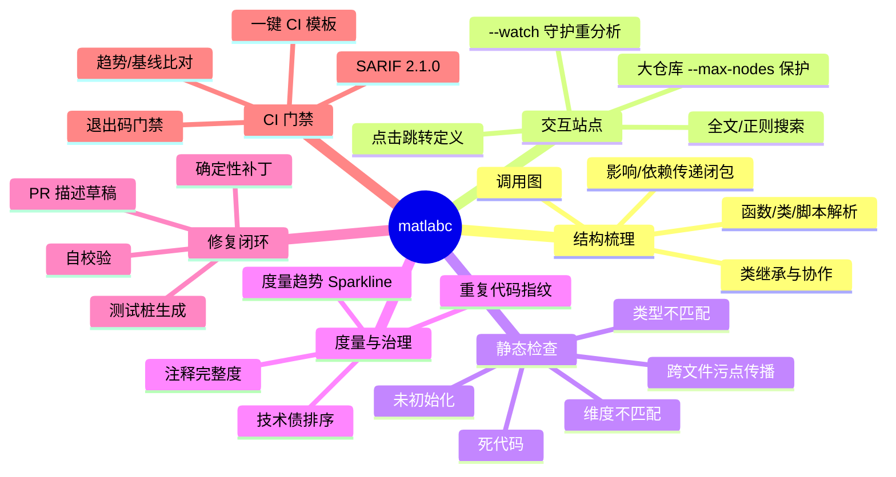
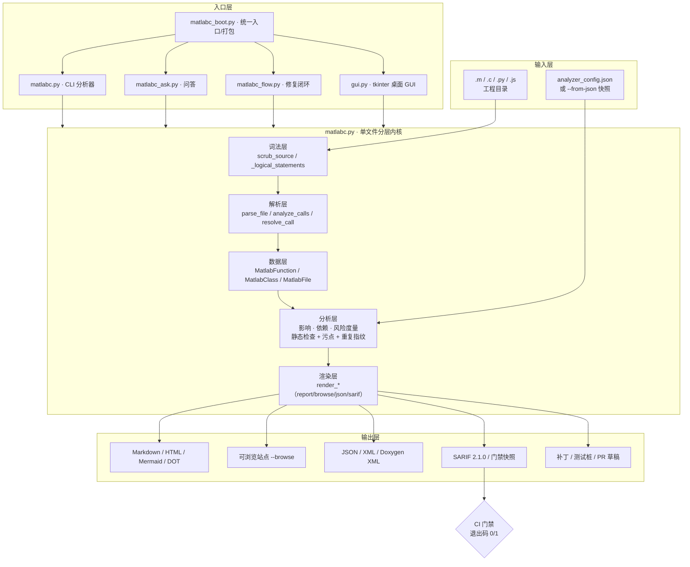
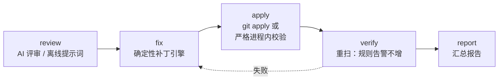
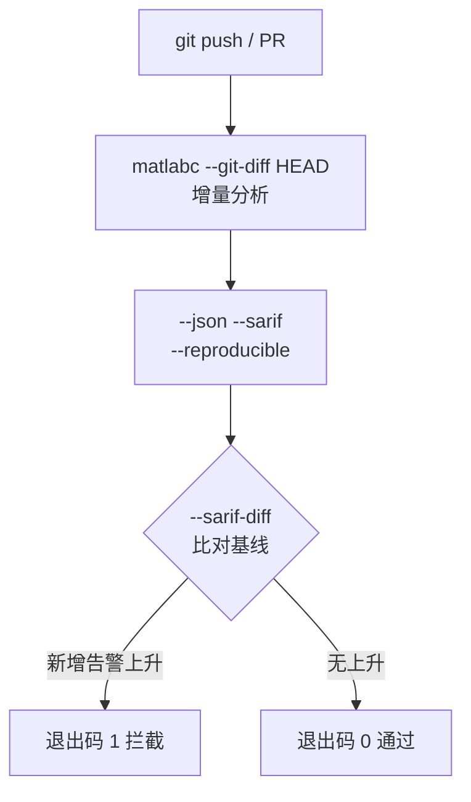

<div align="center">


# malabc

**MATLAB / Simulink 静态分析与确定性自动修复引擎（`matlabc`）**

把"读代码"变成"工作台"：它不只是梳理调用关系，更告诉你**风险在哪、有多严重、怎么改，
以及能否一键生成修复补丁 / 测试桩 / PR 草稿**，并把每一项结论都接进 **CI 质量门禁**。

<br>


-brightgreen)


[快速开始](#快速开始) · [核心能力](#核心能力) · [架构](#架构) · [命令速查](#命令速查) · [CI 门禁](#ci-质量门禁) · [English](README.md) · [许可证](#许可证)

</div>

---

## 解决什么问题

| 场景 | 旧做法 | 用 `matlabc` |
| --- | --- | --- |
| 接手陌生 MATLAB 工程 | 全局搜索 + 手动跳转，三天才摸清入口 | `--browse` 生成可点击站点，十分钟看全貌 |
| "改这个函数会影响谁？" | 凭经验猜，改完才发现漏了 | 影响 / 依赖传递闭包 + 算子影响分析 |
| "这代码里有没有隐藏风险？" | 跑 MATLAB 才能发现 | 未初始化 / 类型不匹配 / 死代码 / 维度不匹配 / 污点，全部静态可得 |
| "怎么改才安全？" | 手改，容易引入新 bug | `--gen-apply-patch` 生成确定性、自校验补丁 |
| "怎么阻止腐烂？" | 靠评审自觉 | SARIF + 退出码 + 趋势基线，CI 强制卡点 |

> **零依赖、无需 MATLAB、默认离线**：只用 Python 标准库；不依赖 MATLAB / Octave，不发起任何网络请求
> （离线优先，产物中不含 CDN 引用）——完全可在内网使用。

---

## 核心能力



### 多语言支持

| 语言 | 参数 | 关键能力 |
| --- | --- | --- |
| **MATLAB**（默认） | — | 函数 / 类 / 脚本 / 嵌套函数 / `arguments` 块 / 结构体字段 / 全局状态，完整解析 |
| **C** | `--lang c` | 函数调用 / `#include` 跨文件依赖边 / 悬空指针、越界、释放后使用启发式 |
| **Python** | `--lang py` | 函数 / 调用 / 静态检查，含 **Python 3.6 语法兼容门禁**（`--check-py36`） |
| **JavaScript** | `--lang js` | 函数 / 调用 / 全局变量、参数过多、缺文档检查 |
| **混合（MEX 桥接）** | `--mixed` | MATLAB ↔ C 跨语言调用边 |

### 静态检查规则

| 规则 | 说明 |
| --- | --- |
| `uninitialized` | 局部变量读前未写（区分"未初始化 / 可能未初始化"；仅高置信度才卡 CI） |
| `type_mismatch` | 同一变量类型前后不一致（如矩阵变量被赋标量） |
| `dead_code` | `return` 之后不可达代码 + 恒假 `if` 分支 |
| `shape_mismatch` | `A*B` / `A+B` / `A-B` 维度约束违背 |
| `tainted_sink` | 跨文件污点：用户输入 / 文件 / 网络 → 危险汇如 `system` / `eval` / `fprintf` |

**四级告警抑制**（写在源码注释里，不改业务语义）：

```matlab
% analyzer:ignore uninitialized                 % (1) 文件级：整文件不检查
% analyzer:ignore type_mismatch x -- legacy      % (2) 名称级：仅变量 x，原因可选
% analyzer:ignore-next-line shape_mismatch        % (3) 行级：仅下一行
% analyzer:disable uninitialized                  % (4) 区间级：块内全部忽略
y = a + b;
% analyzer:enable uninitialized                   %     ↑ 区间结束
```

---

## 架构



**目录结构**

```
malabc/
├─ matlabc.py          # 核心分析器 + 报告渲染（CLI 主入口，约 29k 行，零依赖）
├─ matlabc_boot.py     # 统一入口分发：无参数 = GUI / ask / flow / 否则 = 分析器
├─ matlabc_ask.py      # 问答式代码理解（BM25 检索 + 意图识别 + 大模型）
├─ matlabc_flow.py     # AI 修复闭环编排 review→fix→apply→verify→report
├─ matlabc_mcp.py      # MCP 服务器（把 matlabc 作为工具暴露给 AI Agent）
├─ ai_cli.py           # 多厂商大模型接入（离线回显 / 在线回答，优雅降级）
├─ gui.py              # 零依赖 tkinter 桌面 GUI
├─ renderers/          # 报告与可视化渲染器（report/callgraph/hotspot/sarif/snapshot...）
│  └─ assets/          # 内联 CSS 资源（离线优先，无 CDN）
├─ tests/              # 测试与样例（test_matlabc.py / eval_ai_fix / sample_m/*.m）
├─ docs/               # 完整文档（用法 / 功能 / JSON Schema / 交付报告 ...）
├─ ci-examples/        # GitHub / GitLab CI 模板样例
├─ LICENSE             # MIT 许可证（英文正本，唯一具法律效力的文本）
└─ LICENSE_CN          # MIT 许可证中文译本（仅供参考）
```

---

## 快速开始

```bash
# (1) 控制台报告（零安装，克隆即跑）
python matlabc.py my_matlab_project/

# (2) 生成可交互浏览站点（推荐：点击跳转、全文搜索）
python matlabc.py my_matlab_project/ -o report.html --browse

# (3) CI 静态分析（SARIF + 退出码门禁）
python matlabc.py my_matlab_project/ --checks all --sarif report.sarif \
    --max-warnings 0 --reproducible
```

环境要求：**Python 3.6+**（工具本身严格兼容 3.6.5；可用 `--check-py36` 自检）。
可选装为命令：执行 `pip install -e .` 后使用 `matlabc <参数>`（无参数 = GUI）。

> 也可打包为**无需 Python 的单文件可执行程序**（`build_dist.py` + `build_release.bat/.sh`）：
> 双击 = GUI，带参数 = CLI。

---

## 四个入口

### 1. 分析器（CLI）

```bash
python matlabc.py myproj/ -o report.md --html report.html --browse \
    --offline --checks all --debt --sarif report.sarif
```

### 2. `ask` —— 问答式代码理解

把静态分析结果规约为三类可检索对象——"函数文档 + 调用图 + 告警/优先级"——再用 BM25 检索 +
意图识别（谁调用 X / X 调用了谁 / 风险热点 / 解释 X）拼出给大模型的提示词。

```bash
matlabc ask "谁调用了 main" --dir ./myproj           # 打包统一入口
python matlabc_ask.py "风险最高在哪" --dir ./myproj   # 源码等效入口
python matlabc_ask.py "helper 做了什么" --json report.json --provider deepseek
```

> **离线优先**：未配置 API Key 时不调用任何模型，只回显一份"可直接粘贴"的提示词
> （含检索到的真实上下文 + 问题）。配置好厂商后，直接给出回答。

### 3. `flow` —— AI 修复闭环



```bash
matlabc flow ./myproj                    # 默认仅产出补丁 + 报告，不改任何文件
matlabc flow ./myproj --auto-apply       # 应用补丁并自校验
matlabc flow ./myproj --steps review,fix,report --lang c --provider deepseek
```

### 4. GUI（零依赖桌面界面）

```bash
python gui.py            # 或双击打包后的 matlabc.exe
python gui.py --selftest # 无头自测
```

选目录 → 勾选产物（可浏览站点 / HTML / JSON / SARIF / MD）→ 选择 AI 时机 → 一键分析并流式日志。

---

## 输出产物

| 产物 | 触发 | 用途 |
| --- | --- | --- |
| 控制台 / Markdown 报告 | `dir`（默认） / `-o` | 快速查看、留档评审 |
| HTML 报告 | `--html` | 单文件，直接分享 |
| Mermaid / Graphviz DOT | `--mermaid` / `--dot` | 嵌入 Wiki / 文档 |
| 可交互浏览站点 | `--browse`（+`--watch` 守护） | 点击跳转定义、全文搜索 |
| JSON / XML / Doxygen XML | `--json` / `--xml` / `--export-doxygen-xml` | 二次开发、doxygen 生态 |
| SARIF 2.1.0 | `--sarif`（+`--sarif-base` / `--sarif-diff`） | GitHub / GitLab 代码扫描 |
| 技术债 / 趋势 | `--debt` / `--trend` / `--gate` | 质量度量与趋势门禁 |
| 修复闭环 | `--gen-pr` / `--gen-apply-patch` / `--gen-tests-risk` | 修复落地、测试桩骨架 |
| 重复代码治理 | `--dup-*`（baseline / patch / self-verify / gate） | 复制粘贴代码异味治理 |
| 差异报告 | `--diff` / `--diff-html` | 两份快照的全维度对比 |

---

## CI 质量门禁



`ci-examples/` 提供开箱即用的 GitHub Actions / GitLab CI 模板，复制即可用。

## 命令速查

```bash
# 结构梳理报告（Markdown）
python matlabc.py myproj/ -o report.md

# 可交互浏览站点（点击跳转 + 全文搜索）
python matlabc.py myproj/ --browse -o site.html

# C 工程分析
python matlabc.py myproj/ --lang c --checks all

# Python 3.6 语法兼容门禁
python matlabc.py myproj/ --lang py --check-py36

# CI 门禁：出现任何新增告警即失败，输出 SARIF
python matlabc.py myproj/ --checks all --sarif report.sarif \
    --sarif-base baseline.sarif --sarif-diff --max-warnings 0 --reproducible

# 跨文件污点扫描
python matlabc.py myproj/ --check tainted_sink

# 生成确定性、自校验修复补丁
python matlabc flow myproj --auto-apply --gen-apply-patch

# 问答式代码理解（离线 => 回显可直接粘贴的提示词）
python matlabc_ask.py "风险最高在哪" --dir myproj
```

---

## AI Agent 集成（MCP）

`malabc` 可作为 **Model Context Protocol（MCP）** 工具服务器，被任意支持 MCP 的 AI Agent
（CodeBuddy / Cursor / Claude 等）即插即用地调用，把"代码理解 + 静态检查 + 确定性补丁"
能力接入 Agent 的自主工作流。

启动（由 Agent 的 MCP 客户端自动拉起，零第三方依赖）：

```bash
python matlabc_mcp.py
```

协议为 MCP over stdio（LSP 分包帧，兼容官方 MCP SDK）。暴露的工具：

| 工具 | 作用 |
| --- | --- |
| `matlabc_analyze` | 静态分析 + 结构梳理，生成调用关系 / 风险热点 / 技术债报告 |
| `matlabc_check` | 门禁式静态检查（`uninitialized` / `type_mismatch` / `dead_code` / `shape_mismatch` / `tainted_sink`） |
| `matlabc_ask` | 自然语言问答式代码理解（谁调用 X / 风险热点 / 解释 X） |
| `matlabc_gen_patch` | 运行 AI 修复闭环，生成 / 应用确定性修复补丁 |
| `matlabc_version` | 返回引擎版本与能力清单，供 Agent 能力协商 |

> **设计要点**：server 通过 `subprocess` 复用 `matlabc` 现有 CLI（进程隔离、行为一致）；
> 拉起的子进程**整棵进程树**在 server 退出 / 超时时被强制回收（Windows `taskkill /T`、
> POSIX `killpg`），避免孤儿进程跑飞。所有工具返回带 `isError` 标记，便于 Agent 做错误分支。

Agent 调用示例（伪代码）：

```json
{"method":"tools/call","params":{"name":"matlabc_check",
 "arguments":{"target":"src/","check":"uninitialized","max_warnings":0}}}
```

---

## 文档

- [docs/matlabc_USAGE.md](docs/matlabc_USAGE.md) — 完整命令行用法参考
- [docs/matlabc_FEATURES.md](docs/matlabc_FEATURES.md) — 能力细节与示例
- [docs/matlabc_JSON_SCHEMA.md](docs/matlabc_JSON_SCHEMA.md) — JSON 输出 schema
- [docs/matlabc_DELIVERY_REPORT.md](docs/matlabc_DELIVERY_REPORT.md) — 交付 / 打包说明
- [docs/matlabc_STRUCTURE.md](docs/matlabc_STRUCTURE.md) — 代码结构总览
- [docs/matlabc_AI_ROADMAP.md](docs/matlabc_AI_ROADMAP.md) — AI 演进路线图

---

## 许可证

[MIT](LICENSE) —— 详见 [LICENSE](LICENSE)（英文正本，唯一具法律效力的文本）与
[LICENSE_CN](LICENSE_CN)（中文译本，仅供参考）。

---

> 本文档拥有完全对应的 **英文版本**：[README.md](README.md)。两者按章节一一对应、保持同步；
> 单个文件内不混用语言。
