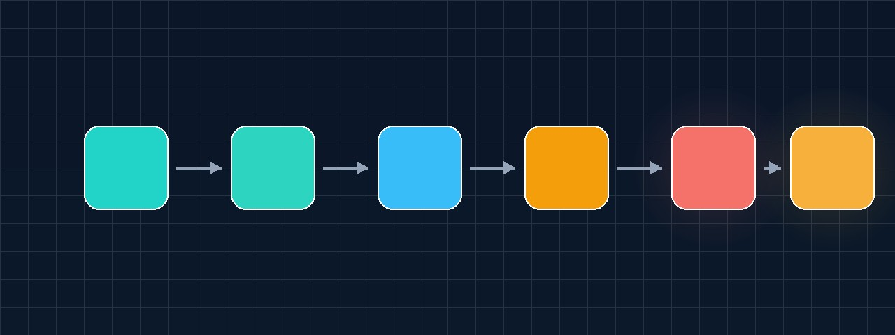
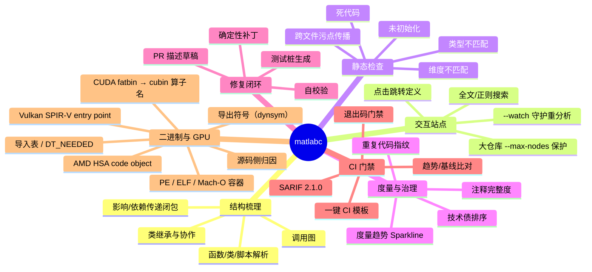
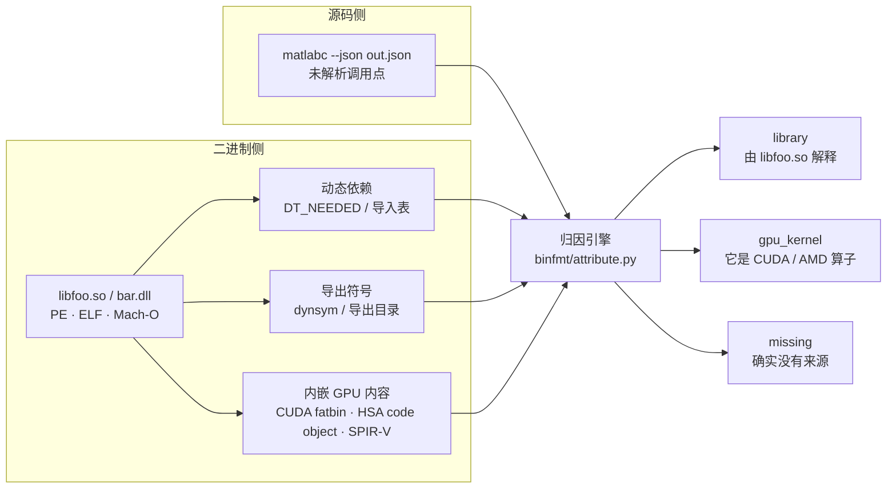
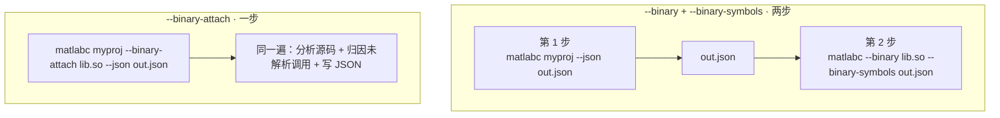
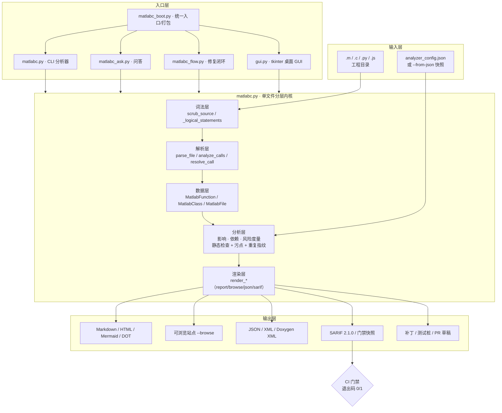
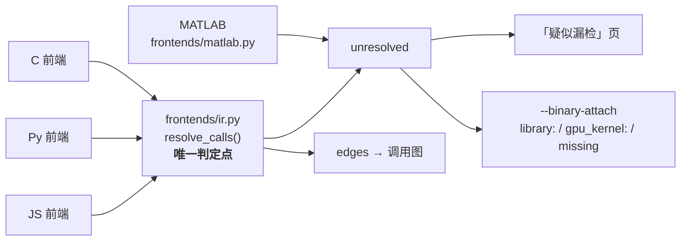
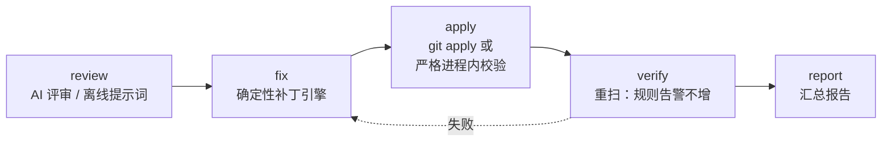
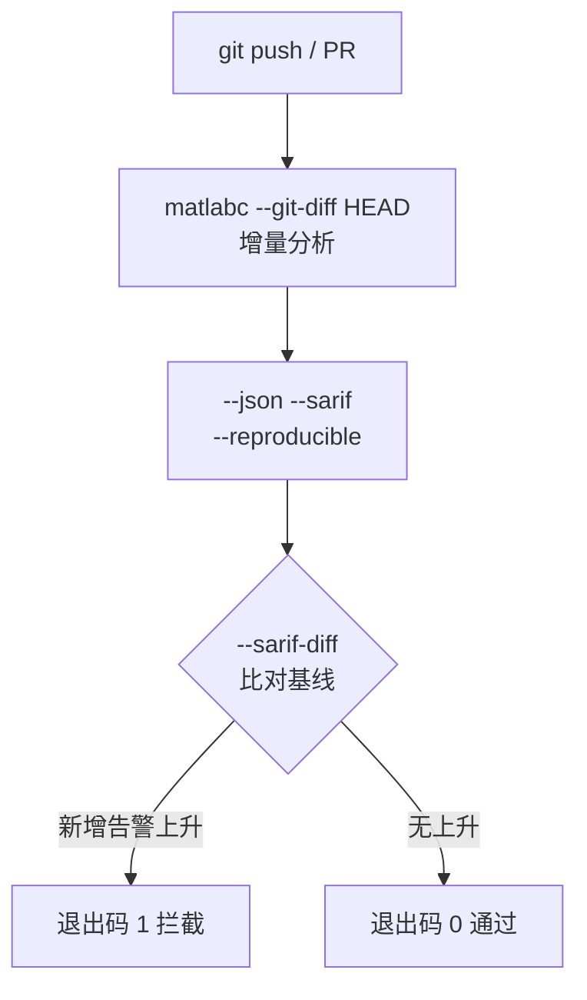
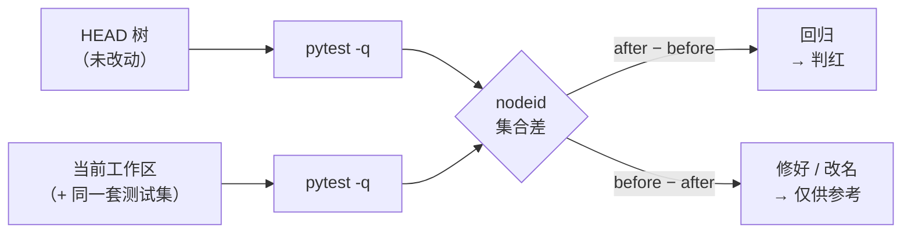

<div align="center">



# malabc

**静态分析与确定性自动修复引擎 —— MATLAB / Simulink、C·C++（子集）、Python、JavaScript，以及 PE / ELF / Mach-O 二进制与其中内嵌的 CUDA · ROCm · Vulkan GPU 内容**

把"读代码"变成"工作台"：它不只是梳理调用关系，更告诉你**风险在哪、有多严重、怎么改，
以及能否一键生成修复补丁 / 测试桩 / PR 草稿**，并把每一项结论都接进 **CI 质量门禁**。

<br>


-brightgreen)


[快速开始](#快速开始) · [核心能力](#核心能力) · [架构](#架构) · [二进制与 GPU](#二进制与-gpu-分析---binary) · [命令速查](#命令速查) · [CI 门禁](#ci-质量门禁) · [自验证质量门](#自验证质量门quality-gates) · [English](README.md) · [许可证](#许可证)

</div>

---

## 解决什么问题

| 场景 | 旧做法 | 用 `matlabc` |
| --- | --- | --- |
| 接手陌生 MATLAB 工程 | 全局搜索 + 手动跳转，三天才摸清入口 | `--browse` 生成可点击站点，十分钟看全貌 |
| "改这个函数会影响谁？" | 凭经验猜，改完才发现漏了 | 影响 / 依赖传递闭包 + 算子影响分析 |
| "这代码里有没有隐藏风险？" | 跑 MATLAB 才能发现 | 未初始化 / 类型不匹配 / 死代码 / 维度不匹配 / 污点，全部静态可得 |
| "怎么改才安全？" | 手改，容易引入新 bug | `--gen-apply-patch` 生成确定性、自校验补丁 |
| "怎么阻止腐烂？" | 靠评审自觉 | SARIF + 退出码 + 趋势基线，CI 强制卡点 |
| "这个调用解析不出来 —— 是我们写错了，还是它本就是库函数？" | 靠猜，或手动翻磁盘 | `--binary` + `--binary-symbols`，或用一条命令搞定的 `--binary-attach`：每个未解析名字都被归到某个库、某个 GPU kernel，或标记 `missing` |

> **零依赖、无需 MATLAB、默认离线**：只用 Python 标准库；不依赖 MATLAB / Octave，不发起任何网络请求
> （离线优先，产物中不含 CDN 引用）——完全可在内网使用。

---

## 核心能力



### 多语言支持

| 语言 | 参数 | 关键能力 |
| --- | --- | --- |
| **MATLAB**（默认） | — | 函数 / 类 / 脚本 / 嵌套函数 / `arguments` 块 / 结构体字段 / 全局状态，完整解析 |
| **C / C++** | `--lang c`（别名 `--lang cpp`） | `.c/.h/.cc/.cpp/.cxx/.hpp/.hh/.hxx`；函数调用 / `#include` 跨文件依赖边 / 悬空指针、越界、释放后使用、重复释放、缓冲区溢出启发式。**对字面量 `#if 0` 具备预处理感知**：死分支不再被分析（**行号保持不变**），`#else` 分支照常分析 —— `#ifdef` / `#if defined` 刻意**不动**，不做猜测。函数定义识别走「**词法 + 括号配平**」扫描（R49）：`名字(参数) {` **跨行**（Allman 花括号、返回类型独占一行、参数表跨行）的定义同样可见 —— 实测 glibc-2.37（13,527 个 `.c/.h`）漏识率由 **99.05%** 降到 **0.04%**，`unresolved` 假阳性归零。C++ 按 **C 子集**解析（模板/类/命名空间不保证识别）—— 已披露的降级，不是静默丢弃 |
| **Python** | `--lang py` | 函数 / 调用 / 静态检查（`py_unused_import` / `py_dup_params` / `py_too_many_params` / `py_missing_doc` / `py_eval_usage` / `py_sql_injection`），含 **Python 3.6 语法兼容门禁**（`--check-py36`） |
| **JavaScript** | `--lang js` | 函数 / 调用 / 静态检查（`js_unused_import` / `js_global_var` / `js_too_many_params` / `js_missing_doc` / `js_dangerous_call` / `js_unused_var` / `js_prototype_pollution`） |
| **混合（MEX 桥接）** | `--mixed` | MATLAB ↔ C 跨语言调用边 |

**语言支持边界（显式，不静默）**：`--lang` 只覆盖 MATLAB / C·C++ / Python / JavaScript。TypeScript、Rust、Go、Java、Kotlin、C#、Swift、Scala、Ruby、PHP **没有前端**：当目录里存在这些文件、而本次请求的语言一个源文件都没找到时，CLI 会向 stderr 打印 `[warn]` 行，点名语言与被跳过的文件，而不是悄悄给出「0 文件 / 0 函数」。与本次语言的源文件**混放**时，这些文件会被**安静跳过** —— 别把「本次语言 0 文件」当成「目录里什么都没有」。跨语言算子只有在**确有代码路径会产出**时才会出现在算子目录里；刻意不实现的算子登记在 `_UNIMPLEMENTED_KINDS` 并写明原因，`tools/check_operator_impl.py` 会在两者不一致时让构建失败。

### 二进制与 GPU 分析（`--binary`）

源码侧分析能告诉你**有个调用没解析出来**，却告诉你**为什么**。`--binary` 补上这一环：
把它指向你代码实际链接的那些库，每个没解析出来的名字都会得到归属。



```bash
# 这个库依赖什么、导出了什么？
python matlabc.py --binary libfoo.so

# 让源码侧和二进制侧回答同一个问题
python matlabc.py myproj/ --json out.json                              # ① 找出未解析调用
python matlabc.py --binary libcublas.so.12 --binary-symbols out.json   # ② 给它们归属

# 机器可读，便于接进你自己的流水线
python matlabc.py --binary a.dll,b.so --binary-json -
```

| 后端 | 它藏在哪 | 怎么找 | 能提出什么 |
| --- | --- | --- | --- |
| **CUDA** | PE `.nv_fatb` · ELF `.nv_fatbin` · PE/ELF `.nvFatBi` / `.nvFatBin` | fatbin 魔数 `0xba55ed50`；再经 cubin 的 `.text._Z…` **节名表**定位 | kernel 名 + 可反解（demangle）形式、SM 目标、code object 计数 |
| **ROCm / HIP** | PE/ELF `.hip_fat` / `.hipFatBin` | HSA code object 头（`e_ident[7]` = 64、`e_machine` = 224） | 可信 code object 计数（kernel 名**不猜**） |
| **Vulkan** | **没有专用段** —— SPIR-V 躲在 `.rdata` 里 | 裸魔数扫描 `0x03022307`（解 `OpEntryPoint`） | entry point 名、模块数 |
| **PTX** | 同一个 fatbin 段内 | `.entry <名字>(`，**必须**后随左括号 | **通常提不到东西** —— 见下方「诚实的边界」 |

> **实测记录 —— 8 字节陷阱。** PE 的段名被硬截断到 8 字节。同一个 CUDA 段在 ELF 里叫
> `.nv_fatbin`，在 PE 里叫 `.nv_fatb`；`.nvFatBin` 变成 `.nvFatBi`；AMD 的 `.hip_fatbin`
> 变成 `.hip_fat`。只认完整拼写的匹配器，会在**每一个** Windows 二进制上报告「零个 GPU
> 内容」—— 静默地、不报错地。现在两种拼写都匹配。

> **实测记录 —— cubin 不是标准 ELF。** cubin 的 `e_type = 0x8000`、`e_machine = 0x100`，
> `e_shoff` 落在 `0xCAFE…` 哨兵值上。唯一可信的判别字段是 `e_ident[7]`
> （`ELFOSABI_CUDA` = 51）与 `e_ident[8]`。数 `\x7fELF` 出现次数只是**便宜**信号，
> 它与**严格**信号被放在**不同字段**里（`suspect_code_objects` 与 `confidence_code_objects`），
> 二者不可能被混淆。

**诚实的边界（都是实测出来的，不是猜的）。**

- **PTX 基本提不出 kernel 名。** 要求 `.entry <名字>(` 后随左括号，在一份 692 MB 的真实驱动
  发行包上只剩约 2 个可用名字；其余 `.entry ` 命中都是二进制元数据。真正有效的是 cubin 里的
  **`.text._Z…` 节名表** —— 实测在一个厂商 BLAS 库里提出 **171** 个独立 kernel 名、另一个
  库 **59** 个，且 100% 可反解。
- **Mach-O 已实现但未经实测。** 开发机上没有 Mach-O 样本；解析器会把这件事写进报告的
  `notes`，而不是假装验证过。
- **「不可解析」是一等状态。** 提不出内容的 GPU 段会报成 `NOT-PARSEABLE` **并附书面原因**，
  绝不静默给 0 个 kernel。
- **截断一定可见。** `--binfmt-scan-cap`（默认 64 MiB）限制扫描量；一旦截断，报告打印
  `[TRUNCATED]`。
- **运行期绑定不在范围内。** 不追踪 `dlopen` / `LoadLibrary` / `dlsym` / `LD_PRELOAD`，
  也不解析 `Makefile` / `CMakeLists.txt` 的链接意图（`-lfoo` 只作为候选名提示）。
  要看运行期谁加载了谁，请用外部装置：`ltrace` / `strace -e openat` / `LD_DEBUG=bindings`
  —— 它们是运行期装置，静态分析原理上给不出这个答案。

#### 一条命令代替两条：`--binary-attach`

`--binary` 会**短路** —— 看完二进制就退出。`--binary-attach` 刻意**不短路**：它先照常做源码
分析，再顺手把刚刚发现的未解析调用拿去二进制里对账 —— 一次调用完成，不需要在中途搬一个
JSON 文件。



| | `--binary` | `--binary-attach` |
| --- | --- | --- |
| 同一次调用里做源码分析 | 不 —— 只看二进制 | **做** —— 做完再归因 |
| 名字从哪来 | 你事先用 `--binary-symbols` 备好的文件 | 自动取自源码侧 |

```bash
# 一条命令：分析 myproj，再把它的未解析调用拿去 libblas.so 里对账
python matlabc.py myproj/ --binary-attach libblas.so --json out.json
```

只依据你**显式给出**的二进制。没给的库一律 `missing`，绝不猜 —— 一个假阳性会把真缺陷洗白成
「来自某个库」，比不归因更糟。JSON 里结果落在 `unresolved_attribution`（`{summary, rows}`），
且**未给该开关时这个键不存在** —— 不留一个可能被下游误读成「归因过、但一个都没命中」的空壳。

名字仍然落在 `missing` 时，它还会再走一步：读工程里的 `Makefile` / `CMakeLists.txt`，
把其中**字面量**的链接意图列出来（`-lblas` → 候选 `libblas.so`，`find_package(BLAS)` 也算线索），
让你看到**下一步该把哪个库传进来**。含变量的 `-l$(X)` 只会被记成一条明确的 note，绝不猜。

### 静态检查规则

| 规则 | 说明 |
| --- | --- |
| `uninitialized` | 局部变量读前未写（区分"未初始化 / 可能未初始化"；仅高置信度才卡 CI） |
| `type_mismatch` | 同一变量类型前后不一致（如矩阵变量被赋标量） |
| `dead_code` | `return` 之后不可达代码 + 恒假 `if` 分支 |
| `shape_mismatch` | `A*B` / `A+B` / `A-B` 维度约束违背 |
| `tainted_sink` | 跨文件污点：用户输入 / 文件 / 网络 → 危险汇如 `system` / `eval` / `fprintf` |
| `py_eval_usage` | `--lang py`：函数体内裸调 `eval()` / `exec()`（代码注入 / 沙箱逃逸） |
| `py_sql_injection` | `--lang py`：拼接 / `%` / `.format()` 构造 SQL 后交给 `execute()`；参数化查询不报 |
| `c_double_free` | `--lang c`：同一指针 free 两次且中间无重新赋值 |
| `c_buffer_overflow` | `--lang c`：`strcpy`/`strcat`/`sprintf`/`gets`（或未用 `sizeof(buf)` 的 `memcpy`/`strncpy`）写入固定大小缓冲区 |
| `js_dangerous_call` | `--lang js`：`eval` / `new Function` / `document.write` / `innerHTML` 赋值 / `insertAdjacentHTML` / 定时器字符串 |
| `js_unused_var` | `--lang js`：函数体内简单声明后从未再被引用的局部变量 |
| `js_prototype_pollution` | `--lang js`：直写 `__proto__`、`prototype[<变量>] =`、`constructor.prototype`，或 for-in 合并中写 `target[key]` |

**四级告警抑制**（写在源码注释里，不改业务语义）：

```matlab
% analyzer:ignore uninitialized                 % (1) 文件级：整文件不检查
% analyzer:ignore type_mismatch x -- legacy      % (2) 名称级：仅变量 x，原因可选
% analyzer:ignore-next-line shape_mismatch        % (3) 行级：仅下一行
% analyzer:disable uninitialized                  % (4) 区间级：块内全部忽略
y = a + b;
% analyzer:enable uninitialized                   %     ↑ 区间结束
```

---

## 架构



**目录结构**

```
malabc/
├─ matlabc.py          # 核心分析器 + 报告渲染（CLI 主入口，约 29k 行，零依赖）
├─ matlabc_boot.py     # 统一入口分发：无参数 = GUI / ask / flow / 否则 = 分析器
├─ matlabc_ask.py      # 问答式代码理解（BM25 检索 + 意图识别 + 大模型）
├─ matlabc_flow.py     # AI 修复闭环编排 review→fix→apply→verify→report
├─ matlabc_mcp.py      # MCP 服务器（把 matlabc 作为工具暴露给 AI Agent）
├─ frontends/          # 「哪个调用解析不到」的**唯一判定点**
│  ├─ ir.py            #   共享 IR + resolve_calls()；唯一做判定的地方
│  ├─ matlab.py        #   MATLAB 自己的 unresolved 产出器（形状不同，契约相同）
│  └─ __init__.py      #   对外接口 + IR_LANG_OWNERS（哪种语言归谁）
├─ binfmt/             # 二进制与 GPU 容器分析（零依赖）
│  ├─ model.py         #   统一 IR：Section / Symbol / Dependency / GpuBlob / BinaryReport
│  ├─ pe.py  elf.py    #   PE32+ 与 ELF64/32 流式解析（含 CUDA/AMDGPU 判别）
│  ├─ macho.py         #   Mach-O（⚠ 已实现但未经实测 —— 开发机无样本）
│  ├─ gpu.py           #   CUDA fatbin/cubin · HSA code object · SPIR-V entry point
│  ├─ attribute.py     #   归因：未解析名字 → library / gpu_kernel / missing
│  ├─ buildsys.py      #   Makefile / CMakeLists.txt 链接意图提示
│  └─ report.py        #   文本报告（绝不隐藏负面状态）
├─ tools/              # 自验证静态护栏（见「自验证质量门」一节）
│  ├─ check_all.py     #   一键跑完全部 check_*.py 及各自的 --selftest
│  └─ check_*.py       #   文档开关 · 算子实装 · 补丁算子 · 3.6 兼容 ·
│                      #   帮助契约 · binfmt 夹具 · 子进程卫生 ·
│                      #   README 对等 · 公平基线 · IR 归因
├─ ai_cli.py           # 多厂商大模型接入（离线回显 / 在线回答，优雅降级）
├─ gui.py              # 零依赖 tkinter 桌面 GUI
├─ renderers/          # 报告与可视化渲染器（report/callgraph/hotspot/sarif/snapshot...）
│  └─ assets/          # 内联 CSS 资源（离线优先，无 CDN）
├─ tests/              # 测试与样例（test_matlabc.py / eval_ai_fix / sample_m/*.m）
├─ docs/               # 完整文档（用法 / 功能 / JSON Schema / 交付报告 ...）
├─ ci-examples/        # GitHub / GitLab CI 模板样例
├─ LICENSE             # MIT 许可证（英文正本，唯一具法律效力的文本）
└─ LICENSE_CN          # MIT 许可证中文译本（仅供参考）
```

**一条规则只有一个地方判。** `resolve_calls()` 是唯一决定「这个调用解析不到」的代码；
下游三处 —— 调用图、「疑似漏检」页、二进制归因 —— 读的都是这同一个结论，
而不是各自再推一遍。



---

## 快速开始

```bash
# (1) 控制台报告（零安装，克隆即跑）
python matlabc.py my_matlab_project/

# (2) 生成可交互浏览站点（推荐：点击跳转、全文搜索）
python matlabc.py my_matlab_project/ -o report.html --browse

# (3) CI 静态分析（SARIF + 退出码门禁）
python matlabc.py my_matlab_project/ --checks all --sarif report.sarif \
    --max-warnings 0 --reproducible
```

环境要求：**Python 3.6+**（工具本身严格兼容 3.6.5；可用 `--check-py36` 自检）。
可选装为命令：执行 `pip install -e .` 后使用 `matlabc <参数>`（无参数 = GUI）。

> 也可打包为**无需 Python 的单文件可执行程序**（`build_dist.py` + `build_release.bat/.sh`）：
> 双击 = GUI，带参数 = CLI。

---

## 四个入口

### 1. 分析器（CLI）

```bash
python matlabc.py myproj/ -o report.md --html report.html --browse \
    --offline --checks all --debt --sarif report.sarif
```

### 2. `ask` —— 问答式代码理解

把静态分析结果规约为三类可检索对象——"函数文档 + 调用图 + 告警/优先级"——再用 BM25 检索 +
意图识别（谁调用 X / X 调用了谁 / 风险热点 / 解释 X）拼出给大模型的提示词。

```bash
matlabc ask "谁调用了 main" --dir ./myproj           # 打包统一入口
python matlabc_ask.py "风险最高在哪" --dir ./myproj   # 源码等效入口
python matlabc_ask.py "helper 做了什么" --json report.json --provider deepseek
```

> **离线优先**：未配置 API Key 时不调用任何模型，只回显一份"可直接粘贴"的提示词
> （含检索到的真实上下文 + 问题）。配置好厂商后，直接给出回答。

### 3. `flow` —— AI 修复闭环



```bash
matlabc flow ./myproj                    # 默认仅产出补丁 + 报告，不改任何文件
matlabc flow ./myproj --auto-apply       # 应用补丁并自校验
matlabc flow ./myproj --steps review,fix,report --lang c --provider deepseek
```

### 4. GUI（零依赖桌面界面）

```bash
python gui.py            # 或双击打包后的 matlabc.exe
python gui.py --selftest # 无头自测
```

选目录 → 勾选产物（可浏览站点 / HTML / JSON / SARIF / MD）→ 选择 AI 时机 → 一键分析并流式日志。

---

## 输出产物

| 产物 | 触发 | 用途 |
| --- | --- | --- |
| 控制台 / Markdown 报告 | `dir`（默认） / `-o` | 快速查看、留档评审 |
| HTML 报告 | `--html` | 单文件，直接分享 |
| Mermaid / Graphviz DOT | `--mermaid` / `--dot` | 嵌入 Wiki / 文档 |
| 可交互浏览站点 | `--browse`（+`--watch` 守护） | 点击跳转定义、全文搜索 |
| JSON / XML / Doxygen XML | `--json` / `--xml` / `--export-doxygen-xml` | 二次开发、doxygen 生态 |
| SARIF 2.1.0 | `--sarif`（+`--sarif-base` / `--sarif-diff`） | GitHub / GitLab 代码扫描 |
| 技术债 / 趋势 | `--debt` / `--trend` / `--gate` | 质量度量与趋势门禁 |
| 修复闭环 | `--gen-pr` / `--gen-apply-patch` / `--gen-tests-risk` | 修复落地、测试桩骨架 |
| 重复代码治理 | `--dup-*`（baseline / patch / self-verify / gate） | 复制粘贴代码异味治理 |
| 二进制 / GPU 报告 | `--binary`（+`--binary-symbols` / `--binary-json` / `--binfmt-scan-cap`） | 动态依赖、导出符号、CUDA/ROCm/Vulkan 内容，以及源码侧归因 |
| 差异报告 | `--diff` / `--diff-html` | 两份快照的全维度对比 |

---

## CI 质量门禁



`ci-examples/` 提供开箱即用的 GitHub Actions / GitLab CI 模板，复制即可用。

## 命令速查

```bash
# 结构梳理报告（Markdown）
python matlabc.py myproj/ -o report.md

# 可交互浏览站点（点击跳转 + 全文搜索）
python matlabc.py myproj/ --browse -o site.html

# C 工程分析
python matlabc.py myproj/ --lang c --checks all

# Python 3.6 语法兼容门禁
python matlabc.py myproj/ --lang py --check-py36

# CI 门禁：出现任何新增告警即失败，输出 SARIF
python matlabc.py myproj/ --checks all --sarif report.sarif \
    --sarif-base baseline.sarif --sarif-diff --max-warnings 0 --reproducible

# 跨文件污点扫描
python matlabc.py myproj/ --checks tainted_sink

# 二进制分析：动态依赖、导出符号、GPU 内容
python matlabc.py --binary libfoo.so

# 未解析调用的归因：源码侧 ↔ 二进制侧
python matlabc.py myproj/ --json out.json
python matlabc.py --binary libcublas.so.12 --binary-symbols out.json

# ……或用一条命令同时做掉（不需要中转 JSON）
python matlabc.py myproj/ --binary-attach libcublas.so.12 --json out.json

# 生成确定性、自校验修复补丁
python matlabc flow myproj --auto-apply --gen-apply-patch

# 问答式代码理解（离线 => 回显可直接粘贴的提示词）
python matlabc_ask.py "风险最高在哪" --dir myproj
```

---

## AI Agent 集成（MCP）

`malabc` 可作为 **Model Context Protocol（MCP）** 工具服务器，被任意支持 MCP 的 AI Agent
（CodeBuddy / Cursor / Claude 等）即插即用地调用，把"代码理解 + 静态检查 + 确定性补丁"
能力接入 Agent 的自主工作流。

启动（由 Agent 的 MCP 客户端自动拉起，零第三方依赖）：

```bash
python matlabc_mcp.py
```

协议为 MCP over stdio（LSP 分包帧，兼容官方 MCP SDK）。暴露的工具：

| 工具 | 作用 |
| --- | --- |
| `matlabc_analyze` | 静态分析 + 结构梳理，生成调用关系 / 风险热点 / 技术债报告 |
| `matlabc_check` | 门禁式静态检查（`uninitialized` / `type_mismatch` / `dead_code` / `shape_mismatch` / `tainted_sink`） |
| `matlabc_ask` | 自然语言问答式代码理解（谁调用 X / 风险热点 / 解释 X） |
| `matlabc_gen_patch` | 运行 AI 修复闭环，生成 / 应用确定性修复补丁 |
| `matlabc_version` | 返回引擎版本与能力清单，供 Agent 能力协商 |

> **设计要点**：server 通过 `subprocess` 复用 `matlabc` 现有 CLI（进程隔离、行为一致）；
> 拉起的子进程**整棵进程树**在 server 退出 / 超时时被强制回收（Windows `taskkill /T`、
> POSIX `killpg`），避免孤儿进程跑飞。所有工具返回带 `isError` 标记，便于 Agent 做错误分支。

Agent 调用示例（伪代码）：

```json
{"method":"tools/call","params":{"name":"matlabc_check",
 "arguments":{"target":"src/","check":"uninitialized","max_warnings":0}}}
```

---

## 自验证质量门（Quality Gates）

项目对自己能力的每一项宣称，都由**可执行的护栏**兜底。一条命令全跑：

```bash
python tools/check_all.py        # 跑完 tools/check_*.py 全部护栏 + 各自的 --selftest
```

| 护栏 | 它拦住什么 |
| --- | --- |
| `check_baseline.py` | `P1–P4/T1` — 「这次改动有没有让测试变差？」—— 按失败 **nodeid 集合**比对，不是比个数。本仓测试集**本来就不全绿**，所以个数证明不了任何事：124 → 123 可能是「修好一个」，也可能是「修好两个又弄坏一个」。`--full` 真跑两侧；默认模式只做前置条件体检 + 判定逻辑两向自证。「仓库」含**两种形态**：`.git` 是目录，或 `.git` 是首行 `gitdir:` 指向**存在**目录的文件（`git worktree add`）—— 旧判据只认前者，于是在 worktree 里 `check_all` 根本跑不起来（R54）。**T1（R63）**再把「**本轮新增/改动过**的测试」单列一类：`--full` 把**当前** `tests/` 复制进导出树，而树里的 `tools/` 还是**上一个提交**的，所以断言本轮产品事实的测试在 before 侧**必然**红。这类 nodeid 登记它是**错的** —— 提交后导出树就带上产品了，下一轮它不再出现在 fixed 里，登记**当场变陈旧**（B3） |
| `check_doc_flags.py` | `NO_HELP_SCRIPTS` — 文档**或帮助正文**里宣传了一个**其实不存在**的命令行开关（真发生过：README 写过 `--check tainted_sink`，而 argparse 会以**歧义前缀**拒绝它） |
| `check_operator_impl.py` | `_UNIMPLEMENTED_KINDS` — 「幻影算子」（出现在算子目录里、却没有任何代码路径会产出）、元表与未实现表自相矛盾，以及**「不做」这件事没写进 `--help`** |
| `check_patch_ops.py` | `G0–G3` — 会**覆盖**目标行（而不是插在其前）的补丁算子 —— 那等于静默删源码 |
| `check_binfmt_fixtures.py` | `C1–C12` — 二进制 / GPU 解析器回归 —— 合成 PE/ELF/Mach-O 夹具 + 契约断言 C1–C12。**R68**：一个动态库「我依赖谁」的三种机制现在都读得出来 —— ELF 的 `DT_NEEDED`、PE 的导入表、Mach-O 的 `LC_LOAD_DYLIB`（含 weak/reexport/upward/lazy）+ `LC_ID_DYLIB` + `LC_RPATH` + `LC_LOAD_DYLINKER`（C10）；Mach-O 的 `LC_SYMTAB` 外部符号读入，且内部 / 调试符号严格不混进导出表（C11）；库名**家族**归一，让 `libfoo.so.1`、`libfoo.so.1.2.3`、`libfoo.1.dylib` 算同一个库，而 rpath/runpath 绝不会被当成「你还得加进来的库」（C12）。**R68 还顺手量出一个缺陷**：那个归一函数的 `.framework` 支路**不可达** —— 取 basename 发生在判 `.framework/` **之前**，于是 `@rpath/Foo.framework/Versions/A/Foo` 返回 `foo`，而函数自己的文档字符串写的是 `foo.framework`；顺序已修正，三种 framework 写法由 C12 的夹具钉住 |
| `check_py36_clean.py` | `--check-py36` — 本仓违背**自己**的 Python 3.6.5 承诺（已经发生过：`list[str]` 与 `from __future__ import annotations` 都曾提交进来） |
| `check_subprocess_hygiene.py` | `S1–S5` — 任何「捕获输出却继承 stdin」或「可能永远挂住」的子进程调用 |
| `check_help_contract.py` | `B0–B5` — 代码里有、`--help` 里没有的退出码（或反之）；帮助丢了用法示例 / 图示 / 退出码段；**示例命令其实跑不起来**；帮助**悄悄缩水或臃肿**（绝对界 **+** 对已批准快照的 **±64 B** 漂移带 **+** 对 `--help` **规范形**的**逐字节**比对 —— 规范形与解释器、终端宽度都无关，分辨率 **1 字节**）；`ci-examples/` 模板宣称的退出码；以及**散文里陈旧的「N 道护栏」数字** |
| `check_ir_attribution.py` | `I0–I7` — 「这个调用解析不到」被**第二处**独立判定。R44 之前这条规则被**抄了五遍**（`build_c_model` / `_build_ext_model` 内联，三个 `build_edges` 逐字复制），于是调用图与二进制归因讨论的**可能不是同一批名字**，而两边都不报错。此门钉住全仓写点的**集合**、每个写点的**写入形状**，以及每一次「再抄一遍」都绕不过的 `func_index.get(x.lower())` 查表 —— 任何未登记的「按小写名查函数索引」谓词即红；**C7'** 钉住 **C 扩展名的事实源**—— `CFrontend.exts` 必须**引用** `matlabc.py::_C_SOURCE_EXTS` 而不是复制它（R50 实测：前端声明 2 类，而 `collect_c_files` 真认 8 类）|
| `check_import_graph.py` | `G1–G7` — **import 期成环**。`renderers/*` 原先在各文件**底部** `from matlabc import ...` 借用符号，而 `matlabc.py` 也在自己底部再导出 `renderers.*` —— 这是**真的** import 期环，只靠一份「被借用的名字必须已经定义在再导出点之前」的**隐式时序契约**才跑得起来，而那份契约没有任何对手方，测试、`git status`、`git diff` 都看不见它。R52 把借用搬到惰性代理（`renderers/_late.py`），import 期图于是无环；这道门不让它长回来，并要求剩余的惰性环与每一条「指向本仓模块的动态 import」都**登记 + 两向核对**（未登记 → 红；陈旧登记 → 也红）。**G7** 把同一条纪律推到这条通道的**内容侧**：`renderers/_late.py::BORROWED` 是借用清单的静态单一事实源 —— 用了 `_mL.X` 却没登记 → 红；登记了却再没有使用点、或登记了 `matlabc.py` 模块层里没有的名字 → 也红 |
| `check_flow_diagrams.py` | `D1–D12` — README 里嵌的图、`flow/diagrams/` 里的文件、`candidate*.json` 里的声明、交互产物与 `flow/FLOW_INDEX.json` 索引 —— **六条来源两两对齐**（D1–D12，每一对都双向）：裂图、没人引用的旧图、只补了英文没补中文、以及 SVG 自身形态不成立（尺寸/字体/双主题/含外链）都必须红 |
| `check_boundary_reverse.py` | `V1–V5` — 「诚实的边界」里那些**书面承诺还成不成立**。R51 只核对「这句话还在不在」，这台门给每条边界接上能说「不」的判据（V1–V5）：未认领 / 又认领又豁免（歧义）/ 豁免理由过短 / 认领的 head 已成陈迹 / 只有「必须不出现」的空断言 / 棘轮被改动而不改常量，都要红。**R56**：V1 的准入条件从「含 6 个否定标记词」放宽为「**每一条** bullet」—— 旧口径把 `* Mach-O：`（一句状态声明，一个标记词都没有）**整条跳过**了，而它的行为对手方其实一直在 `check_binfmt_fixtures.py` 的 C8/C9 上 |
| `check_c_frontend_shapes.py` | `F1–F6` — C 前端的**函数定义形态**丢掉一个已经修过一次的 case。R49 把行锚定正则 `_RE_C_FUNC` 换成词法 + 括号配平扫描，并在 glibc 上证过（漏识 15,471 → 4，且全在 `#if 0` 死区），但那份证据**只活在仓库外**（`_r49/`），而产品的 `_scan_c_definitions_selftest()` 在**产品里零调用点** —— 于是 `check_all.py` 跑完全部护栏，仍然没有任何东西能对 C 前端形态说「不」。本门用**公开 CLI** 跑三个合成夹具，钉住六条**互不重叠**的判据：P1/P2/P3/P4 四种书写形态（F1）、指针返回类型紧贴函数名（F2）、参数 / 返回类型值域（F3）、**字符串字面量**里的花括号不得干扰函数体边界（F4）、声明起点行号（F5），以及「不假阳」与帮助正文已披露的「不识别 K&R / 返回函数指针」边界（F6 带正向半边，所以不会是空断言）。夹具完备性（`R2`）与五个棘轮（`R1`）挡住「判据悄悄缩水」 |
| `check_py_js_frontend_shapes.py` | `G1–G7 (py/js)` — Python / JS 前端丢掉一个已经处理过一次的定义形态。独立装置（`_r66/probe_r66a_forms.py`）实测：Python 的 **8** 个真实形态里**漏 4 个**（`def one(): return 1`、`async def`、`-> bool` 返回注解、参数表跨行），JS 的 **10** 个里**漏 8 个**（`async function`、`export function`、`export default function`、`function*`、三种箭头）—— 同一台装置量 **C** 前端是 **0 漏**。第二台装置（`_r66/probe_r66b_domain.py`）量出形参是用 `\(([^)]*)\)` 取的，而它**不能含 `)`** —— 默认值里的嵌套括号（`x=(1, 2)` / `b = g(1, 2)`）会把参数截断、严重时整个定义都认不出来。R66 已把两处修掉（同装置复量：Python 0/8、JS 1/10、值域 0/8、假阳 0/7；剩的那 1 个是**有意披露**的对象方法简写）。本门用**公开 CLI** 跑四个合成夹具，钉住七条互不重叠的判据：Python 四形态（G1）、JS 七形态（G2）、形参值域含注解剥离与嵌套括号（G3）、不假阳（G4）、已披露的「不识别对象方法简写 / 匿名 default」边界**及其正向半边**（G5）、声明起点行号（G6）、不**过度**识别（三引号字符串 / 块注释 / 模板串里独占一行的定义必须不被认出，G7）。夹具完备性（`R2`）与棘轮（`R1`）挡住「判据悄悄缩水」 |
| `check_readme_parity.py` | `P1/P2/P4/P5` — 中英 README 的结构分叉 —— 小节数，以及逐节的表行 / 代码块 / mermaid 图数。它**故意不比对行数**，因为中文比英文紧凑。**P4（R61）** 把对手方从「另一侧文件」换成**事实**：每一侧 README 的「质量门表」都必须逐行列出 `tools/check_*.py` 里真实存在的脚本 —— 漏列 / 多列 / 重复行 / 表后紧跟悬空续行，都要红。光靠对等门**永远看不见**那个缺陷：两侧**同时**少了一行，逐节计数当然还相等 **P5（R62）**再把对手方换成「**那道门自己**」：每道护栏在源码里声明 `ROW_SIGNATURE`（本门自己的判据族，或只有它在用的机制名），并把它打进自己的成功行；两侧 README 的对应表行必须逐字含它 —— 把两行的描述整段对调，行的**集合**并没有变，所以光靠 P4 看不见。 |
| `check_known_red.py` | `K1–K9` — 把「这套测试永远是红的」从口头传说变成**两向登记**。6 个**从未提交**的产物（`fe_audit.py`、`fe_dom_check.js`、`.github/workflows/frontend-gate.yml`、`_fe_capability.json`、`setup.py`、`analyzer_config.example.json`）+ 1 个刻意负样本；引用它们的测试三分在册：红 **47** / 优雅跳过 **8** / 其余绿 **4**。未登记的缺口、陈旧的登记、理由里没点名自己那个产物、伪装的跳过、或**新**冒出来的「引用不存在产物」→ 都要红。**K7–K9（R65）**补上**实测半**：`--measure` 真跑登记的 59 个 nodeid（约 6 秒），把每条的**实测结局**与它的桶对账 —— 登记为红却通过了 / 登记为绿却失败了 / 登记为跳过却不再跳，都要红；缺 pytest 时返回 rc=2 而**不是**静默放行 |

**「多少个测试失败」在本仓证明不了任何事 —— 基线门存在的意义就是说出这一点。** 因为这套
测试集带着一批历史遗留失败，一个「比个数」的门会欣然放行「修好一个、弄坏一个」的改动。
所以它比的是**集合**：



```bash
python tools/check_baseline.py          # 前置条件体检 + 门自身两向自证（秒级）
python tools/check_baseline.py --full    # 真基线：两侧各跑一次全量（分钟级）
```

让这些门可信而不是装饰的，是四条纪律：

1. **每道门都要**两向**自证。** `--selftest` 会造出**必须变红**的坏样本，也造出**必须保持
   绿**的好样本，然后打印一行机器可读的 `SELFTEST COUNTS {"bad": N, "good": M}`，由回归
   测试用**下界**断言 —— 悄悄把样本集缩小，构建就会失败。
2. **会挂死的门比没有门更糟。** `check_all.py` 给每个子进程都设墙钟超时，**超时即判红**。
   这条来自一个真缺陷：某道护栏以「捕获输出 + **继承 stdin**」的方式跑 `<脚本> --help`，
   而四个脚本里最后一个正是**读 stdin 的 stdio MCP 服务**，于是它一直阻塞到自己的 180 秒
   内建超时才返回 —— 护栏实测耗时约 181 秒，被外层 `timeout 90` 杀掉，表现出来就是
   「无缘无故卡住」。把 stdin 切断后，同一道护栏降到 **3.4 秒**，并由
   `check_subprocess_hygiene.py` 把这条教训在全仓固化下来。
3. **测量工具自身的 bug，会伪造出被测对象的 bug。** 所以「两向自证先跑通」必须先于
   「宣布真实仓库 0 违规」。这不是口号：退出码护栏自己的依据匹配器写的是 `\breturn\s+0\b`，
   而它会在 `return 0.0` 上命中（`0` 与 `.` 之间就是词边界）—— 于是一个**返回浮点数**的函数
   被当成了「退出码 0 的依据」，一条**陈旧的登记条目被洗白成有效**。它能发现自己的 bug，
   只因为自证先跑了一遍。
4. **散文里的数字也是宣称，而且它烂掉时不会有任何东西失败。** `--help` 曾写着「7 道护栏」 <!-- guard-count:historical R42 历史引用：举例引用旧值 -->
   而实际是 9 道；两份 README 又各写过「8 道门」。没有语法错误、没有测试失败、没有编译 <!-- guard-count:historical R42 历史引用：举例引用旧值 -->
   警告 —— 陈旧的数字只能靠某人恰好读到才被发现。所以 `check_help_contract.py` 现在会把
   当前态文档里每一处 `N 道…护栏` / `N gates` 与真实道数核对，并且要求**那句话仍然存在**
   （把句子整段删掉 = 静默取消覆盖，而 `rc` 依然是 0）。历史文档 —— 逐轮复盘与
   `docs/analysis/**` —— 显式豁免：它们的数字在写下时是真的，去「修正」等于篡改历史。

其中几道门把「宣称」接到了一个**可执行的对手方**，而不是接到风格规则上：
`check_py36_clean.py` 拿本仓源码去喂本仓自己的 3.6.5 门；
`check_help_contract.py` 把帮助里写的退出码与源码**真能返回**的退出码互相核对，**真跑**
每一条文档里的示例命令，并把 `ci-examples/` 的 CI 模板按住它们自己宣称的退出码；
`check_baseline.py` 拿当前工作区与 `git archive HEAD` 对比；
`check_readme_parity.py` 把两份 README 互相比对。
它们都是**双向**的：一条陈旧的登记和一条缺失的登记会同样响亮地失败 ——
因为只会增长的登记表等于没有登记表。

---

## 内置帮助（每个入口都图文并茂）

每个入口脚本的模块 docstring 就是它 `--help` 的正文，都按同一套骨架写：
**先说它解决什么痛点 → 一张流程/时序图 → 可直接复制的示例 → 退出码 → 诚实边界**。
`--help` 立即返回，不做任何副作用（不会开窗口、不会跑分析、不会挂住）。

```bash
python matlabc.py --help          # 主分析器：任务导向命令表 + 流水线图 + 诚实的边界
python matlabc_flow.py --help     # 修复闭环：五站点流水线图 + 五条可复制配方
python matlabc_ask.py --help      # 问答式理解：事实底座如何装配成答案
python matlabc_mcp.py --help      # MCP 服务：五个工具 + 「为什么 stdin 必须切断」
python gui.py --help              # 图形界面：表单每一格等价于哪个命令行开关
python tools/check_all.py --help  # 护栏总纲：16 道门各自拦什么
```

这不是口头承诺，而是被 `check_help_contract.py` 与 `check_doc_flags.py` 同时盯着的 ——
而且它们查的不只是措辞：

- 示例里出现的开关必须真实存在；
- 文档里写的退出码必须与源码**真能返回**的退出码一致；
- 每条示例命令都会被**真跑**一遍（要求 `rc == 0`），并且必须**逐字**出现在帮助正文里 ——
  这样它才真的是「复制就能用」；
- 帮助有**体积棘轮**，上下界都管 —— 悄悄缩水回 argparse 自带 usage，和臃肿到没人会读，
  一样都会让构建变红。

---

## 流程图（archify）

本仓库里全部 21 个图块都被找了出来，逐字导出，再用 **archify** 重绘成可独立打开的交互式 HTML。
结果都在 [`flow/`](flow/) 下，并且逐张详解在 [`flow/FLOW_REPORT.md`](flow/FLOW_REPORT.md)。

21 个块里有 8 对是中英镜像（同一张图、标签语言不同），因此对应 **13 张不同的图**：

| 图 | archify 图型 | 源锚点 | 它回答的问题 |
| --- | --- | --- | --- |
| `F01` | architecture | `README.md` L55–97 | 这个工具由哪几块能力组成？ |
| `F02` | architecture | `README.md` L117–138 | 一个名字为什么被判成 unresolved？三态各由什么证据支持？ |
| `F03` | workflow | `README.md` L195–206 | `--binary-attach` 到底省了什么？ |
| `F04` | architecture | `README.md` L261–295 | 单文件内核内部分了哪几层？输入输出各是什么？ |
| `F05` | architecture | `README.md` L338–348 | 「解析不到的调用」在哪里被判定？ |
| `F06` | workflow | `README.md` L400–407 | 修复闭环五步是什么？失败回哪一步？ |
| `F07` | workflow | `README.md` L447–454 | CI 退出码怎么算出来？ |
| `F08` | workflow | `README.md` L560–568 | 基线门为什么比集合不比个数？ |
| `F09` | lifecycle | `docs/SUPERPOWER_REVIEW_R30.md` L24–36 | 一轮方法论闭环怎么走？ |
| `F10` | workflow | `docs/SUPERPOWER_REVIEW_R30.md` L176–189 | 护栏怎么被登记进测试与 CI？ |
| `F11` | workflow | `docs/SUPERPOWER_REVIEW_R44.md` L182–200 | 唯一判定点收拢后，用什么挡住它再扩散？ |
| `F12` | architecture | `docs/analysis/ANALYSIS_2026-10-08_MALABC_DEEP_AUDIT.md` L72–107 | 仓库真实分层是什么？循环依赖在哪？ |
| `F13` | lifecycle | `docs/analysis/ANALYSIS_2026-10-08_MALABC_DEEP_AUDIT.md` L189–208 | 怎么保证不留下改了一半的树？ |

任意一张都可以从可编辑源重新生成：

```bash
cd flow
node <archify>/bin/archify.mjs render <type> <dir>/candidate.json <dir>/<name>.html --quality showcase
```

每张图都有**两个版本**：**英文版**（`candidate.json`，`locale: en`）与**中文版**
（`candidate.zh-CN.json`，`locale: zh-CN`，共 450 条译文）。中文候选**不是手写的**——它由英文候选
**只替换字符串**得到，生成脚本会断言「把两份文件里所有字符串都清空后，结构逐键逐序完全相同」，
所以节点 id、顺序、几何与说明卡数量都不会漂。locale 标签本身也有讲究：archify 的内置目录只有
`en` 与 `zh-CN`，写成 `zh` 这类近似标签会**静默回退**成英文查看器外壳。同理，中文 HTML 会**连渲两次
逐字节比对**，让「重跑渲染器 == 仓库里的文件」保持为一个可验证的等式。

#### 13 张图

每张图都**存了两份**：一份是**独立 SVG**（不用打开任何东西就能在这里看见），
一份是**可交互的 HTML**。下面是中文版；英文版在 [`README.md`](README.md) 里。
`flow/diagrams/` 与候选、以及 `flow/FLOW_INDEX.json` 索引之间由
`tools/check_flow_diagrams.py` 钉住 —— 图一旦和它的源对不上、或漂出索引，
构建就会变红，而不是静默腐坏。点任意一张图可打开它的交互版。

### `F01` — 这个工具由哪几块能力组成？

[](flow/archify/architecture-malabc-capabilities-20261009-2215/f01-capabilities.zh-CN.html)

### `F02` — 一个名字为什么被判成 unresolved？三态各由什么证据支持？

[](flow/archify/architecture-binary-attribution-20261009-2340/f02-binary-attribution.zh-CN.html)

### `F03` — `--binary-attach` 到底省了什么？

[](flow/archify/workflow-binary-attach-20261009-2310/f03-binary-attach.zh-CN.html)

### `F04` — 单文件内核内部分了哪几层？输入输出各是什么？

[](flow/archify/architecture-malabc-layers-20261009-2340/f04-layers.zh-CN.html)

### `F05` — 「解析不到的调用」在哪里被判定？

[](flow/archify/architecture-single-decision-point-20261009-2340/f05-decision-point.zh-CN.html)

### `F06` — 修复闭环五步是什么？失败回哪一步？

[](flow/archify/workflow-fix-loop-20261009-2310/f06-fix-loop.zh-CN.html)

### `F07` — CI 退出码怎么算出来？

[](flow/archify/workflow-ci-gate-20261009-2310/f07-ci-gate.zh-CN.html)

### `F08` — 基线门为什么比集合不比个数？

[](flow/archify/workflow-baseline-nodeids-20261009-2310/f08-baseline-nodeids.zh-CN.html)

### `F09` — 一轮方法论闭环怎么走？

[](flow/archify/lifecycle-superpower-loop-20261009-2340/f09-superpower-loop.zh-CN.html)

### `F10` — 护栏怎么被登记进测试与 CI？

[](flow/archify/workflow-guard-registry-20261009-2340/f10-guard-registry.zh-CN.html)

### `F11` — 唯一判定点收拢后，用什么挡住它再扩散？

[](flow/archify/workflow-ir-attribution-20261009-2340/f11-ir-attribution.zh-CN.html)

### `F12` — 仓库真实分层是什么？循环依赖在哪？

[](flow/archify/architecture-audit-layers-20261009-2340/f12-audit-layers.zh-CN.html)

### `F13` — 怎么保证不留下改了一半的树？

[](flow/archify/lifecycle-agent-loop-20261009-2340/f13-agent-loop.zh-CN.html)

映射表、每张图背后的实测数字，以及下一步建议，见
[`flow/FLOW_REPORT.md`](flow/FLOW_REPORT.md) 与 [`flow/INDEX.md`](flow/INDEX.md)。

---

## 文档

- [docs/matlabc_USAGE.md](docs/matlabc_USAGE.md) — 完整命令行用法参考
- [docs/matlabc_FEATURES.md](docs/matlabc_FEATURES.md) — 能力细节与示例
- [docs/matlabc_JSON_SCHEMA.md](docs/matlabc_JSON_SCHEMA.md) — JSON 输出 schema
- [docs/matlabc_DELIVERY_REPORT.md](docs/matlabc_DELIVERY_REPORT.md) — 交付 / 打包说明
- [docs/matlabc_STRUCTURE.md](docs/matlabc_STRUCTURE.md) — 代码结构总览
- [docs/matlabc_AI_ROADMAP.md](docs/matlabc_AI_ROADMAP.md) — AI 演进路线图
- [docs/analysis/](docs/analysis/) — 深度分析报告（六顶思考帽复盘、方案对比）
- [docs/SUPERPOWER_REVIEW_R31.md](docs/SUPERPOWER_REVIEW_R31.md) — 逐轮复盘：二进制/GPU 接入、子进程卫生、以及那道会挂死的门
- [docs/SUPERPOWER_REVIEW_R33.md](docs/SUPERPOWER_REVIEW_R33.md) — 逐轮复盘：`--binary-attach`、README 双语对等门、可执行的帮助示例，以及那个抓出自身 bug 的退出码匹配器
- [docs/GITHUB_REPO_ABOUT.md](docs/GITHUB_REPO_ABOUT.md) — 可直接粘贴的 GitHub 仓库 About 面板文案（简介 / 网站 / 主题标签）

---

## 许可证

[MIT](LICENSE) —— 详见 [LICENSE](LICENSE)（英文正本，唯一具法律效力的文本）与
[LICENSE_CN](LICENSE_CN)（中文译本，仅供参考）。

---

> 本文档拥有完全对应的 **英文版本**：[README.md](README.md)。两者按章节一一对应、保持同步；
> 单个文件内不混用语言。
