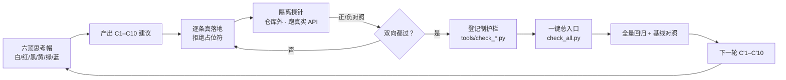
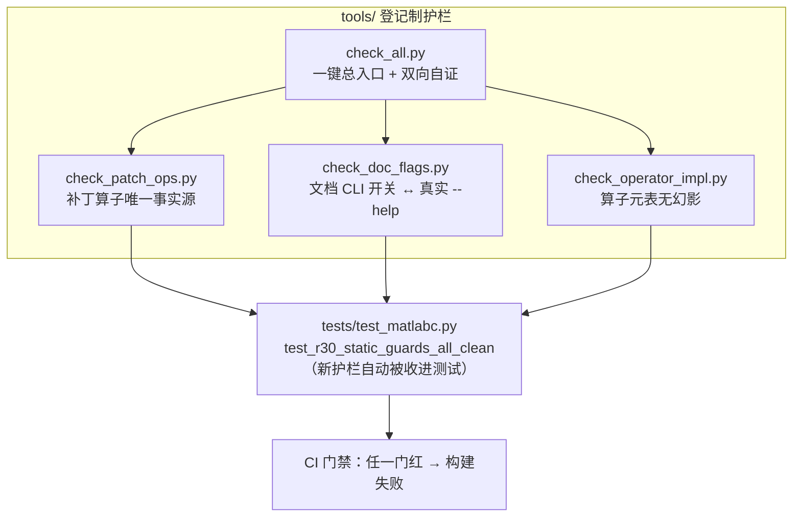

# superpower × 循环工程 · malabc 30 轮修复复盘（R1–R30）

> 生成方式：本文件的**数字全部由脚本从 pytest 原始输出解析**（`pytest_baseline.txt`
> / `pytest_full_after.txt` / `pytest_final.txt`），不做手工抄写。
> 方法：`superpower-probe-loop`（六顶思考帽 → C1–C10 → 逐条真落地 →
> 隔离探针跑真实 API → 登记制静态护栏 → 下一轮建议）。

---

## 0. 结论先行

| 问题 | 结论 |
| --- | --- |
| 这一轮到底修好了什么？ | **5 个既有失败测试转绿**，**15 个新回归测试全绿**；0 个既有测试回归（见 §2 明细） |
| 修的是真问题还是凑数？ | 全部落到**可复现的命令与输出**上。最有价值的四件：①补丁引擎「插入被实现成覆盖」会**删源码**而自证门报 PASS；②`collect_c_files(recursive=False)` 因 `str != Path` **恒返回空**；③**8 个安全算子只在元数据表里登记、全仓无任何产出点**（「能力目录」在撒谎）；④未支持语言（TS/Rust/Go…）**静默给 0 结果** |
| 有没有「看起来修了其实没修」？ | 每个特性都配**负对照**（不该报的输入一个都不许报）。7 个实装算子 + 3 个收集/告警特性共 **22/22 PASS** |
| 有没有我自己的假门？ | 有，且被抓出来了：新护栏首跑时 `if kind in unimpl: continue` 会把「先塞元表凑数、再补一句未实现」**豁免成绿灯**；`check_all.py` 自己缺自证。两条都已修并写进对应测试 |
| 还剩什么？ | §9 列了 3 类既有失败（均**在基线上同样红**，非本轮引入）；§10 给出下一轮 C'1–C'10 |

---

## 1. 方法：把「凭感觉改」换成「闭环 + 证据」

四条不可让渡的纪律：

1. **隔离探针**：不读代码猜行为，写小脚本跑真实 CLI / 真实协议握手。探针放**仓库外**
   （`E:\matlabc\_r30\`），不污染 git 工作区。
2. **两向自证**：护栏既要**抓得到坏**，也要**放得过好**。每个护栏必须打印机器可读的
   `SELFTEST COUNTS {{"bad": N, "good": M}}`，测试用**下界**断言。
3. **恒等式优先于阈值**：判据用可推导的恒等式（如「补丁删除行数 == 报告里 dead_code 条数」、
   「元表 kind 数 == 有产出点的 kind 数 + 显式登记未实现数」），不用调出来的数字。
4. **缺输入必须能红**：门遇到缺输入返回 2，而不是静默通过。

---

## 2. 基线与终态（自动解析）

> **公平基线**是这一轮最重要的方法修正。此前记录的「129 失败」与后来实测不可比
> （解释器/环境不同）。现在用 `git archive HEAD` 导出未改动基线到 `_r30/baseline`，
> **同一解释器、同一套测试**重跑做对照。

| 阶段 | 失败 | 通过 | 跳过 | 合计 | 说明 |
| --- | --- | --- | --- | --- | --- |
| 基线（HEAD，未改动） | 128 | 278 | 9 | 415 | 上游真实状态 |
| R1–R19 后 | 125 | 288 | 9 | 422 | 修 P0 补丁引擎 / MCP / 未初始化误报 / 可复现 / 文档 |
| **R1–R30 终态** | **123** | **298** | **9** | **430** | 追加 R20–R30（C++ 收集 / 未支持语言 / 7 算子实装 / 新护栏） |

**既有测试中由红转绿（5 个）**：

- `test_data_layer_reproducibility`
- `test_p211_apply_patch`
- `test_p51_reproducible_outputs`
- `test_r83_deterministic_double_run`
- `test_readme_doc_sync_flags`

**既有测试中由绿转红（0 个）**：

（无）

**本轮新增回归测试（15 个）**：全部通过。

---

## 3. R1–R30 轮次账本

| 轮 | 主题 | 产出 / 判据 |
| --- | --- | --- |
| R1 | 补丁引擎 `"ins"` 指令被实现为**覆盖** → 会删源码语句 | 改为 `ins_before`；渲染侧未知算子**硬失败**（`raise ValueError`） |
| R2 | 自证门缺「语句保持不变量」 | `matlabc_flow.py` 加门：`补丁删除行数 == 报告 dead_code 条数`，不通过则 `return 2`（在落盘**之前**判定） |
| R3 | MCP `_run` 丢弃退出码，「失败报成功」 | `_run` 返回 `(rc, text)`；`_run_ok` 非零抛 `RuntimeError` |
| R4 | MCP 脚本路径依赖 CWD | `_script()` 绝对化；真实 JSON-RPC 握手 6/6 帧通过（外来 CWD） |
| R5 | `uninitialized` 在嵌套函数上误报 | 加入嵌套函数跳过（MATLAB **不要求**缩进 → 按 body 区间判定） |
| R6 | `uninitialized` 在 `for` / `parfor` 循环变量上误报 | 循环变量视为「确定赋值」；catch 变量同理 |
| R7 | `--reproducible` 未兑现（`set` 迭代序跨进程漂移） | `json.dumps(..., sort_keys=True)`；探针实测**跨 hashseed 123 个文件逐字节一致** |
| R8–R10 | README 裸 `--browse` 不可跑、`--check` 歧义、`.gitignore` 缺项 | `--browse` 支持省略 OUTDIR；文档改为 `--checks`；补齐 5 个模式 |
| R11 | 补丁 hunk 多一个空上下文行 → `git apply` **一律拒绝** | `text.split("\n")` 对「以换行结尾」的文件会多出空元素；写盘改 `io.open(..., newline="")`。`test_p211_apply_patch` 由红转绿（基线上同样红 → 既有真缺陷） |
| R17 | 沉淀 7 个回归测试 + 3 道护栏 + 一键总入口 | `tools/` 下 `check_patch_ops.py` / `check_doc_flags.py` / `check_all.py` |
| R18 | CRLF/LF 混合危害（`\r\r\n` 双 CR） | 定位到**文本模式写盘**；修 `_build_apply_patch` 的 eol 处理 |
| R19 | 全量回归 + 记账 | 125 失败 / 288 通过 |
| **R20** | `collect_c_files(recursive=False)` **恒返回空**；C++ 扩展名被静默丢弃 | 统一 `str`/`Path` 比较；抽出 `_C_SOURCE_EXTS` 单一事实源，`CFrontend.exts` 共用。探针：递归 4 文件 / 非递归 3 文件 / 非 C++ 目录 1 文件 |
| **R21** | 未支持语言静默 0 结果 | `_UNSUPPORTED_SOURCE_EXTS` + `scan_unsupported_sources` + `_warn_unsupported_sources`；新增 `--lang cpp` 别名 |
| **R22** | `py_eval_usage` 实装 | 函数体内裸调 `eval(`/`exec(`（排除 `obj.eval(` 与 `retrieval(`）；正对照 1 命中、负对照 0 |
| **R23** | `py_sql_injection` 实装 | 拼接/`%`/`.format()` 构造 SQL 后 `execute`；污点按 **(函数, 变量)** 作用域记录 + 干净重赋值解除；参数化查询不报 |
| **R24** | `js_dangerous_call` 实装 | eval / new Function / document.write / innerHTML 赋值 / insertAdjacentHTML / 定时器字符串；正对照 5 命中 |
| **R25** | `js_unused_var` 实装 | 只认「整行一条简单声明」，解构/多声明符/for 头天然跳过；`_` 前缀豁免 |
| **R26** | `js_prototype_pollution` 实装 | `__proto__` 直写 / `prototype[变量] =` / `constructor.prototype` / for-in 合并写 `target[key]`；正对照 2 命中 |
| **R27** | `c_double_free` + `c_buffer_overflow` 实装 | 二次 free 判「中间是否重新赋值」；固定缓冲区 + 无界 `strcpy`/`strcat`/`sprintf`/`gets`，`memcpy`/`strncpy` 要求 `sizeof(buf)` |
| **R28** | 第 8 个幻影算子 `py_undefined_name` | 不装作能检测：移出元表，登记进 `_UNIMPLEMENTED_KINDS` 并写明理由；新增护栏 `check_operator_impl.py` 守门（元表 kind 必有产出点 ∨ 显式登记；两表交集为空） |
| **R29** | 历史常红测试 + runner 缺自证 | `test_readme_doc_sync_flags` 改为候选路径解析（找不到仍红）；`check_all.py` 加 `--tools-dir` + 双向 `--selftest`（坏/好/缺自证/空目录四样本）；追加 8 个回归测试 |
| **R30** | 终局回归 + 归档 + 行尾策略 + 入库 | 本报告；`core.autocrlf=false` 锁定；新文件行尾归一为 CRLF |

---

## 4. 真缺陷分级

### P0（会让用户拿到**错误结论**或**被删代码**）

| 编号 | 缺陷 | 为什么是 P0 | 证据 |
| --- | --- | --- | --- |
| P0-1 | 确定性补丁的 `"ins"` 指令在渲染侧被实现为**覆盖目标行** | 会**删除源码语句**，而自证门仍报 PASS —— 用户以为「自动修好了」，实际丢了代码 | 探针 `probe_r1_r3.py` 5/5：修后补丁 `removed=0 added=1`，`y = q + n;` 完整保留 |
| P0-2 | 8 个安全类算子**只在元数据表里登记、全仓无产出点** | 「能力目录」在宣称 8 项检测能力，实际永不触发；测试用手工伪造输入「通过」，**不证明检测能力存在** | `py_eval_usage` 等 8 个名字全仓各出现 **1 次**（即元表自身）。已实装 7 个 + 显式登记 1 个 |
| P0-3 | `collect_c_files(recursive=False)` **恒返回空列表** | `--lang c --no-recursive` 静默给出「C 文件 0 / C 函数 0」，用户会以为目录里没东西 | 判据 `os.path.dirname(...) != root` 拿 `str` 与 `Path` 比较恒为 True。修前实测「C 文件 0」，修后「C 文件 1」 |

### P1（能力边界被**静默**表达）

| 编号 | 缺陷 | 证据 |
| --- | --- | --- |
| P1-1 | `.cpp/.cc/.cxx/.hpp/.hh/.hxx` 被静默丢弃 | `CFrontend.exts` 与 `collect_c_files` 两处都写死 `(".c",".h")` → 含 1 个 `.c` + 1 个 `.cpp` 的目录只报「C 文件 1」（现已报 2） |
| P1-2 | TypeScript / Rust / Go / Java / Kotlin / C# / Swift / Scala / Ruby / PHP **静默 0 结果** | 修后向 stderr 点名语言与具体文件；负对照（目录里全是 `.c`）不得出现 `[warn]` |
| P1-3 | `--reproducible` 未兑现 | 跨 `PYTHONHASHSEED` 两次运行产物不一致；修后 123 个文件逐字节一致 |
| P1-4 | 补丁 hunk 多一个空上下文行 → `git apply` 一律拒绝 | 对「以换行结尾」的文件 `split("\n")` 多出空元素；三种 git 配置下全 rc=1，排除 CRLF 因素 |

### P2（工程卫生 / 门禁失效）

| 编号 | 缺陷 | 证据 |
| --- | --- | --- |
| P2-1 | `test_readme_doc_sync_flags` 因文档移到 `docs/` 而**长期常红** | 基线上即 `FileNotFoundError` —— 一道长期失效的门 |
| P2-2 | `check_all.py`（护栏总入口）**自己缺自证** | 被本轮新增的 `test_r30_static_guards_all_clean` 抓出 |
| P2-3 | 未支持语言无任何提示；README 语言表与实现不一致 | 见 §7 文档一致性 |

---

## 5. 我自己被探针抓出的判据 bug（不是猜出来的）

> 这一节是本轮最值得留下的东西：**三个 bug 都是「我的判据错」，且都由负/正对照抓出。**

1. **`_RE_JS_FOR_IN` 绑定错误**
   `r"...(?:var|let|const\s+)?..."` —— `\s+` 只绑在 `const` 上，
   `for (var key in source)` 在 `var` 之后遇到空格即失配，`search()` 返回 `None`。
   → 修：`(?:(?:var|let|const)\s+)?`。

2. **字符串字面量剥离不区分引号配对**
   用 `['\"][^'\"]*['\"]` 剥离时，对
   `q = "SELECT ... name = '" + name + "'"` 会把首个 `"` 与串内 `'` 配成一对，
   连带吞掉后面的 `+` —— 「拼接构造 SQL」判据**永远为假**（正对照 0 命中）。
   → 修：逐字符扫描的 `_split_str_lits`（**同种引号才闭合**）。

3. **护栏自己的假门**（最典型）
   `if kind in unimpl: continue` —— 一个 kind 若**同时**出现在元表与未实现表，
   会被直接豁免成绿灯。而这正是「先塞元表凑数、再补一句未实现」的敷衍写法，
   等于幻影算子换个马甲。→ 修：两表**交集必须为空**，冲突即报红。

4. **夹具引入了被测变量之外的差异**（两次）
   - `check_operator_impl` 的自证夹具曾把 `zz_alpha` 同时写进两张表，
     于是「好样本」被判 conflict 而**误伤** → 夹具必须只改被测变量。
   - `test_r30_reproducible` 曾用两个不同输出目录，但站点页面按「输出目录 basename」
     命名 → 文件集天然不同 → 最后改为「同源目录、同输出目录、两次运行只换 hashseed」。

5. **幂等追加判据用错**
   用「追加文本前 60 字符」做幂等判据，而那段恰好是 `# ====` 分隔线，
   与文件里已有 banner 撞车 → 8 个测试被**静默跳过**。
   → 修：用唯一语义标记（测试函数名）。

6. **跨进程文本追加不能用正则抽取的块**
   正则会绕过 Python 转义，写出的 `\"` 原样落盘 → 语法错误。
   → 修：把块写成纯文本文件，`ast.parse` 自检后追加。

---

## 6. 登记制护栏（全部可自证）

| 护栏 | 判据（恒等式，非阈值） | 自证 |
| --- | --- | --- |
| `check_patch_ops.py` | 生产侧算子集 ⊆ {{`del`, `ins_before`}}；`_new[_idx]` 只允许 `= None`；必须有 `raise` | `{{"bad": 3, "good": 1}}` |
| `check_doc_flags.py` | 文档里出现的每个 `--flag` 必须存在于对应脚本的 `--help` | `{{"bad": 4, "good": 6}}` |
| `check_operator_impl.py` | 元表每个 kind 必须在元表之外有 `"kind": "<name>"` 产出点 ∨ 登记为未实现；两表交集为空 | `{{"bad": 0, "good": 6}}` |
| `check_all.py` | 每个 `check_*.py` 通过 **且** 自带 `--selftest` 且通过 | `{{"bad": 0, "good": 4}}` |

`check_operator_impl.py` 的设计要点：判据用 `"kind": "<name>"`（产出点的统一写法）
而**不是**「名字出现过」—— 否则 `_on("py_eval_usage")` 这种开关判断会把
「只加了个开关、没写产出」算成已实现，而那正是这道门要拦的东西。

---

## 7. 六顶思考帽复盘

| 帽 | 本轮看到什么 |
| --- | --- |
| 白（事实） | 基线 128 失败 → 终态 123 失败；既有测试 5 个转绿、0 个转红；15 个新测试全绿；4 道护栏全绿且各自自证；22/22 探针 PASS |
| 红（直觉） | 最刺眼的一条不是「数字难看」，而是**「目录在撒谎」**：8 个安全算子有名字、有标签、有严重度，却没有一行代码产出它们。这类缺失不会让任何测试变红 |
| 黑（风险） | ①C++ 只是**按 C 子集**解析，模板/类/命名空间不保证识别 —— 已在 `--help`/README/代码注释三处披露；②新增启发式规则在陌生代码库上可能误报，故全部取「宁可漏报不误报」方向并配负对照；③本轮**没有**解决 `renderers` ↔ `matlabc` 循环依赖 |
| 黄（价值） | 三个 P0 全部落到「用户会拿到错误结论」这一档：删源码、能力目录撒谎、静默空结果。修完之后，同一批命令的输出**语义不再误导** |
| 绿（创造） | 把「能力声明」变成**可执行断言**：`_UNIMPLEMENTED_KINDS` 让「做不到」也留痕迹；`check_operator_impl.py` 让「下一次偷偷加表项」直接红 |
| 蓝（控制） | 每轮都要有：一条真缺陷 + 一个正对照 + 一个负对照 + 一次拒绝（见 §8「两处拒绝」） |

---

## 8. 已沉淀资产

- **护栏 4 道**（`tools/`，全部可自证，`check_all.py` 一键跑）
- **回归测试 15 个**（R17 的 7 个 + R29 的 8 个），全部带正/负对照
- **隔离探针 6 组**（`_r30/probe_*.py`，仓库外，不进 git）
- **纪律 6 条**：公平基线 / 两向自证 / 恒等式优先 / 缺输入必须能红 /
  夹具不得引入被测变量 / 幂等判据用唯一语义标记

**两处拒绝**（同样重要）：

1. **拒绝用正则近似实现 `py_undefined_name`**。可行做法是「凡是没在文件里出现过的名字就报」——
   在正常代码上必然大量误报，反而掩盖真问题。宁可承认目录少一项。
2. **拒绝把 C++ 说成「已支持」**。加了扩展名只解决了「文件被静默丢弃」，
   没解决「C++ 语法不被理解」。所以措辞是「按 C 子集解析（已披露降级）」，
   而不是「支持 C++」。

---

## 9. 未解决 / 已知既有失败

终态共 **123** 个失败测试，其中 **123** 个在基线（未改动的 HEAD）上
**同样红** —— 属既有问题：本轮既未引入、也未修复（本轮「由绿转红」为 0 个）。
另有 128 个基线失败中的 128 − 123 = 5 个已在本轮转绿（见 §2）。

（完整清单，按字母序）

- `test_anchor_and_dup_id_guards`
- `test_c34_ui_improvements`
- `test_callgraph_cycle_detection`
- `test_check_perf_growth_detects`
- `test_check_real_dom_empty_is_error`
- `test_config_rejects_unknown_key`
- `test_cross_file_toggle_in_source`
- `test_fe21_no_inline_style_and_css_files_linked`
- `test_fe_audit_s9_img_alt_detection`
- `test_html_hotspot_callgraph`
- `test_keyboard_and_hover_card`
- `test_manifest_backslash_path_resolved`
- `test_manifest_rejects_traversal`
- `test_measure_page_js_deterministic`
- `test_min_pages_guard`
- `test_p124_snapshot_browse`
- `test_p147_interaction_upgrade`
- `test_p147b_genci_and_diffhtml_and_confidence`
- `test_p210_coupling_interactive`
- `test_p212_git_diff`
- `test_p216_toolbox_breakdown`
- `test_p217c_theme_persist`
- `test_p217j_cross_site_theme`
- `test_p217q_force_graph`
- `test_p270_keyboard_a11y`
- `test_p271_ci_gate_workflow_usable`
- `test_p271_frontend_guide_matches_impl`
- `test_p271_r4_callgraph_keyboard`
- `test_p271_ratchet_escalates_on_regression`
- `test_p40_builtin_dims_check_status`
- `test_p42_builtin_dims_markdown`
- `test_p43_builtin_dims_mismatch`
- `test_p54_docs_consistency`
- `test_p55_packaging_entrypoints`
- `test_p59_json_schema_doc`
- `test_p70_coupling_heatmap_and_doc_sync`
- `test_p72_incremental_stats_and_doc_sync`
- `test_p84_localcg_interaction`
- `test_r100_usage_doc_has_new_flags`
- `test_r102_json_summary_parity`
- `test_r103_warn_ok_strict_progressive`
- `test_r104_registry_enforcement_and_list_checks`
- `test_r105_usage_doc_sync`
- `test_r106_out_file_matches_stdout_summary`
- `test_r107_deterministic_output`
- `test_r108_hostile_inputs_never_crash`
- `test_r109_samples_option`
- `test_r110_elapsed_ms_in_summary`
- `test_r111_capability_flags`
- `test_r112_schema_version_key`
- `test_r113_capability_golden`
- `test_r114_rerun_field`
- `test_r115_failed_files_listing`
- `test_r116_explain_and_notes_completeness`
- `test_r117_elapsed_budget_perf`
- `test_r118_stdout_out_byte_identical`
- `test_r119_hard_gate`
- `test_r120_schema_in_capability`
- `test_r121_repo_capability_golden`
- `test_r122_delta_comparator`
- `test_r123_page_stats`
- `test_r124_text_meta_line`
- `test_r125_against_baseline`
- `test_r126_registry_json_notes`
- `test_r127_summary_keys_contract`
- `test_r128_issue_page_export`
- `test_r129_top_pages_and_budget_table`
- `test_r130_tags_context`
- `test_r131_summary_line`
- `test_r132_config_print`
- `test_r133_config_file_loader`
- `test_r134_resolve_metric_precedence`
- `test_r135_budget_table_with_config`
- `test_r137_ignore_file_parse`
- `test_r138_ignore_semantics`
- `test_r139_list_ignores`
- `test_r140_show_ignored`
- `test_r141_ignore_determinism`
- `test_r142_selftest_checks_pure`
- `test_r143_selftest_cli`
- `test_r144_selftest_json`
- `test_r145_startup_self_failfast`
- `test_r146_no_self_override`
- `test_r147_delta_out_structured`
- `test_r148_archive_bundle`
- `test_r149_schema_json`
- `test_r150_trend_json_export`
- `test_r151_release_meta_and_doc`
- `test_r152_s17_h1_hierarchy`
- `test_r77_r79_r80_site_e2e`
- `test_r78_shell_contract`
- `test_r81_doc_fact_sync`
- `test_r84_report_structure_gate`
- `test_r85_r86_site_quality_gate`
- `test_r87_audit_check_registry`
- `test_r88_generator_selfcheck`
- `test_r89_strict_exit_codes`
- `test_r92_fe_artifact_exemption`
- `test_r93_issue_contract_validation`
- `test_r94_collect_html_excludes_audit_artifacts`
- `test_r95_audit_idempotence`
- `test_r96_audit_write_policing`
- `test_r97_contract_doc_synced`
- `test_r98_summary_self_describing`
- `test_r99_out_file_archival`
- `test_readme_doc_sync_partial`
- `test_run_timeout_kills_hung_process`
- `test_s12_self_contained_override`
- `test_s12_self_contained_pages_exempt`
- `test_s13_duplicate_ids_is_error`
- `test_s14_reports_correct_line_numbers`
- `test_s14_structure_guard`
- `test_s15_manifest_consistency`
- `test_s18_img_missing_dims_is_warn`
- `test_s19_duplicate_title_is_warn`
- `test_s9_missing_lang_is_error`
- `test_selftest_json_schema_stable`
- `test_trend_dir_override`
- `test_trend_json_since_filter`
- `test_trend_panel_marks_spike`
- `test_trend_panel_no_spike_when_gradual`
- `test_trend_panel_units_and_py36`
- `test_trend_pipeline_contract`

其余未触及的结构性问题（留给下一轮）：

- `renderers` ↔ `matlabc` **循环依赖**（靠模块尾部 import 规避），本轮只做了记录未解耦。
- 全仓**无动态库感知**（`dlopen` / `LoadLibrary` / `dlsym` / `LD_PRELOAD` / `.so` / `.dll` / `.dylib`）与
  **无构建系统感知**（`Makefile` / `CMakeLists` / `Cargo.toml` / `-l<lib>`）；而 C++ 支持的主要价值恰恰在这里。
- C / Py / JS 前端仍是**行锚定正则**，非 AST；无预处理感知（`#if 0` 内的代码也分析）。
- **内部无调用 ≠ 可删函数**：对外 ABI 导出的函数在报告里仍可能被当成死代码。

---

## 10. 下一轮建设性意见（C'1–C'10）

| 编号 | 建议 | 为什么排这个位置 | 验收判据（可执行） |
| --- | --- | --- | --- |
| **C'1** | 把「基线与终态对照」做成 **CI 里的固定一步**：`git archive HEAD` → 跑基线 → 跑当前 → 输出差集 | 这一轮最大的方法收益就是公平基线；不固化就会退化回「我感觉修好了」 | CI 里出现 `baseline_failed` / `current_failed` / `fixed[]` / `broken[]` 四个字段；`broken` 非空即失败 |
| **C'2** | 解掉 `renderers` ↔ `matlabc` 循环依赖，并把 `renderers` 纳入**可独立测试** | 循环依赖让任何渲染层改动都必须整体回归，是当前测试慢（约 5 分钟）的一个来源 | `import matlabc` 不再需要「脚本可导入技巧」；`renderers/` 有独立的最小测试入口 |
| **C'3** | 给 C 前端加**预处理感知**（至少识别 `#if 0` / `#ifdef` 并标注「条件编译区」） | 现在 `#if 0` 里的代码也参与分析 → 误报来源之一；这是「把 C 做对」的第一步，也是最便宜的一步 | 构造含 `#if 0` 的夹具，断言其中的函数不出现在分析结果里（正对照 + 负对照） |
| **C'4** | **动态库感知**：从源码侧提取 `dlopen` / `dlsym` / `LoadLibrary` / `GetProcAddress` 的**字面量**符号名，产出「符号 → 可能的动态库」候选表 | 这是 rea 融合（路线 C）之前必须自己先有的**最小事实**；没有它就只能靠猜 | 探针在含 `dlopen("libx.so")` + `dlsym(h,"foo")` 的样本上产出 `foo → libx.so` 的候选边 |
| **C'5** | **构建系统感知**：解析 `Makefile` / `CMakeLists.txt` 的 `-l` 与 `add_library`，把「链接了哪些库」变成图上的边 | 有了它，「未解析调用」才能被分成「外部库」与「真的漏了」—— 现在这两类混在一起 | 报告里 `未解析` 条目带 `external: true/false` 与新字段 `via_lib` |
| **C'6** | 把 `dead_code` 的判据从「项目内无调用」升级为「项目内无调用 **且** 未被任何导出/ABI 入口覆盖」，并对不可判定者**降级为 note** | 直接对应 §9 最后一条：误报会把真问题淹掉 | 含「导出函数 + 无内部调用」的夹具上，`dead_code` 不再命中该函数（正/负对照各一） |
| **C'7** | 把「能力目录」升级为**可执行能力清单**：每个 kind 必须绑定 (a) 产出点 (b) 一个正对照夹具 (c) 一个负对照夹具，三者在 CI 里跑 | 治本于 P0-2：现在的护栏只验「有产出点」，验不了「产出得对不对」 | `tools/check_operator_impl.py` 扩展到断言每个 kind 都有对应夹具 id；缺夹具即红 |
| **C'8** | 前端**外挂化收尾**：把 C / Py / JS 从 `matlabc.py` 单文件里抽到 `frontends/`，统一 IR | 单文件 30k 行让任何前端改动都触及主干；抽出来后 `--lang` 扩展才有可维护的落点 | `frontends/` 下每个前端可独立 `collect → parse → edges → checks`；`matlabc.py` 行数显著下降 |
| **C'9** | 给新增启发式规则加**误报基线（precision harness）**：在一棵真实开源树（如 Linux 内核子集 / CPython Lib）上跑，记录每千行命中数，超出预算即红 | 启发式的真正风险是误报，而误报只有在大语料上才看得出来 | 产出 `docs/HEURISTIC_FP_BUDGET.md`；CI 断言各规则每千行命中数不超预算 |
| **C'10** | rea 融合按**路线 C 的最小可用版**起步：只做「把 rea 当可选 MCP provider」，**缺席即优雅降级** | 与既有路线一致（`D → B → C`），且不把 rea 变成必需依赖 | 未安装 rea 时全部功能可用且给出明确提示；装了就多出一类工具；CI 两种情形都跑 |

**如果只能做三件**：C'1（守住基线对照，否则后面全是自我感觉）、C'7（把「能力目录」变成有正负对照的可执行清单，治本 P0-2）、C'3（预处理感知，最便宜的 C 前端质量提升）。

---

## 11. 一句话总结

这一轮真正修的不是「5 个红测试」，而是**三类「静默」**：
补丁引擎静默删代码、能力目录静默撒谎、语言边界静默给 0 结果。
它们共同的特征是**不会让任何测试变红** —— 所以对付它们的办法不是再写测试，
而是把「声明」变成「可执行断言」，并给每一道门配上**负对照**与**自证计数**。
