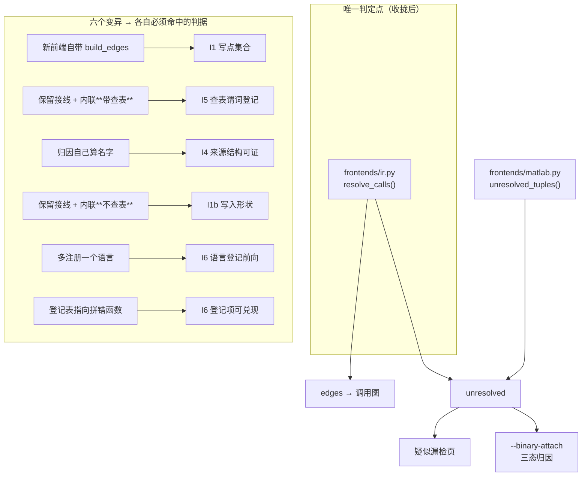

# SUPERPOWER_REVIEW_R44 —— 唯一判定点 · 五份复制变一份 · 反向判据照出前向盲区 · 行为保持

> 本轮做的唯一一件事，是把**一句规则**从五份逐字复制变成一份可证伪的实现：
>
>     被调名在本语言的 func_index 里找不到  ⇒  记入 unresolved
>
> 这句话此前在 `matlabc.py` 里存在**五份**（两处内联 + 三处逐字复制），另有 MATLAB
> 第 6 条**形状不同**的路径。本轮把它收进 `frontends/` 包，并新增一道门把
> 「只有一个判定点、而且归因吃到的就是它」钉成**全仓集合判据**。
>
> 这一轮的三个看点，都不是"写完了"，而是**被装置抓出来的**：
> ① 一道**反向**判据（陈旧登记）照出了前向收集器的盲区；
> ② 一件**测试写不出来**的事，暴露了门自己接口不自洽；
> ③ 一次**跑通**的探针，复查后发现里面有一部分是**运气**。

---

## §1 白帽：事实清单（全部来自真实文件实测）

### 1.1 真缺陷：同一条规则被抄了五遍

R44 之前，`matlabc.py` 里存在这些**各自独立**的实现（数字是数出来的，不是估的）：

| # | 位置 | 形态 | 说明 |
| --- | --- | --- | --- |
| 1 | `matlabc.py::build_c_model` | 内联，12 行 for 循环直接 `append` | C 模式组装器 |
| 2 | `matlabc.py::_build_ext_model` | 内联，同一份逻辑 | Py/JS 共用组装器 |
| 3 | `matlabc.py::CFrontend.build_edges` | **逐字复制** | 与 #1/#2 同一段代码 |
| 4 | `matlabc.py::PyFrontend.build_edges` | **逐字复制** | 同上 |
| 5 | `matlabc.py::JsFrontend.build_edges` | **逐字复制** | 同上 |
| 6 | MATLAB 侧 `_collect_unresolved_calls` | **形状不同** | 名字来自 `Function.external_calls`（按名聚合），归 `frontends/matlab.py` |

第 6 条**不该被合并**（见 §4.1）；前 5 条是真正的问题。代价不是"多写了几十行"，而是：

* 五条路径会**各自漂移** —— 改一处，另外四处静默保持旧语义；
* `--binary-attach` 的三态归因只挂在其中**一条**名字来源上 ⇒
  「源码说这个名字解析不到」与「归因说它来自某个库」讨论的**可能不是同一批名字**，
  而两边都不报错。

### 1.2 收拢后的形态

| 位置 | R44 之前 | R44 之后 |
| --- | --- | --- |
| `build_c_model` | 12 行内联判定 | `f_ir.resolve_calls(...)` + `extend` |
| `_build_ext_model` | 12 行内联判定 | 同上 |
| `CFrontend.build_edges` | 逐字复制 12 行 | **删除 override**（用基类实现） |
| `PyFrontend.build_edges` | 逐字复制 12 行 | **删除 override** |
| `JsFrontend.build_edges` | 逐字复制 12 行 | **删除 override** |
| `BaseFrontend.build_edges` | —（本来没有默认实现） | **默认实现就是唯一判定点** |
| `MatlabFrontend.build_edges` | 逐字复制 12 行 | 显式 `return [], []` + 写明理由 |
| `_collect_unresolved_calls` | `cnt.update(f.external_calls)` | `f_matlab.unresolved_tuples(files)` |
| 新包 `frontends/` | 不存在 | `ir.py`（IR + 判定点）/ `matlab.py`（MATLAB 产出点）/ `__init__.py`（公开面 + `IR_LANG_OWNERS`） |

新增文件实测：`frontends/ir.py`（140 行）、`frontends/matlab.py`（55 行）、
`frontends/__init__.py`（52 行）；`matlabc.py` 的行数**没有增长**（删了 5 处复制、
加了 2 行 import），`CRLF=30875`、`bare_LF=0`。

### 1.3 行为保持：产物逐字节比对（不是 `git diff`）

| 组 | 命令 | HEAD 侧 | WORK 侧 | 结论 |
| --- | --- | --- | --- | --- |
| c | `--lang c --json` | rc=0 | rc=0 | SAME（除声明内差异） |
| py | `--lang py --json` | rc=0 | rc=0 | SAME |
| js | `--lang js --json` | rc=0 | rc=0 | SAME |
| m | `--json`（MATLAB） | rc=0 | rc=0 | SAME |
| attach | `--lang c --binary-attach kernel32.dll` | rc=0 | rc=0 | SAME |

共 10 个产物（5 组 × JSON/stdout），**掩码合计 13 处**（探针自带变量：`generated_at`
1 + `生成时间` 1 + `耗时` 1 + 输出目录名 10），**声明内差异 6 处**（版本号：
5 个 JSON 的 `"version"` + 1 处 Markdown 的 `工具版本`，值已打印在报告里）。
连跑 **3 次全 PASS**。

### 1.4 新门 `tools/check_ir_attribution.py` 的实测读数

| 指标 | 实测值 |
| --- | --- |
| 真跑（真实仓库） | `rc=0`，扫描 **50 个 `.py`** |
| 写点 | **3 处** = 判定点 1 + 消费点 2（与登记表双向一致） |
| 归因喂入点 | **3 处** |
| 语言登记 | **4 个**（`c` / `js` / `matlab` / `py`） |
| 纯函数判据 | **10 项**形状/规则 + **9 项**语言登记 |
| 自证（`--selftest`） | `SELFTEST COUNTS {"bad": 0, "good": 19}` → `rc=0` |
| 文件规模 | `CRLF=999`、`bare_LF=0`、`bytes=50876` |

---

## §2 黑帽：本轮抓到的五个真问题（含一个自伤）

### 2.1 一句文档在描述一个**不存在的对手方**

`frontends/__init__.py` 的 docstring 里写着：

> 守这件事的是 `tools/check_ir_attribution.py`，并且**两向核对**：
> `matlabc.py` 里 `register_frontend("x", ...)` 注册了、这里却没登记 → 红；
> 这里登记了、`matlabc.py` 却没注册 → 红。

而那道门里 **`IR_LANG_OWNERS` / `register_frontend` / `LANGS` 三个标识符一个都没有**
（实测 grep：0 命中）。**一份文档在描述一个不存在的对手方** —— 这正是本仓
R40 起反复禁止的「宣称没有装置」。

两条出路：删掉那句话，或**把它兑现**。本轮选后者，于是新增判据 **C6'**：
`register_frontend` 的注册语言集合 与 `IR_LANG_OWNERS` 的登记集合必须**双向相等**，
且每个登记项必须**真能兑现**成一个可调用对象。

### 2.2 **反向**判据照出了**前向**收集器的盲区

C6' 上线后立刻报了一条红：

```
I6 陈旧登记：REGISTER_OUT_OF_SCOPE 里有 tests/test_matlabc.py，但它已经不再调用 register_frontend
```

而 `tests/test_matlabc.py:4855` 明明写着 `ma.register_frontend("dummy", DummyFrontend)`。
真因：收集器只认**裸调用** `register_frontend(...)`，而那是**属性式**调用
`ma.register_frontend(...)` ⇒ 前向收集是瞎的，反向判据据此报了一条假红。

> 这件事的价值在于：**只有正向（"看到的都登记了"）永远发现不了"根本看不见"。**
> 每张登记表都两向核对，是从这里再一次得到验证的。

顺带还发现一个**陷阱**：`tests/` 里注册假前端是**夹具**而不是**宣称**，
全仓扫描会误红 ⇒ 判据必须显式划分范围（`REGISTER_SCOPE` + 范围外逐文件登记）。

### 2.3 **测试写不出来**，说明门自己的接口不自洽

给 C6' 写回归测试时，我想用一个「函数名拼错」的登记表去触发"登记项必须可兑现"这条判据，
**触发不了**。查因：`judge_langs(registered, declared, owner_lookup, ...)` 收一个
`declared` 参数，但 `owner_lookup` 的实现**总去读模块里的 `fr.IR_LANG_OWNERS`** ——
传进来的表与真正被兑现的表可以不是同一张。

今天两者恰好是同一个对象，所以没有产生错误结果；但这个 API **允许**调用方拿着一张表却
去判另一张。修法不是"记得传同一个对象"，而是把参数改成**必传**
（`_owner_lookup(fr, owners)`，取消默认值）⇒ 两张表不可能分叉。

> 教训写下来：**当一条判据的测试写不出来时，先怀疑判据的接口，不要怀疑测试。**

### 2.4 探针的**对照组**红了 —— 环境差异长得和被测缺陷一模一样

红路径探针引入 C6' 后，**对照组（未变异的原样副本）变成了红**：

```
对照组（原样）  rc=1  判据=['I6']   ← 红的原因与任何变异无关
```

真因：探针的"迷你树"只拷了 `matlabc.py` + `frontends/` + 门，**没有 `tests/`**，
而 `REGISTER_OUT_OF_SCOPE` 登记的是 `tests/test_matlabc.py` ⇒ 陈旧登记判据报红。

**对照组红 = 所有变异结论作废**（红了也不知道是不是被测改动引起的）。修法：凡登记表
点名的文件，探针环境里必须真的存在 ⇒ 迷你树一并拷 `tests/test_matlabc.py`。

### 2.5 自伤两项（写下来，避免下一轮重犯）

* **改签名漏调用方 × 3。** 本轮三次改了被调签名却漏了调用点，**每次都是"跑一遍"才发现**：
  ① `patch_ir` 改 `judge` 形参 → 两个调用点还传 `srcs=`；
  ② `patch_judge` 把 `scan_repo` 从 4 元组改成 6 元组 → 两个调用点还解 4 个；
  ③ `patch_langs` 再把 `scan_repo` 改成 6 元组 → `_sample` 还解 5 个。
  ⇒ 新增测试 `test_r44_gate_call_sites_agree_with_return_arity`：**凡是解包本门某个函数
  返回值的地方，元组长度必须与那个函数的 `return` 一致**，把"跑一遍才发现"变成
  "每次测试都跑"。

* **一次 PASS 里有一部分是运气。** 行为探针首版 PASS 之后，复查时 `m.stdout` 变 DIFF：
  真因是产物里有一行 **墙钟耗时** `总行数 8 | 耗时 0.010s` vs `0.011s`。
  首版那次两侧恰好落在同一毫秒档 ⇒ **"跑通一次"不等于"可重复"**。
  修法不是只补眼前这一处，而是先做**系统扫描**：把所有 `[0-9]+\.[0-9]+s` / 日期 / 时刻 /
  小数在两侧列出来对一遍，确认唯一的易变字段只有耗时（`1.416` 两侧一致，是稳定字段），
  **然后**才加掩码；加完连跑 3 次全 PASS。

---

## §3 黄帽 / 绿帽：C'''1 落地表

| C'''1 的原始要求（R43 §9） | 落地物 | 可证伪的断言 | 实测 |
| --- | --- | --- | --- |
| 「前端外挂化 + 统一 IR」 | 新包 `frontends/`（`ir.py` / `matlab.py` / `__init__.py`） | `IR_KEYS` 是键集合唯一登记处；`build_ir` 产出的键必须等于它 | 门 C5-① 通过 |
| 「把归因接到 IR 的 `unresolved` 节点」 | `_collect_unresolved_calls` 改读 `f_matlab.unresolved_tuples` | 归因喂入点的名字来源必须**结构上可证**（AST：`kind="calls"` / `kind="reads"`） | 门 C4 通过；变异③ 被抓 |
| 「`IR.unresolved` 的符号集合 == 归因 rows 的符号集合」（**比集合不比个数**） | `ir.unresolved_symbols()` 返回 **set**；`unresolved_arity_problems()` 共享判据 | 返回 list 即红；四段元组即红 | 门 C5-③ + 测试双断言 |
| 「断言 `IR.unresolved` 的符号集合 == `unresolved_attribution.rows` 的符号集合」 | 收拢为**唯一产出点**：两条路径读同一个函数，不再各算一份 | 归因函数自己重算名字 → 红 | 变异③（真实文件变异）被抓，判据 I4 |
| 新门 `check_ir_attribution.py` 作为对手方 | 七条静态判据 + 十条纯函数判据 | 每条都能被反例证伪，且**每条都有自己的见证** | 自证 `{"bad": 0, "good": 19}`；红路径 6 个变异各自命中指定判据 |

红路径探针的六个变异与它们**各自**的见证（这一栏是本轮最硬的部分：
一个判据"存在"与一个判据"能独立说'不'"，是两件事）：



| 变异 | 判据 | 为什么必须单独有它 |
| --- | --- | --- |
| ① 新前端自带 `build_edges` | **I1** 写点集合 | 这正是 R44 之前的真实形状 |
| ② 保留共享调用 + 内联**带查表**判定（用 `extend`） | **I5** 查表谓词登记 | 写点集合没变（还是 `extend`）⇒ 只有 I5 看得见 |
| ③ 归因自己算名字 | **I4** 来源结构可证 | 首版文本判据被函数 **docstring** 骗过，故改成 AST 结构判据 |
| ④ 保留共享调用 + 内联**不查表**判定（用 `append`） | **I1b** 写入形状 | 没有任何 `.get(x.lower())` ⇒ I5 不会响；专证 C1b 有独立见证 |
| ⑤ `matlabc.py` 多注册一个语言 | **I6** | 该语言的「解析不到的调用」无人负责 |
| ⑥ `IR_LANG_OWNERS` 指向拼错函数名 | **I6** | 登记表只写字符串不够：`("matlab", "typo")` 看起来依然"有覆盖" |

> ② 与 ④ 是一对**互补见证**：用 `extend` 写的复制品只有 I5 能抓，不用查表的复制品
> 只有 I1b 能抓。两条判据都**不可删**，这是量出来的，不是论证出来的。

---

## §4 蓝帽：本轮建立的不变量

1. **形状不同 ≠ 该被合并。** MATLAB 的 `external_calls` 是「**解析期**未知的外部调用」，
   而 `func_index` 判定要求「**汇总期**有全项目函数表」；前者是后者的**超集**
   （项目内同名混在里面，那正是 `in_project=True` 的「疑似漏检」档）。
   所以两件事、**两个函数**，各有唯一产出点 —— 硬合并会造出一个错误的共同语义。

2. **判据不许读源码文本。** 变异③ 实测过：函数 docstring 里一句
   「名字取自 `_collect_unresolved_calls`」就把文本判据骗过去了。
   一行与被测行为无关的文字，顶替了一次真实的来源检查。
   ⇒ 来源判据必须是 **AST 事实**（调了哪个函数 / 读了哪个键）。

3. **写点集合对了，不等于写法没变。** 只查集合会漏掉
   「保留了共享调用、又顺手加了一段内联 `append`」。⇒ 每个写点还要登记它的**写入形状**。

4. **任何"再抄一遍"都绕不过的那一步，才是最好的指纹。**
   抄的人可以改临时变量名、可以把结果藏进别的容器，但绕不过
   `func_index.get(x.lower())` 这次查表。所以「哪个函数里有这次查表」也进登记表。

5. **反向判据是前向盲区的唯一照妖镜。** §2.2 是这条的最新实例。

6. **测试写不出来 ⇒ 先怀疑接口。** §2.3。

7. **对照组红了，变异结论就全部作废。** 环境差异（迷你树里缺文件）长得与被测缺陷
   一模一样；红必须**可归因**。

8. **"跑通一次"不是"可重复"。** 含墙钟的产物逐字节比对天生 flaky，而它绿的时候
   没人会怀疑 ⇒ 掩码要按"字段类别"系统扫，不是只补眼前这一处。

9. **声明内差异必须打印值。** 掩掉版本号而不打出来，等于给未来留一个看不见的洞。

10. **改了被调签名，去改所有调用方** —— 本轮忘了三次。用一条断言把这个纪律装置化。

---

## §5 轮次账本（R44 内）

| # | 动作 | 结果 |
| --- | --- | --- |
| 1 | 建 `frontends/` 包并接线 `matlabc.py`（6 处锚定替换） | 5 处复制 → 1 处；`bare_LF=0` |
| 2 | 行为保持探针（`git archive` + 双侧跑 + 逐字节比） | 5 组命令 10 个产物 SAME |
| 3 | 新门 `check_ir_attribution.py`（C1/C2/C3/C4 + 纯函数 C5/C6/C7） | 自证 `{"bad":0,"good":12}`，真跑 OK |
| 4 | 红路径探针（真实 `matlabc.py` 副本 + 3 个变异） | 变异②③**没红** ⇒ 抓出两个真盲区 |
| 5 | 据盲区加 C1b（写入形状）+ 结构化 C4 + C5'（查表谓词登记） | 自证 14；变异①②③④各自命中指定判据 |
| 6 | **修「改签名漏调用方」×1**（`scan_repo` 6 元组 → 两个调用点） | 门自证/真跑恢复绿 |
| 7 | 登记：`check_all` 门数 9→**10**、`GUARD_CONTRACT` →11 道、4 份文档散文数字 9→10 | `check_all` 10 道全绿 |
| 8 | 加 C6'（语言登记双向 + 登记项可兑现，含范围划分） | **抓出 §2.1 的假宣称** |
| 9 | 修「改签名漏调用方」×2（`_sample` 5→6）+ 收集器认属性式调用 | **抓出 §2.2 的盲区**（由反向判据照出） |
| 10 | 修 `_owner_lookup` 接口不自洽（owners 必传） | **抓出 §2.3**（测试写不出来） |
| 11 | 红路径探针补 C6' 两个变异 + 迷你树补 `tests/` | 对照组恢复绿；6 变异全命中 |
| 12 | 加 6 条 R44 回归测试（含 arity 一致性与独立复核） | `-k r44` → **6 passed** |
| 13 | 修「探针 PASS 里有运气」（耗时字段从未被掩） | 连跑 3 次全 PASS |
| 14 | 复盘文档 + 版本 1.16.71 → 1.16.72 | 本文件 |

---

## §6 验证矩阵

| 项目 | 命令 | 实测 |
| --- | --- | --- |
| 全部护栏 | `python tools/check_all.py` | **10 道全绿**（含各自 `--selftest`），门数下限 10 |
| 新门自证 | `python tools/check_ir_attribution.py --selftest` | `{"bad": 0, "good": 19}`，rc=0 |
| 新门真跑 | `python tools/check_ir_attribution.py` | rc=0（50 个 `.py`；写点 3；喂入点 3；语言 4） |
| 退出码契约 | `check_help_contract.py` | 6 入口 + **11 护栏** + 4 CI 模板 |
| 3.6.5 语法门 | `check_py36_clean.py` | **50 个 `.py` 全部通过** |
| 双语结构对等 | `check_readme_parity.py` | 14 个小节逐节对等（新增 mermaid 两侧成对） |
| 回归家族 | `pytest -k "r30 or … or r44"` | **52 passed** |

## §7 探针清单（仓库外，不进 git）

| 探针 | 回答的问题 |
| --- | --- |
| `_r44/probe_writers.py` | 全仓对 `unresolved` 的**写点到底有几处**（AST，答案 3） |
| `_r44/probe_predicate.py` | 「按小写名查表」的谓词到底出现在哪些函数（答案 2；另 12 处是无关查表） |
| `_r44/probe_ir_red.py` | 门的**红路径**：6 个变异是否各自命中**指定**判据（对照组必须绿） |
| `_r44/probe_behaviour.py` | 行为保持：HEAD vs WORK 产物逐字节（掩码/声明差异都上报） |
| `_r44/diff_behaviour.py` | 差异**归因**：把剩余差异逐行打出来（掩码前必跑） |
| `_r44/dbg_mut3.py` | 变异③ 为何逃逸（结论：文本判据被 docstring 满足） |
| `_r44/patch_*.py` | 所有仓库内改动都走"锚点数必须精确命中 + `ast.parse` 自检 + 行尾自查" |

---

## §8 C''''1–C''''10：下一次建设性意见

排序原则不变：**优先「已有装置但没接上线」与「已有承诺但没装置」**，
且每条都必须先能说清「**什么会红**」。

**C''''1（最高优先）JS/Py/C 前端从「行锚定正则」升级到「跨行签名感知」。**
`_RE_C_FUNC` 要求 `) {` 与函数名**同行**，跨行签名的函数会被**整条漏掉**，
而漏掉的函数连带它的调用点一起消失 ⇒ 「解析不到」集合会**变小**（假阴性）。
**先量影响**：拿本机 Linux 内核语料 + 本仓 `tests/` 扫一遍，统计被漏的函数占比；
若 < 1%，只修"跨行签名"这一条，不做完整 AST。对手方：造一个跨行签名夹具，
当前必须红、修完必须绿。

**C''''2 动态库的**运行期绑定**边界显式化（C'''2 未做，可证伪的那一半）。**
全仓至今无 `dlopen` / `LoadLibrary` / `dlsym` / `LD_PRELOAD` 处理。
落点：`--help` 的「诚实的边界」+ 报告里明确写「不跟踪运行期绑定」，
并点名替代工具（`ltrace` / `strace -e openat` / `LD_DEBUG=bindings`）。
**对手方**：`check_doc_flags` 已有的机制可扩一条断言 —— 那三句话必须**逐字**存在于帮助正文。
理由：写清边界是**可以证**的；启发式近似只会引入新的假阳性（与 §4.1 同源）。

**C''''3 打断 `renderers` ↔ `matlabc` 的循环依赖（C'''3 未做）。**
现在靠「模块尾部 import」规避。落点：新增 `tools/check_import_graph.py`，
用 `ast` 建模块级 import 图并断言无环，允许的例外登记在 `CONTRIBUTING.md`。
**对手方**：人为加一条回边必须红；并**双向核对**例外登记（登记了却已无回边 → 也红）。

**C''''4 把 `IR_LANG_OWNERS` 接进 `.lang` 的 truth-source（C'''1 的自然延伸）。**
现在"文件扩展名"仍在 `matlabc.py::_C_SOURCE_EXTS`（**故意**不搬，避免第二事实源），
但「哪些语言已注册」已经有了两个读者：`register_frontend` 与 `IR_LANG_OWNERS`。
落点：把"扩展名 → 语言"也做成包内一张只读表，并让 `CFrontend.exts` / `collect_c_files`
继续**读原表**（不复制）。**对手方**：`CFrontend.exts` 与 `collect_c_files` 用的扩展名
集合必须相等（现在只是"碰巧一样"）。

**C''''5 两条验证轴推广到 PE / ELF（C'''4 未做）。**
目前只有 Mach-O 带 `fixture_verified`。落点：PE/ELF 显式写
`verified=True, fixture_verified=True`，让三档（真实 / 仅夹具 / 都没有）在**所有容器**上可读。
**对手方**：断言三档的措辞三者互不相同，且都有真实样本覆盖。

**C''''6 让「本轮无回归」成为**产物**（C'''6 未做）。**
现在 `--full` 只在终端打印 `BASELINE COUNTS`。落点：落一份 `baseline_report.json`
（两侧 nodeid 集合的对称差 + 解释 + 时间戳 + `regressions` 必须为空）。
**对手方**：报告缺失或 `regressions` 非空 → 红。

**C''''7 新门的**判据计数**也进棘轮。**
本轮已经两次出现"判据数变化"（六条→七条静态、14→19 自证样本），而它只写进成功行。
落点：把 `SELFTEST COUNTS` 的下界与**静态判据条数**一起做成 `HELP_BYTES` 那种棘轮
（只许增不许减，减了要在同一个提交里说明）。**对手方**：删掉 C1b → 红。
理由与 §2.2 同源：**覆盖数是可以悄悄缩水的**。

**C''''8 `check_baseline` 的工作目录改用 `tempfile.mkdtemp` 或补 `--gc`（C'''7 未做）。**
现在用"唯一目录"，结论干净，但 `E:\matlabc\_baseline_cb\` 会攒下历次导出树。
**对手方**：`--gc` 必须能在**守卫拦删**的情况下至少报告"哪些目录可删、共多少项"，
而不是静默失败（本机 `safe-delete` 是**终止进程**而不是抛异常，已知）。

**C''''9 `binfmt` 的 GPU 判据加「节名 vs 节内容」一致性（C'''9 未做）。**
现在靠节名 / `.text._Z` 表。加一条：**声称有 GPU 但节大小为 0** → 降级为 `missing` 并存 note。
**对手方**：造一个"名字像但内容空"的夹具，必须不报 GPU。

**C''''10 给 `check_all.py` 加**墙钟预算**（C'''10 未做）。**
现在 10 道门各自 < 2s，但没有总预算断言。加一条「总耗时 > N 秒 → 警告」。
理由与 §4.8 同源、也与 R37 的「把分钟级东西塞进默认路径 ⇒ 所有人开始绕开它 ⇒
实际覆盖率 0」同源：**守护慢到没人愿意跑，就等于没有守护。**

---

## §9 明确拒绝做的事（避免下一轮走回头路）

1. **不把 MATLAB 的 unresolved 合并进 `func_index` 判定。** 两者的"未知"发生在
   **不同阶段**（解析期 vs 汇总期），合并会造出一个错误的共同语义（§4.1）。
2. **不用源码文本做来源判据。** docstring 骗过一次（§2.2 / §4.2）。
   `_func_src` 这条路本轮已**整个拆掉**，不许以任何形式加回来。
3. **不为让某条判据通过而放宽它。** 变异②③逃逸时的正确反应是**加判据**，
   不是把 `judge` 的正则改松到"碰巧不命中"（与 R42 §10 同一条纪律）。
4. **不把 `REGISTER_OUT_OF_SCOPE` 做成"任何文件都能登记"。** 它必须两向核对：
   未登记 → 红；登记了却已不再注册 → 也红。
5. **不用"对照组红了但变异也红了"当结论。** 对照组红 ⇒ 结论作废，先修探针环境。
6. **不在含墙钟的产物上做逐字节比对而不掩码。** 那会得到一条**看起来通过**的 flaky 探针。
7. **不做"注释式"的单一事实源。** `frontends/` 必须真的被四条路径调用；
   `BaseFrontend.build_edges` 必须是那个唯一判定点，而不是"文档说它是"。
8. **不引入新依赖。** 本仓坚持「离线、零依赖、3.6.5 兼容」；`frontends/` 三个文件
   连 `import` 都不需要，这条不许打破。
