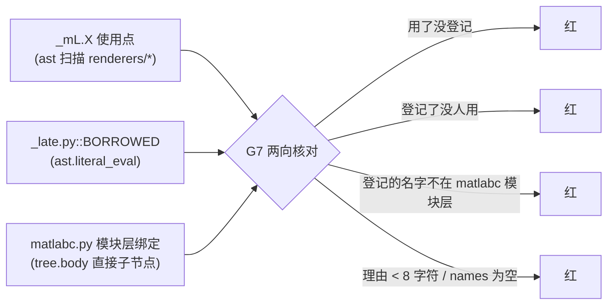

# R53 —— 借用清单的静态单一事实源（`_late.py::BORROWED` + 门 G7）

> 本轮落地 R52 §8 的第 3 条（前两条：`C'''''''0` 阻塞、`C'''''''1` 小而易修）。
> 贯穿始终的口径：**优先「已有装置但没接上线」与「已有承诺但没装置」**，
> 每条判据都必须先说清「**什么会红**」。

---

## §1 白帽：事实（全部来自仓库外独立装置实测）

| 口径 | 装置 | 读数 |
| --- | --- | --- |
| `_mL.X` 使用点（**逐点**，非逐行） | `_r53/probe_borrowed.py`（ast，不 import 产品） | **44 处** |
| 借用的**符号并集** | 同上 | **22 个** |
| 借用方模块 | 同上 | **6 个**：callgraph / hotspot / report / sarif / snapshot / unresolved |
| 目标是否在 `matlabc.py` **模块层**有定义（只看 `tree.body` 直接子节点） | `_r53/probe_mc_toplevel.py` | 悬空 **0**（strict 797 名 / loose 802 名，两种口径都是 0） |

各模块借用面（逐点计数）：

| 模块 | 使用点 | 唯一符号 |
| --- | --- | --- |
| `renderers.snapshot` | 21 | 9 |
| `renderers.sarif` | 7 | 4 |
| `renderers.report` | 5 | 5 |
| `renderers.unresolved` | 5 | 1 |
| `renderers.callgraph` | 3 | 3 |
| `renderers.hotspot` | 3 | 3 |

**真缺陷**：R52 把回边搬进惰性代理之后，门与测试只能验「`_mL.X` 里的 `X` **存在于** matlabc」
（`tests/test_matlabc.py::test_renderers_import_smoke` 就是这条）。于是：

* 新加一个借用 → 没有任何东西要求**登记**；
* 删掉一个使用点 → 没有任何东西发现**登记已经陈旧**；
* 借用一个 matlabc 里**根本不存在**的名字 → 只有「跑起来才发现」。

用 R52 自己的话：这是「**已有装置但没接上线**」。

---

## §2 黑帽：本轮要防的三类静默失效

1. **登记表与使用点分叉**（两向）：任意一侧多出或缺失，都必须在门里变红。
2. **悬空借用**：登记的名字在 `matlabc.py` 的模块层没有定义 —— 它在 import 期
   是否存在取决于分支，借用它本就不安全。
3. **空登记 / 空理由**：一张写满占位符的表，与没有表是同一种病。理由少于 8 字符
   ⇒ 该登记**不生效**（沿用 G5 的口径）。

---

## §3 落地物

### 3.1 `renderers/_late.py::BORROWED`（静态单一事实源）

键 = 借用方**模块名**（与 import 图同口径），值 = `{names: (…) , reason: "…"}`。
⚠ 本表**只被门读**，产品代码从不读它 —— 也就是说：它是**宣称**，而 G7 是它的对手方。

### 3.2 `tools/check_import_graph.py::G7`（四条子判据，各自独立作证）

| 子判据 | 什么会红 |
| --- | --- |
| G7 未登记借用 | 某模块用了 `_mL.X`，而 `BORROWED[模块]` 里没有 `X` |
| G7 陈旧登记 | 登记了 `X`，但全仓再没有 `(该模块, X)` 使用点；或登记的模块根本不存在 |
| G7 悬空借用 | 登记的 `X` 不在 `matlabc.py` 的**模块层**绑定里 |
| G7 登记不生效 | 该条登记的理由少于 8 字符；或 `names` 为空 |

**适用性口径**（与 `check_ir_attribution` 的 `pred_registry=None` 同源）：
树里没有 `renderers/_late.py` ⇒ G7 **不适用**（合成样本因此不受影响）；
**有**这条通道而登记表缺失或为空 ⇒ **真红**（不是"不适用"）。

---

## §4 判据与验证矩阵（改完 → 终局回归 → 数字）

| 判据 | 装置 | 读数 |
| --- | --- | --- |
| 门主路径 | `tools/check_import_graph.py` | rc=0，打印 `借用登记 6 个模块 / 22 个符号 / 44 处使用点；G1–G7 全绿` |
| 门自证 | `--selftest` | `SELFTEST COUNTS {"bad": 0, "good": 19}`（R52 时 14；本轮 +4 反例 +1 正例） |
| 反向判据（红） | 干净 `HEAD` 树（`git worktree add _r53/wt_head`）注入新测试 | `test_r53_borrow_registry_two_way` **failed**（`has_late` 不存在）+ `test_r52_import_graph_can_say_no` **failed**（旧门打印 G1–G6） |
| 反向判据（绿） | 本树 | `pytest -k "r53 or r52 or renderers_import_smoke or r44 or r50 or r51 or r37 or r31"` → **22 passed** |
| 四条子判据各自独立 | 新测试内四处变异 | 每处只 `startswith("G7 …")`，`_others()` 必须为空 |
| 总门禁 | `tools/check_all.py` | **rc=0（12 道护栏，各自自证）** |
| 双语结构 | `check_readme_parity.py` | 15 小节逐节对等 |
| 帮助契约 | `check_help_contract.py` | rc=0（`GUARD_CONTRACT` 的 G1–G6 → G1–G7 已同步；退出码集合未变） |

### ⚠ 一处**授权的接口变更**（不是放宽判据）

门的成功行由 `G1–G6 全绿` 改成 `G1–G7 全绿`，因此
`tests/test_matlabc.py::test_r52_import_graph_can_say_no` 里那条**逐字断言**同步改写。
这不是放宽：断言强度未变，只是所断言的字符串随接口一起演进 —— 与 R44「改被调方签名
必须同步全部调用方」同一条纪律。对照组（干净 HEAD 树）里它**照样红**，正是这条纪律的证据。

---

## §5 轮次账本

| # | 动作 | 结果 |
| --- | --- | --- |
| 1 | 装置 A：`probe_borrowed.py`（逐点使用点 / 并集 / 悬空） | 44 / 22 / 0 |
| 2 | 装置 B：`probe_mc_toplevel.py`（strict vs loose 口径对照） | strict 缺失 0，**收紧口径不会造出假红** |
| 3 | 写 `BORROWED`（6 模块 / 25 条登记 / 6 条理由） | — |
| 4 | 门加 G7（scan 收集 + judge 判定 + 成功行 + 4 反 1 正样本） | — |
| 5 | 补丁脚本全或无落盘（7 文件） | 锚点各 1 次；`ast.parse` 全过；`bare_lf=0` |
| 6 | 自证第一次跑 | **红**：合成样本 `_mc_ok` 用了 list，`_mk` 只吃 str ⇒ 被自证自己挡住 |
| 7 | 修 + 复跑 | `{"bad": 0, "good": 19}` |
| 8 | 门主路径 | `借用登记 6 / 22 / 44`，rc=0 |
| 9 | `check_all` | rc=0（12 道） |
| 10 | 对照组（干净 HEAD 树） | 2 failed（反向判据成立） |

### 本机踩坑（全是「工具自己的坑」）

1. `'''…'''` 里出现 `''''`（写 `C''''2`）会**提前终结字符串** —— 与 R50/R52 同一条。
   换成 `"""` 后，内容里的 `"""`（文档字符串定界符）又反过来终结外层 ——
   最后用「逐块选定界符 + 必要的 `\"\"\"` 转义」解决。
2. `io.open(p, encoding="utf-8")` 是 **universal-newlines**：读进来 CRLF 已变 LF，
   直接写回会**把整仓文件变成 bare LF**。本轮那条 `bare_lf==0` 自检**当场拦下了这次写盘**
   （断言在写之前），改成 `io.open(p, "rb")` + 手工归一后才落盘。
3. 用 bash heredoc 给 `python -` 传非 ASCII 锚点时，**引号层数与 JSON 转义**会互相吃掉
   （本轮 `\\n` 退化成真换行）⇒ 需要字面反斜杠时用 `chr(92)` 拼，别数转义层。

---

## §6 探针清单（仓库外，**不进 git**）

| 文件 | 用途 |
| --- | --- |
| `_r53/probe_borrowed.py` | 装置 A：逐点使用点 / 并集 / 悬空（ast，不 import 产品） |
| `_r53/probe_mc_toplevel.py` | 装置 B：`matlabc.py` 模块层绑定的 strict / loose 对照 |
| `_r53/patch_r53.py` | 7 文件全或无补丁（锚点各 1 次 + `ast.parse` + `bare_lf`） |
| `_r53/wt_head/` | 对照组的 linked worktree（detached at `b944191`） |

---

## §8 下一次建设性意见（接在 R52 §8 之后；**R52 C'''''''2 已在 R53 完成**）

**C''''''''0（沿用 R49–R52）`fe_audit.py` / `frontend-gate.yml` 的「不做」登记。**
本轮**量出了真实规模**：只按 `fe_audit|trend|r78|r81|r87|r89|r92–r102|r127|readme_doc_sync`
这**一个**过滤式，仓内就有 **25 条红**（`ModuleNotFoundError: fe_audit` / `FileNotFoundError`），
而不是历史文档里写的 7 条。⇒ 「把 7 条登记为不做」这条路**事实不成立**；
真正的选择只有「补一个真前端审计器」或「按**产物**（而非按测试）登记缺口」。
**对手方**：登记了却其实已存在 → 红；存在却仍被登记为缺失 → 也红。

**C''''''''1（沿用 R52 C'''''''1，本轮又被咬了一次）`check_baseline.py` 的 P1 把
「`.git` 是**目录**」当成「是 git 仓库」的唯一形态 ⇒ 在 `git worktree` 里恒判红。**
本轮实测：对照组树里 `check_all` 必红（`P1 … 不是 git 仓库`），所以**对照组只能跑 pytest、
跑不了 check_all** —— 这直接限制了对照组能证的东西。落点：`.git` 是**文件**且首行
`gitdir:` 指向存在的目录时也算仓库。**对手方**：造一个 `.git` 是文件的目录 → 修前红、修后绿；
真·非仓库目录仍必须红。

**C''''''''2 把 `BORROWED` 的「理由 ≥ 8 字符」升级为**文档侧对手方**（沿用 R51 B5 / R52 C'''''''7）。**
现在 `BORROWED` 只有**代码侧**对手方（G7）；`CONTRIBUTING.md` 那张表是**手写**的，
删掉一行没有任何东西发现。落点：给借用模块加 `<!-- borrow-module: <module> -->`
式的双向标记，并让陈旧标记变红。

**C''''''''3 真正**移走**那 22 个被借用的符号（= 把借用关系消灭，而非推迟）。**
最有价值的第一步仍是 R52 点名的四个**纯路径辅助**
（`_page_rel` / `_dir_page_name` / `_src_href_from_rel` / `_up_to_index`，
被 3 个模块共用）搬进 `renderers/_shared.py`；搬完 `BORROWED` 必须同步缩水。
**对手方**：搬完之后 G7 的**陈旧登记**必须能抓住「代码搬了、表没改」。

**C''''''''4 给 `check_import_graph.py` 的「判据条数」加棘轮（沿用 R52 C'''''''4）。**
现在判据 7 条、自证样本 19 条，但**没有一条断言**阻止以后有人删掉 G7 而不改数字。

---

## §9 明确拒绝做的事（避免下一轮走回头路）

1. **不为过门而放宽判据**：`G1–G7` 的字符串变更是接口演进，不是放宽（§4 已说明）。
2. **不做「注释式」单一事实源**：`BORROWED` 必须被 G7 **两向**核对，写错就红。
3. **不用 `sys.modules` 魔法 / 不引 import hook**：`_late.py` 里的
   `importlib.import_module` 仍是全仓**唯一**指向本仓模块的动态 import（G3 登记）。
4. **不把 G7 做成「任何树都能跑」**：没有 `renderers/_late.py` 的树 G7 不适用，
   否则所有合成样本会被凭空判红（那是测量工具自己造缺陷）。
5. **不动 `VERSION`、不动 `flow/diagrams`、不动帮助体积快照**（本轮零产品行为变更）。
