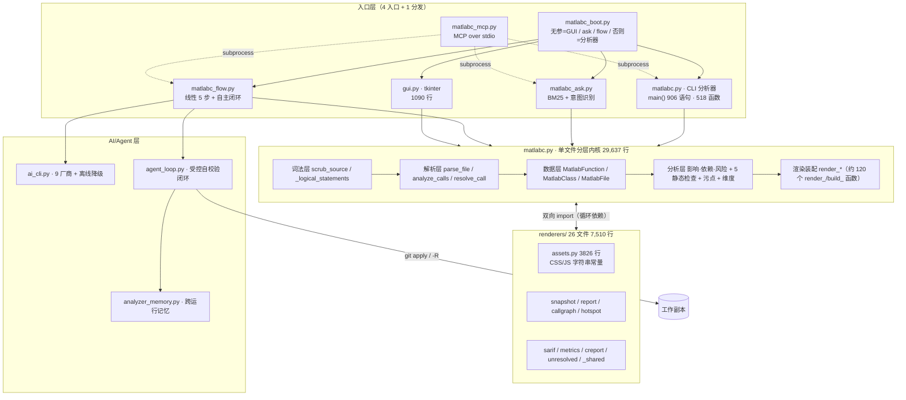
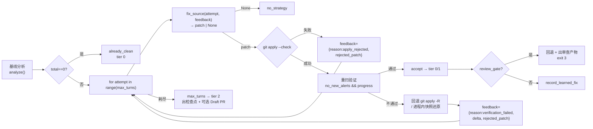

# ANALYSIS 2026-10-08 · malabc 仓库全量深度审计（代码拉取 + 实测取证）

> 归档依据：用户长期偏好 [88222452]（深度分析/审计必须归档并维护索引）+ 本仓 `CONTRIBUTING.md` §深度分析归档。
> 审计对象：`git@github.com:pony-029/malabc.git` @ `main` / `94e62c1`。
> 审计方式：**全分支克隆 + 静态解析（AST）+ 真实运行取证**，不做「读叙述猜实现」。

---

## ① 方法（工具 / 取证层次）

| 层次 | 手段 | 产物 |
| --- | --- | --- |
| L1 版本 | `git clone` / `git branch -a` / `git log` | 单分支 `main`，13 commits，1 作者，无 tag |
| L2 结构 | 自研 AST 提取器（`ast.parse` 全量 `.py`） | 类/函数/语句数/导入图 |
| L3 静态 | 占位符扫描、路径引用对账、`--check-py36` | 引用 13 个不存在路径；py36 门禁 0 问题 |
| L4 动态 | 真实运行 CLI / `flow` 闭环 / `pytest` / MCP JSON-RPC 握手 | **129 失败 / 277 通过 / 9 跳过**；补丁引擎破坏源码实证 |
| L5 差分 | 同参两次运行比对 sha256 / hashseed 扰动 | `--reproducible` 未兑现（2 文件漂移） |

---

## ② 结论先行（评分表）

| 维度 | 评分(1-5) | 判定 | 关键证据 |
| --- | --- | --- | --- |
| 分析引擎能力深度 | **5** | 真实领先 | def-use 链、跨过程污点传播、维度推断+分支合并、4 语言前端抽象 |
| 浏览站点/可视化产出 | **5** | 真实可用 | `--browse` 产出 123 文件 / 1.39 MB，含 callgraph.svg / combined_graph.svg |
| AI 接入层（ai_cli） | **4.5** | 真实且完善 | 9 厂商 + OpenAI 兼容 + 离线降级 + 密钥脱敏（`redact`） |
| 自主修复闭环（agent_loop） | **4** | 真实非占位 | 结构化 feedback、git apply/-R、tier 0/1/2、review gate、Draft PR、learned_fixes |
| MCP 协议暴露 | **4** | 协议层正确 | 5/5 帧响应正确、isError 分支正确；但 1 个工具参数错 |
| **迁移完整性** | **1** | 🔴 严重不完整 | `fe_audit.py` 等 9 类产物缺失 → 129 个测试失败 |
| **补丁引擎安全性** | **1** | 🔴 可破坏源码 | 「插入」被实现为「覆盖」，删语句且自证 PASS |
| 文档 ↔ 实现一致性 | **2** | 🔴 系统性漂移 | README 三条命令实测报错；归档声称「已落地」未落地 |
| 可复现性承诺 | **2** | 🔴 未兑现 | `--reproducible` 下 2 文件随 hashseed 漂移 |
| 工程化（CI/打包） | **1.5** | 🔴 断链 | CI 必红（测试失败）；`setup.py`/`build_dist.py` 全缺 |
| 可维护性 | **2.5** | 🟡 高风险 | `main()` 906 语句；`renderers` ↔ `matlabc` 循环依赖 |

> **总体判断**：**「能力 5 分、工程 1.5 分」的强烈撕裂**。
> 引擎与 AI 融合层是**名副其实的真实现**（无占位符）；但**这次 GitHub 迁移是半成品**——
> 丢了整块子系统和打包链，导致自带测试大面积失败、CI 必红、README 首命令跑不通。
> 该仓库当前状态：**优秀内核 + 断裂的交付外壳**。

---

## ③ 仓库事实（拉取结果）

```
远端      git@github.com:pony-029/malabc.git
分支      main（唯一；remotes/origin/HEAD -> origin/main）
HEAD      94e62c1  feat(flow): P1-B 人工复核门(--review-gate) + 检查点出 Draft PR(--draft-pr)
标签      无
提交      13 次，全部 2026-10-08，唯一作者 pony-029 <916837189@qq.com>
```

**规模（工作区，不含 .git）**：88 文件 / 3.73 MB / 约 62,000 行

| 分区 | 文件 | 行数 | 说明 |
| --- | --- | --- | --- |
| 根目录代码 | 16 | 34,422 | 其中 `matlabc.py` **29,637 行 / 518 函数 / 8 类** |
| tests | 21 | 16,041 | `test_matlabc.py` 单文件 791 KB / 392 测试函数 |
| renderers | 26 | 7,510 | + `assets/page_css/*.css` 15 个 |
| docs | 16 | 5,170 | `matlabc_README.md` 219 KB、`DELIVERY_REPORT.md` 188 KB |
| ci / .github | 9 | 582 | 含 `ci.yml`（已启用但必红） |

**语言构成**：`.py` 26 个 / 2.86 MB · `.md` 20 个 / 687 KB · `.css` 15 个 / 120 KB · `.yml` 6 个 · `.m` 15 个（夹具）· `.json` 1 个

---

## ④ 架构解剖

### 4.1 分层结构（实测还原，非文档抄录）



### 4.2 前端抽象（干净的一处设计）

`matlabc.py` 内 `BaseFrontend` + 4 子类，是本仓**最规范的抽象**：

| 前端 | 行 | collect_files | parse_file | build_edges | collect_checks | gen_tests |
| --- | --- | --- | --- | --- | --- | --- |
| `MatlabFrontend` | 7865 | ✔ | ✔ | 继承 | 继承 | ✔ |
| `PyFrontend` | 7726 | ✔ | ✔ | ✔ | ✔ | ✔ |
| `JsFrontend` | 7777 | ✔ | ✔ | ✔ | ✔ | ✔ |
| `CFrontend` | 7828 | ✔ | ✔ | ✔ | ✔ | ✔ |

> MATLAB 前端未覆写 `build_edges/collect_checks` → 说明 MATLAB 路径走内核内置实现，**其余 3 语言才是「插件式外挂」**。

### 4.3 模块依赖问题（P1，已实测）

- `matlabc.py:463` 与 `29618-29628` 有 10 处 `from renderers.* import ...`
- `renderers/{callgraph,hotspot,report,sarif,snapshot,unresolved}.py` 在**文件底部**（L251 / L147 / L270 / L169 / L838 / L118）反向 `from matlabc import ...`

→ **双向依赖靠「模块尾部延迟 import」绕开循环导入**。这是可工作的，但属于架构债：
任何一处改为顶部 import 即 `ImportError`。`CONTRIBUTING.md` §代码风格 已自认此风险。

### 4.4 规模热点（语句数 Top 8）

| 函数 | 语句数 | 行号 | 风险 |
| --- | --- | --- | --- |
| `main` | **906** | L27823 | 🔴 上帝函数：约 120 个 `_run_*`/`_build_*` 私有函数由它分发 |
| `render_source_page` | 324 | L25259 | 🟡 |
| `_run_p204_p223_integration` | 253 | L10488 | 🟡 |
| `render_browse_site` | 223 | L20346 | 🟡 |
| `_builtin_shape` | 202 | L24002 | 🟡 |
| `_parse_header_comments` | 198 | L3461 | 🟡 |
| `_es_eval` | 191 | L24255 | 🟡 |
| `render_markdown_report` | 185 | L4750 | 🟡 |

> 顶层函数 518 个，语句总数 14,877，**中位数 17 语句** —— 长尾极重、主体健康。

---

## ⑤ 核心能力真实性验证（DFG / CFG / 数据流）

**结论：数据流与可达性分析是真实实现的，不是词汇包装。**

| 能力 | 实现函数（实测存在） | 性质 |
| --- | --- | --- |
| **Def-Use 链（DFG）** | `_record_flow_defuse` | 真实 def-use 记录 |
| **跨过程污点传播** | `_propagate_taint` / `_propagate_var_taint` / `_chain_effectively_tainted` / `_trace_var_taint_source` / `_collect_var_taint_sites` / `_taint_svg_path` | 真实跨文件污点 |
| **维度/shape 推断** | `_infer_dims` / `_infer_file_dims` / `_infer_function_dims` / `_propagate_dims_across_calls` / `_merge_branch_shapes` / `_broadcast_shape` / `_const_dim` / `_lit_dim` | 抽象解释（含**分支合并**） |
| **CFG / 可达性** | `_detect_unreachable_after_return` / `measure_branch_coverage` / `_compute_complexity` | 圈复杂度 + 不可达检测 |
| **类型流** | `_collect_type_flow` | 类型传播 |

**实测输出（`tests/sample_m`，0.064 s）**：

| 指标 | 值 |
| --- | --- |
| 文件 / 函数 / 类 | 13 / 19 / 1 |
| 调用边（跨文件） | 9（3） |
| 代码行 | 129 |
| 污点流（危险入口） | 1（1） |
| 待办清单 | 18（高优先级 0） |

**五条静态检查规则**（`uninitialized` / `type_mismatch` / `dead_code` / `shape_mismatch` / `tainted_sink`）+
**四级告警抑制**（文件级 / 名称级 / 行级 / 区间级）均为真实实现。

---

## ⑥ AI / Agent 融合层审计

### 6.1 `ai_cli.py`（692 行）—— 真实、完善

| 项 | 事实 |
| --- | --- |
| 厂商数 | **9 家**：openai / anthropic / deepseek / qwen / zhipu / moonshot / baichuan / doubao / yi / stepfun / ernie / iflytek（其中 OpenAI 兼容 9 家） |
| 独立鉴权适配 | `ErnieProvider`（OAuth2 client_credentials 换 token）、`IflytekProvider`（WebSocket + HMAC-SHA256 签名） |
| 中文别名 | `PROVIDER_ALIASES`：通义千问/文心一言/豆包/火山/零一/阶跃/讯飞 等 30+ |
| 降级链 | `resolve_provider_auto`：preferred → fallback[] → offline，逐级降级并回传原因 |
| 密钥安全 | `SECRET_RE` + `redact()`，所有输出/异常信息脱敏；密钥仅从环境变量读 |
| 补丁回流 | `parse_unified_diff()` 从自由文本抽取 `diff` 供闭环消费 |

### 6.2 `agent_loop.py`（620 行）—— 真实受控闭环（**本仓最高质量模块**）



| 设计点 | 实现 | 评价 |
| --- | --- | --- |
| 反馈闭环 | `feedback` 为**结构化 dict**（含 `rejected_patch` + 具体拒绝原因），`_feedback_suffix()` 渲染进 LLM 提示词 | ✅ 真反馈，非仅重试 |
| 回退原子性 | 有 git → `git apply -R`；无 git → 进程内 `snapshot` 逐文件还原 | ✅ 不留半截改动 |
| 分层退出 | tier 0（干净）/ 1（改善仍有残留）/ 2（未自证→检查点）；`exit 2`；复核门 `exit 3` | ✅ 设计到位 |
| 多策略修复源 | 轮 0 确定性补丁 → 无解则 LLM；轮 ≥1 纯 LLM（带 feedback） | ✅ |
| 记忆 | `learned_fixes` 按基线签名索引，签名 = 排序后的 `{rule:count}` | ✅ 但见 P1-1 误报会污染签名 |
| 人工复核门 | `--review-gate`：验证通过仍回退工作副本，改出 `REVIEW_*.patch/json/md` | ✅ 可信安全出口 |
| Draft PR | `gh pr create --draft`；任一步失败优雅降级，失败时清理临时分支 | ✅ |

### 6.3 `matlabc_mcp.py`（340 行）—— 协议层正确，1 个工具有缺陷

**实测 MCP JSON-RPC 握手（字节级解析）**：

| # | 请求 | 结果 |
| --- | --- | --- |
| 1 | `initialize` | ✅ `protocolVersion=2024-11-05`，`serverInfo={matlabc, 1.16.67}` |
| 2 | `tools/list` | ✅ 5 工具：`analyze` / `check` / `ask` / `version` / `gen_patch` |
| 3 | `tools/call matlabc_version` | ✅ `isError=false`，返回版本 + 工具清单 |
| 4 | `tools/call matlabc_gen_patch` | 🔴 **`isError=false` 但内容为 argparse 报错** |
| 5 | `tools/call nosuch` | ✅ `isError=true`（错误分支正确） |

**协议层 5/5 正确**，进程树回收（`taskkill /T` / `killpg` + `atexit`）也是真实现。
但工具 #4 存在**双重缺陷**（见 P0-3）。

---

## ⑦ 演进史（13 commits，全部 2026-10-08）

| 序 | SHA | 类型 | 摘要 |
| --- | --- | --- | --- |
| 13 | `94e62c1` | feat(flow) | P1-B 人工复核门 `--review-gate` + 检查点出 Draft PR |
| 12 | `257c1d6` | feat(flow) | P1-C 跨运行记忆（learned_fixes + 误报抑制） |
| 11 | `24f76cd` | feat(flow) | P1-A 被拒补丁 + 拒绝原因回灌 LLM 提示词 |
| 10 | `697f24f` | feat(flow) | P0+ 带 feedback 的 LLM 修复源，离线降级 |
| 9 | `187b921` | feat(flow) | P0 受控自校验 Agent Loop |
| 8 | `689c915` | docs | README 双语化 + banner 去水印 |
| 7 | `4b2653f` | feat(mcp) | 新增 MCP server |
| 6 | `d0777622` | ci | 启用自身 CI + `.gitignore` + CONTRIBUTING + 演进归档 |
| 5 | `0ff6b712` | docs | banner 1.8 MB → 125 KB |
| 4 | `89782d0f` | docs | 图文 README + 中英 MIT |
| 3 | `5018111f` | feat | 迁移质量评测闭环（eval_ai_fix） |
| 2 | `223dc3f` | docs | 迁移 MEMORY.md ⚠️ **提交信息乱码** |
| 1 | `425f3e9` | — | first commit |

**演进节奏解读**：这是一次「**一天内把本地工程推上 GitHub**」的迁移，随后**连续 5 次 P0→P1 迭代打磨 AI 闭环**。
后 5 次提交（9–13）质量最高、叙事最清晰（严格 P0→P0+→P1-A→P1-C→P1-B 递进）。
**问题集中在迁移动作本身**：`fe_audit` 子系统、打包链、根级文档、`.gitignore` 补全项都没跟过来。

---

## ⑧ 实测取证矩阵

| # | 实测项 | 命令 | 结果 |
| --- | --- | --- | --- |
| 1 | 克隆 | `git clone git@github.com:pony-029/malabc.git` | ✅ 成功（SSH 通道） |
| 2 | 分支 | `git branch -a` | 仅 `main`，无其它分支/tag |
| 3 | py36 门禁 | `matlabc.py . --check-py36 --max-warnings 0` | ✅ **26 文件 / 0 问题 / 通过** |
| 4 | 分析样例 | `matlabc.py tests/sample_m --checks all` | ✅ 正常出报告 |
| 5 | SARIF | `--sarif` | ✅ 4 条指纹，写基线 |
| 6 | 浏览站点 | `--browse <OUTDIR>` | ✅ 123 文件 / 1.39 MB |
| 7 | 裸 `--browse`（README 写法） | `--browse --offline` | 🔴 `error: argument --browse: expected one argument` |
| 8 | `--check tainted_sink`（README 写法） | `--check tainted_sink` | 🔴 `error: ambiguous option: --check` |
| 9 | 测试套件 | `pytest tests/` | 🔴 **129 失败 / 277 通过 / 9 跳过**（19m22s） |
| 10 | MCP 握手 | 5 条 JSON-RPC | ✅ 协议 5/5；🔴 gen_patch 工具坏 |
| 11 | 确定性补丁 | `matlabc_flow.py <dir> --auto-apply` | 🔴 **破坏源码 + 自证 PASS** |
| 12 | 可复现性 | 两次 `--browse --reproducible` 比对 | 🔴 2 文件漂移 |
| 13 | 占位符扫描 | TODO/FIXME/stub/NotImplemented 全仓 | ✅ 无未完成桩（命中均为工具自身模板/ABC） |

**测试失败归因（129 条）**：

| 类别 | 条数 | 根因 |
| --- | --- | --- |
| `ModuleNotFoundError` | 42 | `fe_audit` 模块整体缺失（154 次引用） |
| `FileNotFoundError` | 23 | `setup.py`(4) / `matlabc_README.md`(6) / `fe_audit.py`(26) / `fe_dom_check.js`(2) / `matlabc_DELIVERY_REPORT.md`(2) |
| 断言 / 其它 | 64 | 混合：部分为真回归（已独立复现），部分为重构后产物口径漂移 |

**静态量化**：`test_matlabc.py` 392 个测试函数中，**103 个（26.3%）**引用了仓库中不存在的产物
（`fe_audit` 93 / `VERSION` 4 / `matlabc_README.md` 3 / `setup.py` 2 / `matlabc_JSON_SCHEMA.md` 1）。

---

## ⑨ 缺口清单（分级 + 可复现证据）

### 🔴 P0-1 确定性补丁引擎把「插入」实现成「覆盖」→ 删语句 + 自证 PASS

**证据链（完整可复现）**：

1. **生成**（`matlabc.py:12459`）：`uninit` 高置信 → `_edits.append(("ins", _ln, "<var> = [];"))`
   文档承诺（L12432-12433）：*「uninitialized (high)：**在读取行前插入** `<var> = [];` 初始化声明」*
2. **渲染**（`matlabc.py:12537-12540`）：
   ```python
   elif _op == "ins":
       _indent = _new[_idx][:...]
       _new[_idx] = "%s%s" % (_indent, _payload)   # ← 覆盖目标行！
   ```
   对照 `"ins_before"`（L12541-12545）才是正确的切片插入 `_new[_idx:_idx] = [...]`。
3. **实测后果**（最小复现 `demo.m`）：
   ```matlab
   // 输入                       // 输出
   function y = demo(n)          function y = demo(n)
   y = q + n;              →     q = [];
   z = y * 2;                    z = y * 2;
   ```
   **`y = q + n;` 整条被删除**，函数声明了输出 `y` 却永不赋值 —— **静默功能回归**。
4. **自证门**：`[verify] 自证结果：通过(PASS)（无新增告警且总量下降）` —— 因只统计自身规则数（1→0），
   **无 AST/语法校验、无语句保持校验**。
5. **同源第二种破坏**（真实夹具）：`tests/sample_m/nested.m` 第 4 行 `function z = inner(v)` 被替换为 `z = [];`
   → 嵌套函数消失、`end` 悬空；`varargs.m` 第 4 行 `for k = 1:n` 被替换为 `k = [];` → 循环头消失。
   **两处均为 MATLAB 硬语法错误。**

> **违反自身文档承诺：「确定性自动修复覆盖（**安全、可验证、不丢数据**）」。**
> 影响面：一切 `--gen-apply-patch`、`matlabc flow --auto-apply`、`--auto-apply-loop`、MCP `gen_patch` 路径。

**修复建议**：把 `"ins"` 改为 `_new[_idx:_idx] = [payload]`（即 `ins_before` 的语义），
或直接删除 `"ins"` 分支、统一走 `"ins_before"`；并在 `agent_loop` 验证门增加
**「补丁后源文件仍可被 MATLAB 语法判定」+「非目标语句数不减少」** 两条断言。

### 🔴 P0-2 迁移不完整 → 129 测试失败、CI 必红、README 首命令跑不通

**缺失清单（实测 `/exists` 对账）**：

| 缺失产物 | 被谁引用 | 后果 |
| --- | --- | --- |
| `fe_audit.py` | 93 个测试函数（154 次） | `ModuleNotFoundError` 主因 |
| `_fe_capability.json` | `fe_audit` 契约测试 | 同上 |
| `fe_dom_check.js` | DOM 契约测试 ×2 | `FileNotFoundError` |
| `setup.py` | `test_p54` / `test_p55` / README / USAGE | 打包链断 |
| `VERSION` | 4 个测试、`test_p54` 版本对账 | 版本契约断 |
| `analyzer_config.example.json` | `test_p54` ⑤ | 配置示例断 |
| `build_dist.py` / `build_release.bat` / `build_release.sh` | README / FEATURES / CONTRIBUTING | 单文件 exe 交付链断 |
| `__main__.py` | `test_p55` ③ `python -m matlabc` | `-m` 入口断 |
| 根级 `matlabc_README.md` / `STRUCTURE.md` / `USAGE.md` / `JSON_SCHEMA.md` / `DELIVERY_REPORT.md` | 多个测试 | 已移入 `docs/`，但测试仍按根路径读 |
| `OPERATOR_CATALOG.md` | `ai_cli.py:33` 注释引用 | 文档悬空 |

> `ci.yml` 第 29 步 `python tests/test_matlabc.py` 在这份快照上**必然失败** → README 的 CI 徽章与实际不符。
> 另：`pytest` 未在 `ci.yml` 中安装，而 `test_matlabc.py:29` 硬 `import pytest` —— 与「零依赖 + 可直接运行」的自述冲突
> （本地无 pytest 时实测 `ModuleNotFoundError: No module named 'pytest'`）。

### 🔴 P0-3 MCP `matlabc_gen_patch` 参数错误 + 失败被报成成功

- `matlabc_mcp.py:257`：`cli += ["--gen-apply-patch", "mcp_fix.patch"]`
- 但 `matlabc_flow.py` 的 argparse **未定义 `--gen-apply-patch`**（实测：`error: unrecognized arguments`）
- 且 `_run()`（L191-205）**丢弃 returncode**，故 `_handle_call` 把 argparse 报错文本包成
  `{"content":[...], "isError": false}` → **Agent 看到的是「成功」**。

**修复建议**：`auto_apply=false` 分支改为 `cli += ["--steps","fix","report"]` 或调用 `matlabc.py --gen-apply-patch`；
`_run()` 返回 `(rc, out)`，`rc != 0` 时置 `isError=True`。

### 🟡 P1-1 `uninitialized` 规则缺关键字感知 → 高置信误报（误报又被自动修补）

`_detect_uninitialized`（L21183）仅对 `if/elseif/else/end` 做块关键字跳过（L21227），
**未覆盖 `for` / `parfor` / `while` / `switch` / `try`**，且父函数的扫描区间覆盖了其**嵌套函数体**。

实测误报 3 条，**全部 `confidence: high`**：

| 文件 | 行 | 变量 | 真实身份 | 判定 |
| --- | --- | --- | --- | --- |
| `nested.m` | 4 | `v` | 嵌套函数 `inner` 的**入参** | 🟡 误报（父函数 params 不含子函数入参） |
| `nested.m` | 4 | `z` | 嵌套函数 `inner` 的**出参** | 🟡 误报 |
| `varargs.m` | 4 | `k` | `for k = 1:n` 的**循环变量** | 🟡 误报（`_find_assignment_pos` 不识别 `for` 头） |

> 这 3 条误报正是 P0-1 中「源码被破坏」的**触发源**。修 P1-1 可同时消除该样本上的 P0-1 表现，
> 但 P0-1 是独立的渲染缺陷，必须单独修。

### 🟡 P1-2 `--reproducible` 承诺未兑现

两次同参运行（仅 `PYTHONHASHSEED` 不同）比对：**123 个站点文件中 2 个内容不同**

| 文件 | 差异 |
| --- | --- |
| `manifest.json` | `src/_pageview.js` 的 sha256 记录随内容变 |
| `src/_pageview.js` | `window.__BUILTIN_INFO__` 的**键序漂移**（一次 `sum` 开头，一次 `numel` 开头） |

**根因**：`__BUILTIN_INFO__` 由 Python dict 直接序列化，**未 `sort_keys=True`**——
正是 `MEMORY.md` [39029573] 明令禁止的「依赖 dict 插入顺序」。
（对照：`--json` 产物跨 hashseed **完全一致**，说明可复现性只在部分产物上做到了。）

### 🟡 P1-3 / P1-4 README 二例命令实测报错

| README 写法 | 实测 | 真实写法 |
| --- | --- | --- |
| `python matlabc.py proj/ -o report.html --browse` | 🔴 `expected one argument` | `--browse <OUTDIR>`（`metavar="OUTDIR"`，无 `nargs="?"`） |
| `python matlabc.py proj/ --check tainted_sink` | 🔴 `ambiguous option: --check` | `--checks tainted_sink`（与 `--checks`/`--check-py36`/`--check-py36-files` 冲突） |

> 影响：README_CN 的**快速开始第 (2) 条**、命令速查、以及英文版同位置全部失效。
> 对照 `--gen-pr` / `--gen-apply-patch` / `--gen-tests-risk` / `--watch` 均有 `nargs="?"` 可裸用——**`--browse` 漏了**。

### 🟡 P1-5 归档结论与事实不符（`.gitignore`）

`docs/analysis/ANALYSIS_2026-10-08_MALABC_EVOLUTION_GOVERNANCE.md` 的
「**P0**：补全 `.gitignore`（`.analyzer_*`/`dist_bin/`/`_build/`/`*.sarif`/`.codebuddy/`）」
标注为「**已本批落地**」，但真实 `.gitignore` 仅 13 行，**5 个模式一个都没有**：

```
实测：.analyzer ABSENT / dist_bin ABSENT / _build ABSENT / *.sarif ABSENT / .codebuddy ABSENT
```

`CONTRIBUTING.md:30` 同样声称这些「已被 `.gitignore` 忽略」——**同样的失真**。

### 🟡 P1-6 提交 `223dc3f` 信息乱码

`docs: 杩佺Щ椤圭洰璁板繂 MEMORY.md锛圥ython 3.6.5 绾︽潫...`
= UTF-8 字节被按 GBK 二次编码（Windows cmd 代码页问题）。其余 12 条提交信息编码正常。

### 🟡 P1-7 `renderers` ↔ `matlabc` 循环依赖

见 §4.3。6 个渲染器在模块尾部反向 import 内核，靠顺序规避 `ImportError`。

### 🟢 P2 项

| 项 | 证据 |
| --- | --- |
| 增量比首次更慢 | 测试 L3042：`dt_first=6.873s dt_inc=8.235s`（增量缓存反而变慢） |
| Python 3.13 弃用告警 | `matlabc.py:25233` `re.split(r"...", s, 1)` maxsplit 位置传参 |
| `main()` 906 语句 | 上帝函数，拆分收益高但风险高 |
| 部分前端标记缺失 | `--html` 实测缺 `cg-local{` / `KBD_JS`（`gs-b-t`/`cg-host`/`__CG__`/主题持久化均在） |
| 无 `requirements.txt` / 打包元数据 | `pip install -e .` 在 README/USAGE/DELIVERY 中出现，但无法执行 |

---

## ⑩ 建设性改进（可执行 + 优先级）

| 优先级 | 动作 | 验收标准 |
| --- | --- | --- |
| **P0-1** | 修 `matlabc.py:12537`：`"ins"` 改切片插入；`agent_loop` 验证门加「语法可解析 + 语句数不减」 | `demo.m` 复现用例：`y = q + n;` 保留；`nested.m`/`varargs.m` 不被破坏 |
| **P0-2** | 补齐 `fe_audit.py` / `_fe_capability.json` / `fe_dom_check.js` / `setup.py` / `VERSION` / `analyzer_config.example.json` / `build_dist.py` / `build_release.*` / `__main__.py`；或统一把测试里的根路径改为 `docs/` | `pytest tests/` 绿；`ci.yml` 绿；`pip install -e .` + `matlabc --version` 通过 |
| **P0-2b** | `ci.yml` 增 `pip install pytest`；测试脚本改为「无 pytest 时降级为自跑 main」 | 干净 runner 上 `python tests/test_matlabc.py` 不报 ImportError |
| **P0-3** | `matlabc_mcp.py`：改 `gen_patch` 调用参数；`_run()` 回传 rc → `rc!=0` 置 `isError=True` | `tools/call gen_patch` 实测产出补丁且 `isError=false`；故意传坏参时 `isError=true` |
| **P1-1** | `_detect_uninitialized` 增 `for/parfor/while/switch/try` 关键字跳过；扫描区间裁剪到 `body_end` 不含嵌套函数体 | 上述 3 条 high 误报消失 |
| **P1-2** | `__BUILTIN_INFO__` 等所有 JSON 序列化加 `sort_keys=True` | 两次运行站点产物 sha256 全等 |
| **P1-3/4** | `--browse` 加 `nargs="?"`（`const` 默认 `site`）或修正 README；README 的 `--check` 改 `--checks` | README 快速开始三条命令逐条实跑通过 |
| **P1-5** | 真正补 `.gitignore` 五个模式，并修正两份文档的「已落地」表述 | `git status` 在多次分析/打包后仍干净 |
| **P1-6** | 可 `git rebase -i` 改写乱码提交信息（或保留并加注释说明） | `git log --format=%s` 全为可读中文 |
| **P1-7** | 抽 `renderers` 单向依赖：把被反向 import 的符号下沉到新 `core/` 模块 | 渲染器顶部 `import` 不再报错 |
| **P2** | 查增量缓存失效条件（L3042）；修 `re.split` 位置参数；拆 `main()` | 增量耗时 < 首次；0 弃用告警；`main()` < 150 语句 |

---

## ⑪ 亮点（必须公允记录）

1. **零依赖真的是零依赖**：`--check-py36` 实测 26 文件 / 0 问题；运行时只用标准库。
2. **无占位符**：全仓 TODO/FIXME/stub 扫描命中**全部**是工具自身产物模板（它本就是生成测试桩 + 扫 TODO 的工具）与 `ABC` 抽象方法；**没有一处未完成桩**。
3. **AI 闭环是硬工程**：结构化 feedback（含被拒补丁回灌）、git 双向回退、tier 0/1/2 分层退出、review gate、Draft PR 优雅降级、learned_fixes 记忆——这是**教科书级的受控自主循环**，远超同类工具。
4. **MCP 协议层一次做对**：自实现 LSP 分包帧，5/5 请求响应正确，含进程树强制回收防孤儿。
5. **引擎确有 DFG/CFG 内核**：def-use、跨过程污点、分支合并的维度抽象解释、不可达检测——是真算法不是名词。
6. **离线优先贯彻到底**：CSS/JS 全内联无 CDN，未配密钥时不发任何网络请求。
7. **归档纪律好**：`docs/analysis/` + 索引 + 「方法/结论/证据/缺口/改进」五段式，用户长期偏好执行到位。

---

## ⑫ 复现命令（本报告全部结论可复核）

```bash
git clone git@github.com:pony-029/malabc.git && cd malabc

# ③ 仓库事实
git branch -a && git log --oneline && git rev-list --count HEAD

# ④ py36 门禁（应通过）
python matlabc.py . --check-py36 --max-warnings 0

# ⑤ 引擎能力
python matlabc.py tests/sample_m --checks all
python matlabc.py tests/sample_m --browse <OUTDIR> --offline --reproducible   # 注意：--browse 需要值

# ⑦ README 二例失败（P1-3/P1-4）
python matlabc.py tests/sample_m --browse --offline          # error: expected one argument
python matlabc.py tests/sample_m --check tainted_sink        # error: ambiguous option

# ⑨ P0-1 最小复现
mkdir -p /tmp/mr && printf 'function y = demo(n)\ny = q + n;\nz = y * 2;\ndisp(z);\nend\n' > /tmp/mr/demo.m
python matlabc.py /tmp/mr --gen-apply-patch /tmp/mr/out --checks uninitialized
#   -> -y = q + n;  /  +q = [];      （语句被删除）
python matlabc_flow.py /tmp/mr --auto-apply
#   -> [verify] 自证结果：通过(PASS)  ← 破坏了源码却报通过

# ⑨ P0-2 测试
pip install pytest && python -m pytest tests/ -q     # 129 failed / 277 passed / 9 skipped

# ⑨ P0-3 MCP
python matlabc_flow.py tests/sample_m --gen-apply-patch x.patch   # error: unrecognized arguments

# ⑨ P1-2 可复现性
PYTHONHASHSEED=1     python matlabc.py tests/sample_m --browse b1 --offline --reproducible
PYTHONHASHSEED=999   python matlabc.py tests/sample_m --browse b2 --offline --reproducible
#   比对 b1/b2：manifest.json 与 src/_pageview.js 不一致
```

---

*审计执行：2026-10-08 · 工作副本 `E:\matlabc\malabc`（HEAD `94e62c1`）· 审计后工作区已还原为 `git status` 干净*
